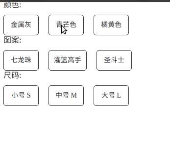

### SKU组件(React版)

#### 起因

今天看掘金的时候看到[前端SKU算法实现](https://juejin.im/post/5dc81ea36fb9a04a6f0fec28),因为公司也有涉及到SKU的业务,记录一下自己写SKU的一个例子吧,刚好他有提供后端的API接口数据,mock一下干起来，但是在做的时候还是有很多问题的，这里做一下记录

#### 实现效果

#### mock数据

~~~json
export const simulatedSku = {
  id: 2,
  title: "林间有风自营针织衫",
  subtitle: "瓜瓜设计，3件包邮",
  category_id: 12,
  root_category_id: 2,
  price: "77.00",
  img: "",
  for_theme_img: "",
  description: null,
  discount_price: "62.00",
  tags: "包邮$热门",
  is_test: true,
  online: true,
  sku_list: [
    {
      id: 2,
      price: 77.76,
      discount_price: null,
      online: true,
      img: "",
      title: "金属灰·七龙珠",
      spu_id: 2,
      category_id: 17,
      root_category_id: 3,
      specs: [
        {
          key_id: 1,
          key: "颜色",
          value_id: 45,
          value: "金属灰"
        },
        {
          key_id: 3,
          key: "图案",
          value_id: 9,
          value: "七龙珠"
        },
        {
          key_id: 4,
          key: "尺码",
          value_id: 14,
          value: "小号 S"
        }
      ],
      code: "2$1-45#3-9#4-14",
      stock: 5
    },
    {
      id: 3,
      price: 66,
      discount_price: 59,
      online: true,
      img: "",
      title: "青芒色·灌篮高手",
      spu_id: 2,
      category_id: 17,
      root_category_id: 3,
      specs: [
        {
          key_id: 1,
          key: "颜色",
          value_id: 42,
          value: "青芒色"
        },
        {
          key_id: 3,
          key: "图案",
          value_id: 10,
          value: "灌篮高手"
        },
        {
          key_id: 4,
          key: "尺码",
          value_id: 15,
          value: "中号 M"
        }
      ],
      code: "2$1-42#3-10#4-15",
      stock: 999
    },
    {
      id: 3,
      price: 66,
      discount_price: 59,
      online: true,
      img: "",
      title: "橘黄色·灌篮高手",
      spu_id: 2,
      category_id: 17,
      root_category_id: 3,
      specs: [
        {
          key_id: 1,
          key: "颜色",
          value_id: 44,
          value: "橘黄色"
        },
        {
          key_id: 3,
          key: "图案",
          value_id: 10,
          value: "灌篮高手"
        },
        {
          key_id: 4,
          key: "尺码",
          value_id: 15,
          value: "中号 M"
        }
      ],
      code: "2$1-42#3-10#4-15",
      stock: 999
    },
    {
      id: 4,
      price: 88,
      discount_price: null,
      online: true,
      img: "",
      title: "青芒色·圣斗士",
      spu_id: 2,
      category_id: 17,
      root_category_id: 3,
      specs: [
        {
          key_id: 1,
          key: "颜色",
          value_id: 42,
          value: "青芒色"
        },
        {
          key_id: 3,
          key: "图案",
          value_id: 11,
          value: "圣斗士"
        },
        {
          key_id: 4,
          key: "尺码",
          value_id: 16,
          value: "大号  L"
        }
      ],
      code: "2$1-42#3-11#4-16",
      stock: 8
    },
    {
      id: 5,
      price: 77,
      discount_price: 59,
      online: true,
      img:
        "http://i1.sleeve.7yue.pro/assets/09f32ac8-1af4-4424-b221-44b10bd0986e.png",
      title: "橘黄色·七龙珠",
      spu_id: 2,
      category_id: 17,
      root_category_id: 3,
      specs: [
        {
          key_id: 1,
          key: "颜色",
          value_id: 44,
          value: "橘黄色"
        },
        {
          key_id: 3,
          key: "图案",
          value_id: 9,
          value: "七龙珠"
        },
        {
          key_id: 4,
          key: "尺码",
          value_id: 14,
          value: "小号 S"
        }
      ],
      code: "2$1-44#3-9#4-14",
      stock: 7
    }
  ],
  spu_img_list: [
    {
      id: 165,
      img:
        "http://i1.sleeve.7yue.pro/assets/5605cd6c-f869-46db-afe6-755b61a0122a.png",
      spu_id: 2
    }
  ],
  spu_detail_img_list: [
    {
      id: 24,
      img: "http://i2.sleeve.7yue.pro/n4.png",
      spu_id: 2,
      index: 1
    }
  ],
  sketch_spec_id: 1,
  default_sku_id: 2
};

~~~

#### 简单的封装一个SKUCard和SKUGroup

类似于RadioGroup和Radio,我们先封装一个简单的SKU Group和SKU组件，便于状态的统一管理

+ SKU Card的实现,其实很简单,就是在**激活的时候和非激活**的时候通过状态位,修改css属性,另外onChange的时候将回应的SKU的value进行传递
  + value: sku对应的sku_id
  + label: 显示的sku名称
  + onChange: sku发生变化的时候的回调函数
  + disabled: 禁用标志位
  + activate: 是否为激活模式

~~~javascript
export const SkuCard = props => {
  const { value, label, onChange, disabled, activate, style } = props;
  const [innerActive, setInnerActive] = useState(activate ?? false);

  const handleChange = value => () => {
    if (!disabled) {
      onChange?.(value, !innerActive);
      setInnerActive(!innerActive);
    }
  };

  return (
    

      {label}
    

  );
};
~~~

+ SKU Group:  集中管理SKU的状态，类似于RadioGroup, CheckboxGroup其实都可以模仿这种封装的思路
  + 利用props.children获取各个子元素的ReactElement对象，之后通过cloneElement将父组件内管理状态的onChange方法进行注入(类似于HOC那种感觉)，将子组件的activate和onChange方法通过父组件进行管理
  + 封装一些其他自己要用的属性
  + 大功告成

~~~javascript
// 定义了Empty,这个Empty对空的时候进行设置
export const Empty = Symbol("empty");

export const SkuGroup = props => {
  const { value, onChange, skuName } = props;

  const [selected, setSelected] = useState(value);
  const { children } = props;

  const _onChange = (value, activate) => {
    const _value = !activate && selected === value ? Empty : value;
    setSelected(_value);
    onChange?.(_value);
  };

  const renderGroupChild = (child, index) => {
    const { props: childProps } = child;

    return React.cloneElement(child, {
      ...childProps,
      onChange: _onChange,
      activate: childProps.value === selected,
      key: `create-${index}`,
      style: {
        ...(childProps?.style ?? {}),
        marginLeft: index === 0 ? 0 : "20px"
      }
    });
  };

  return (
    

      {skuName && 
{skuName}
}
      {children.map((child, index) => {
        return child?.type === SkuCard ? renderGroupChild(child, index) : child;
      })}
    

  );
};
~~~

#### SKU组件实现的思路分析

+ 从数据来看,每个商品(SPU)中包含多个SKU,所以要将多个SKU分别提出来整理成这个样子,就是想sku进行归类

+ 点击选中某个SKU之后,将选中的SKU的id作为**筛选列表中的值**,我们需要遍历整个商品列表,筛选出在商品列表中所有满足筛选条件的商品
+ 通过在满足条件的商品列表中进行遍历,得到剩下可选的sku,其余的将sku中的disabled设为true即不能被选择

~~~javascript
// 代码中的几个关键变量
// skuList: 商品拥有的所有sku组合的型号(SPU中的所有商品类型)
// sku: 需要显示的sku card
// selectSku: radio显示选中值的[1, 2, 3]

// 初始化的时候aviableSku就是所有的商品类目
const _getSku = (aviableSku = []) => {
    const _sku = {};
    const _aviableSku = {};

    // 得到目前可以选择的所有商品的sku
    aviableSku.forEach(item => {
        item.forEach(x => {
            const key = JSON.stringify({ key_id: x.key_id, key: x.key });

            const value = {
                value_id: x.value_id,
                value: x.value,
                disabled: false
            };

            _aviableSku[key]
                ? _aviableSku[key].some(z => z.value_id === x.value_id)
                ? null
            : _aviableSku[key].push(value)
            : (_aviableSku[key] = [value]);
        });
    });

    // 将SKU中所有不满足aviableSku的东西diabled掉
    skuList.forEach(item => {
        // 每个商品
        item.forEach((x, i) => {
            // 商品下的每个sku
            const key = JSON.stringify({ key_id: x.key_id, key: x.key });
            const value = {
                value_id: x.value_id,
                value: x.value,
                disabled: !_aviableSku[key].some(item => item.value_id === x.value_id)
            };

            _sku[key]
                ? _sku[key].some(z => z.value_id === x.value_id)
                ? null
            : _sku[key].push(value)
            : (_sku[key] = [value]);
        });
    });

    setMySku(_sku);
};
~~~

+ 在选择sku的时候,我们需要确定这个sku是如何改变的,并且调整对应的aviableSku

~~~javascript
useEffect(() => {
    // 利用useRef记录上一次选择sku的状态
    if (prevSku.current) {
        // 找到哪一个SKU的值发生了变化
        const cIndex = findChangeIndex(prevSku.current, selectSku);
        if (cIndex !== -1) {
            const changeValue = selectSku[cIndex];
            let otherCondition = {};

            const keys = Object.keys(sku);
            selectSku.forEach((item, index) => {
                if (
                    changeValue === Empty
                    // 改变值为Empty,说明原来选中,现在取消选中场景
                    ? index !== cIndex && item !== Empty
                    // 说明Item是有限定值的
                    : item !== Empty
                ) {
                    // 将限定值保存在otherCondition中
                    // 记录现在的限定状态
                    const key_id = JSON.parse(keys[index])["key_id"];
                    otherCondition[key_id]?.push(item) ??
                        (otherCondition[key_id] = [item]);
                }
            });

            // 通过限定矩阵的值挑选出满足条件的商品类别
            const aviableSku = skuList.filter(good => {
                const aviableGood = good.map(sku => {
                    const isInOther = otherCondition[sku.key_id];
                    return isInOther !== undefined
                        ? isInOther.includes(sku.value_id)
                    : true;
                });

                return aviableGood.every(item => item);
            });

            _getSku(aviableSku);
        }
    } else {
        _getSku(skuList);
    }

    prevSku.current = selectSku;
}, [selectSku]);
~~~

