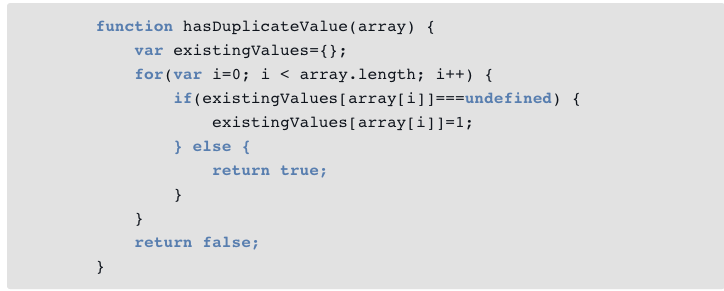
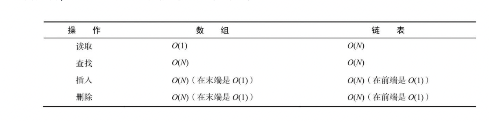
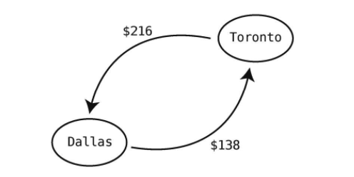
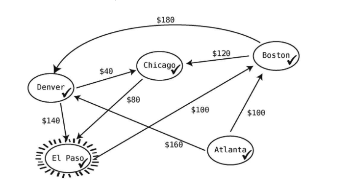

# 数据结构与算法图解

## 第一章 数据结构为何重要

**操作的速度（时间复杂度）：**指的是程序运行的步数，具体的执行时间由机器决定

### 1.1 基础数据结构：数组

数组的结构： [1, 2, 3, 4]

基本操作：读取，查找，插入删除

##### 1.1.1 读取

读取是通过引用直接找到对应的内存地址中的数据值，这种一步是最快的速度，可以理解为复杂度就是1

##### 1.1.2 查找

查找的复杂度和数组的长度有关，如果长度为5的数组复杂度就为5，所以推到长度为N的数组，复杂度就为N

##### 1.1.3 插入

插入的时候需要分为两步：

1. 后续所有商品的向后移一个位置（最复杂情况，第一个元素插入，长度为N的数组需要操作N步） 
2. 插入新元素（1步）

**总计的复杂度：N+1**

##### 1.1.4 删除

删除是插入的逆操作，分为两步：

1. 删除对应的元素（1步）
2. 将后续的所有节点元素左移（N - 1步）

**总计的复杂度：N**


### 1.2 集合：一条规则决定性能

这里的集合指的是类似js中的Set

集合的结构（python）：（1, 2, 3, 4）

基本的操作：读取，查找，插入删除

##### 1.2.1 读取

和数组一样，读取都是直接拿到对应地址中的值，复杂度为1

##### 1.2.2 查找

和数组一样，为N

##### 1.2.3 插入

集合的插入步骤为三步：

1. 查找是否重复（N）
2. 对应位置后的元素都向后移动一个位置，最差（N-1）
3. 插入（1）

**总计：2N**

##### 1.2.4 删除

和数组一样，为N


### 1.3 总结

主要讲了时间复杂度的计算方法，至于后续怎么分析对应的时间复杂度来服务自己写出高性能的代码，需要我们自己选择


## 2. 算法为何重要

算法是什么？为了达到某种目的，执行某种操作的操作流程

算法有啥用？可以决定程序的运行速度

### 2.1 有序数组

以数组为例：[3, 17, 80, 202]

#####  2.1.1 插入步骤

1. 先查找对应插入的位置（一个一个位置对比）
2. 后面元素向后移动
3. 插入

##### 2.1.2 查找步骤

线性查找：从头到位遍历逐一进行对比，因为是有序的，所以一般来说有序数组的查找步骤会少于无序数组

从线性查找来看，两种数据类型查找没有拉开差距，但是当用了其他算法之后，可能性能上就会拉开差距（二分查找）


### 2.2 二分查找

思想：如果是有序数组，先找一半大小的索引值，然后判断目标索引在左侧还是右侧，然后对剩下的部分再进行二分查找

```javascript
// 原文是ruby实现的，这里通过js实现
function bindSearch(array, target) {
  let lowBound = 0
  let highBound = array.length
  let targetIndex = -1

  while (lowBound < highBound) {
    const middleIndex = Math.floor((lowBound + highBound) / 2)

    if (array[middleIndex] === target) {
      targetIndex = middleIndex
      break
    } else if (array[middleIndex] < target) {
      // 不存在的时候只剩最接近的一位，不做这个判断会永远卡在这里死循环了
      if (lowBound === middleIndex) break
      lowBound = middleIndex
    } else {
      highBound = middleIndex
    }
  }

  return targetIndex
}
```


### 2.3 二分查找的优势

有序数组的场景下：

线性查找：最坏复杂度为N，因为需要遍历整个数组，比最后一位还要大的话，就会是N

二分查找：数组的长度每翻一倍，步骤 + 1（log~2~N）


## 3. 大O记法

通过大O计数法，来描述算法的性能级别，来表达数据结构和算法的复杂度

### 3.1 数步法

| 复杂度  | 大O表示 | 解释                           |
| ------- | ------- | ------------------------------ |
| 1数量级 | O(1)    | 一步的操作，例如数组的读取     |
| N数量级 | O(N)    | 对于N个元素，其操作步骤需要N次 |

### 3.2 常数时间和线性时间

常数复杂度：代表随着数据量增长，固定不变的复杂度，例如值的读取

线性复杂度：代表执行步骤随着数据量的增长，线性变化的复杂度

### 3.3 同一算法，不同场景

对于同一算法来说，如果没有特别指出，大O记法一般都是指算法的**最坏情况**

### 3.4 第三种算法

| 复杂度  | 描述                                        | 备注                                           |
| ------- | ------------------------------------------- | ---------------------------------------------- |
| O(N)    | 每增加一个元素，复杂度需要增加1，线性复杂度 | 代表执行步骤随着数据量的增长，线性变化的复杂度 |
| O(1)    | 不管如何增加元素，复杂度都为1，常数复杂度   | 代表随着数据量增长，固定不变的复杂度           |
| O(LogN) | 当数据量翻倍时，复杂度+1                    | 对数复杂度，介于O(1)与O(N)之间                 |

### 总结

主要就是讲了什么是O(N), O(1), O(logN)的大O记法的区别和怎么计算一个算法的复杂度


## 4. 利用大O来给代码提速

###  4.1 冒泡排序

原理：遍历整个数组，每个数组的每个数字都和后一个比， 如果更大就往后交换位置，然后更大的数继续向后比较，直至到底为止


### 4.2 冒泡排序实战/实现

```javascript
let transStep = 0;
let rechargeStep = 0;

function bubbleSort (array) {
  let endLength = 1;
  for(let i = 0; i < array.length; i++) {
    // 比较需要 (N -1) + (N -2) + (N -3) + … + 1
    for (let j = 0; j < array.length - endLength; j++) {
      if (array[j] > array[j + 1]) {
        [array[j], array[j + 1]] = [array[j+1], array[j]]
        rechargeStep++
      }
      transStep++;
    }

    endLength++;
  }
}

const arr = bubbleSort([6, 5, 4, 3, 2, 1])
console.log(arr, transStep, rechargeStep)
```


### 4.3 冒泡排序效率

总体算法的复杂度为==O(N^2^)==

【计算过程】：

**比较**： `(N-1) + (N-2) + …… + 1 = (N - 1) * N / 2 `

**交换**：最坏情况，每次比较都需要交换 所以也是 ` (N - 1) * N / 2`

整体复杂度 : N^2^ - N, 等于==O(N^2^)==的复杂度

### 4.4 复杂度高的解决办法

本文中用了一个例子来说明：**查找纯数字的数组内是否有相同元素**

遍历的实现思路：遍历N * N找对应的元素是否在，复杂度O(N^2^)

利用缓存的实现思路：创建一个新数组L，遍历N次，对应数字i代表值的索引，L[i]置为1，如果L[i]已存在，说明已经有重复的值了，复杂度O(N)

**用空间换时间**，可以利用一个缓存，来降低时间复杂度


## 5. 用或不用大O来优化代码

### 5.1 选择排序

选择排序原理：

1. 从左至右，将第一个元素认为是最小的，记录下索引
2. 一次向后比较，找到整个数组中最小的元素，并记录下索引
3. 交换两者的位置
4. 这个时候第一个元素已经是最小的了，之后需要找第二小的元素，将第二个认为是最小的，重复1～3的步骤

### 5.2~5.3 选择排序实战/实现

```javascript
function chooseSort(array) {
  for (let index = 0; index < array.length; index++) {
    let minIndex = index;

    for (let index = minIndex; index < array.length; index++) {  
      if (array[index] < array[minIndex]) minIndex = index;
    }

    [array[minIndex], array[index]] = [array[index], array[minIndex]]
  }

  return array
}

const items = chooseSort([6, 5, 4, 3, 2, 1])
```

### 5.4 选择排序效率

**比较**： `(N-1) + (N-2) + …… + 1 = (N - 1) * N / 2 `

**交换**：最坏情况，每次都需要交换，所是`N`

整体复杂度：(N^2^ + N) / 2

所以选择排序的复杂度差不多为冒泡排序的一半

### 5.5 忽略常数

对比冒泡和选择排序，两者的对应的大O表达式是保持一致的都是O(N^2^)

因为大O表达式，**忽略常数 N^2^ 和 N^2^/2 都认为是O(N^2^)的复杂度**

### 5.6 大O的作用

1. 当数据量无限增大算法运行的速度logN > N > N^2^是一定的
2. 即使是100N和N^2^也会有在某一个数量级算法运行速度相同的零界点，因此大O描述的都是临界点之后的事情
3. 如果有两个算法跨越两个不同的数量级，那么我们应该知道去选哪种
4. 即使两种算法大O表达式相同他们的速度也不可能完全相同

### 5.7 一个实例

略，其实从冒泡排序和选择排序之间可窥见一斑

### 5.8 总结

1. 大O算法是一种临界点后的参考方式
2. 大O算法指的都是最坏情况下，但是理论上，一半我们代码中遇到的都是平均情况
3. 即使两个算法大O表示相同，他们的效率可能也不同


## 6. 乐观的调优

算法的选择不应该都是按最坏情况进行考虑，可以全面分析各种情况，用来选择适当的算法

### 6.1 插入排序

 原理：

1. 从索引为N（从1开始），第N+1（从2开始）个数从整个数组中拿出
2. 将该数与1～N-1的索引的数比较，找到比他小的位置为M
3. 插入位置为M，M后面的所有数全部向后平移一位，重复1、2两步


### 6.2～6.3 插入排序实战/实现

```javascript
function insertSort (array) {
  for (let i = 0; i < array.length; i++) {
    if (i === 0) continue;

    // 移除N个元素需要N
    const element = array.splice(i, 1)[0];
    let position = i
    for (let j = 0; j < i; j--) {
      if (array[j] > element) {
        // 这里需要对比 1 + 2 + ... + N-1次
        position = j;
      } else {
        break;
      }
    }

    // 这里包括了插入和平移两步操作
    // 最差情况也需要平移 1 + 2 + ... + N-1次
    // 插入N个元素最差要插入N次
    array.splice(position, 0, element);
  }

  return array
}

const rlt = insertSort([6, 5, 4, 3, 2, 1])
```


### 6.4 插入排序的效率

根据6-2中的步骤数量进行计算，插入排序总的复杂度为

N + (N-1) * N /2 * 2 + N = N^2^ + N

所以总的复杂度也为O(N^2^)


如果从最差的情况的大O表达式来看，目前三种类型排序的顺序为

选择排序（(N^2^ + N) / 2）< 冒泡排序（N^2^ - N）< 插入排序（N^2^ + N）


**但是实际情况真的如此吗？**


### 6.5 平均情况

对于`插入排序`而言，最坏、平均、最好情况的复杂度分别是N^2^、N^2^/ 2 以及 N步（这是由于只要对比到之前有比插入的元素更小的就可以停止比较，所以在不同的对比场景中差异较大）


而对于`选择排序`来说都是N^2^（原因是不管如何都需要对比到最后一个元素才知道当前元素是不是剩下中最小的那个元素）


原因：**因为选择排序没有中途退出的机制，所以永远复杂度都是N^2^**,但是**插入排序在对比的过程中可以提早退出循环**，所以算法的性能会得到很大的优化


所以到底哪种算法更好，要看情况


## 7. 查找快速的散列表

### 7.1 散列表

在javascript中的散列表就是对象，在python中是字典。

``` javascript
// 定义一个散列表
const a = { a: 1, b: 2 }

// 通过散列表查询

a['a'] // 1
```

**在散列表中查找值的效率为O(1)**，对于查找带来了无与伦比的性能优势


### 7.2 用散列函数来做散列

散列函数运作的简单案例：

1. 先规定一个映射的关系图

```
A -> 1
B -> 2
C -> 3
D -> 4
E -> 5
F -> 6
G -> 7
```

2. 根据关系图将对应的字符串转换为数字`BAE -> 215`
3. 通过散列函数来进行计算，比如求和 2+1+5 -> 8 （实际要比这个复杂）

【注】这个散列转换的办法一定是可复制的，即多次计算可以得到相同的值（如果输入相同的话）


### 7.3 一个好玩又赚钱的同义词典

散列表存储的原理就是，通过`散列函数`计算出对应的值应该存储的`散列地址`，将对应的内容存进去，之后查询的时候只需要将**查询的索引通过散列函数进行计算**，直接可以查询到对应的散列值，即查询复杂度为O(1)


### 7.4 处理冲突

上述存储存在一个问题，==如果两个索引值对应的散列值相同怎么办==


解决办法：

1. 分离链接，就是在散列相同的时候，存储一个数组，数组的每一个元素中包含了key + value

   查询过程：先看散列对应的值是否为一个数组，如果是数组在找key匹配的对应的索引值，最坏情况O(N)(所有需要存储的key-value中key对应的散列函数计算结果都相同)


### 7.5 找到平衡

散列表的效率：

1. 要存多少数据
2. 要有多少可用的格子
3. 用什么样的散列函数

散列表需要考虑的问题：1. 既要避免冲突（散列表尽可能的大）2. 节约空间（避免不必要的浪费）

目前的扩展法则：**每增加7个元素，就增加10个格子**


### 7.6 一个实例

通过散列表的方式在验证是否数组中有重复的元素




通过统计一个数组中重复元素的数量，代码略（比较简单不赘述了）

【思路】如果散列表中有对应的key，值+1，否则将该key的值置为1


## 8. 用栈和队列来构造灵巧的代码

数据结构本身是一种遵循特殊约束的数据形式，比如栈和队列

栈：**先入后出**

队列：**先入先出**

### 8.1 栈

#### 8.1.1 特殊约束

+ 只能在末尾插入数据
+ 只能读取==末尾==的数据
+ 只能移除==末尾==的数据


#### 8.1.2 特殊术语

1. 压栈： 往栈中添加元素
2. 出栈：从栈顶移除数据


#### 8.1.3 特点

栈：**先入后出**（LIFO：last in first out）

### 8.2 栈实战

实战解决的问题就是，用来检测javascript的一段代码中的`{}`, `()`, `[]`是否匹配的问题

```javascript
const pushStackMarks = ["(", "{", "["]
const outStack = [")", "}", "]"]

function matchBracket (origin, target) {
  const orginIdx = pushStackMarks.indexOf(origin)

  return outStack[orginIdx] === target
}

function lintCode (str) {
  const stack = []

  for (let index = 0; index < str.length; index++) {
    const char = str[index];
    if (pushStackMarks.includes(char)) {
      stack.push(char)
    } else if(outStack.includes(char)) {
      const outStackElem =  stack.pop()

      if (!matchBracket(outStackElem, char)) {
        return false
      }
      
    }
  }

  return true
}


const lintStr = '(var a = { a: 1, b: 2, c: [1, 2, 3] })'

const rlt = lintCode(lintStr)

```


### 8.3 队列

####  8.3.1 约束

+ 只能在末尾插入数据
+ 只能读取==开头==的数据
+ 只能移除==开头==的数据


#### 8.3.2 特殊术语

1. 出队：取出队列中的元素
2. 入队：为队列中加入元素


#### 8.3.3 特点

先入先出：FIFO


### 8.4 队列实战

只要需要顺序执行的场景基本都是队列，比如IO顺序输出，异步顺序执行等


## 9. 递归


### 9.1 用递归代替循环

一个倒计时的例子：

```javascript
function countDown(num) {
  if (num < 0) return
  console.log(num)

  countDown(num - 1)
}

countDown(10)
```

【注意】使用递归的时候，我们需要控制好递归的结束点，不然会造成无限递归的问题，非常危险


### 9.2 基准情形

刚才说到的结束递归的点，称之为`基准情形`，在递归算法中，这是必要的


### 9.3 阅读递归代码

**具体方法：1. 从基准情形下手进行阅读 2. 从基准情形一步一步增加基准值，反推得到对应的结果**

例如，倒计时的例子，我们一步一步计算，countDown(0), countDown(1), ……等一路向上，就能明白该递归算法的意图


### 9.4 计算机眼中的递归

计算机并不是反推的，而是从头到尾开始执行算法的，

从一个求阶乘的计算结果开始：

```javascript
function factorial(num) {
  if (num === 1) return 1

  return num * Fibonacci(num - 1)
}

const rlt = Fibonacci(5)
```

因此，当调用`factorial(5)`的时候，`factorial(4)`，`factorial(3)`，.......，`factorial(1)`会分别被压入栈中，当num为1的时候，逐次出栈，因此如果无限递归，会将同一个方法疯狂的压入调用栈，所以会报栈溢出的错误


### 9.5 递归实战

文件夹目录的递归，获取对应的文件和文件夹信息：

```javascript
const fs = require('fs')

const walkDirs = []
let isEmpty = false

const FILE_TYPE = {
  FILE: 0,
  DIRECTORY: 1
};

function _walk(basePath, recordDir = false) {
    const filenames = fs.readdirSync(basePath);
    if (filenames.length) {
      isEmpty = false;
      filenames.forEach(file => {
        const _path = path.join(basePath, file);
        try {
          if (fs.statSync(_path).isDirectory()) {
            _walk(_path, recordDir);

            if (recordDir) {
              _walkDirs.push({ path: _path, type: FILE_TYPE.DIRECTORY });
            }
          } else {
            this._walkDirs.push({ path: _path, type: FILE_TYPE.FILE });
          }
        } catch (error) {
          console.log("error = ", error);
        }
      });
    }
  }
```


## 10. 飞快的递归算法

这一章讲讲一下快排，先了解其中的分区的概念


### 10.1 分区

**是什么**：分区指的是，在数组中随机选择一个数作为轴，然后把比他大的值放到轴的左边，比他小的值放到轴的右边

**怎么做**：

1. 确定轴的位置 
2. 确定左右两个指针
3. 左右指针移动（移动规则：左指针找比基准值小的找到停止，否则一直右移，有指针找比基准大的值找到停止，否则一值左移）
4. 左右指针都找到了想要的值，则交换左右指针对应位置的值
5. 左右指针指向同一个值判断和基准值的大小，比基准大则交换，否则就不变


**具体的实现方式**

```javascript
function partition(array, ctx = {}) {
  // 如果整个数组的长度小于1直接返回（边界条件）
  if (array.length <= 1) return array

  // 如果只有两个数的话，可以直接比较交换
  if (array.length === 2) {
    if (array[0] > array[1]) {
      [array[1], array[0]] = array
    }
    return array
  }

  // 默认轴为最后一个数
  const base = array[array.length - 1]
  let leftPointer = 0
  let rightPointer = ctx.basePointer = array.length - 2

  while (leftPointer !== rightPointer) {
    if (array[leftPointer] <= base) {
      leftPointer++;
      continue
    }

    // 左指针找到大值
    // 右指针找小值
    if (array[rightPointer] > base) {
      rightPointer--
      continue;
    }

    [array[leftPointer], array[rightPointer]] = [array[rightPointer], array[leftPointer]]
  }

  if (array[leftPointer] > base) {
    [array[leftPointer], array[array.length - 1]] = [base, array[leftPointer]]
    ctx.basePointer = leftPointer
  }

  return array
}

```


### 10.2 快速排序

在生成了第一个分区后，则需要递归的将分区的左右部分分别继续进行分区排序，最后将分区后的值组合起来即可

```javascript

function quickSort(array) {
  let ctx = {
    basePointer: array.length - 1
  }

  if (array.length <= 1) return array

  // 对数组进行分区
  const partitions = partition(array, ctx)
  const base = ctx.basePointer

  // 左边排序结果
  const leftArray = quickSort(partitions.slice(0, base))
  // 右边排序结果
  const rightArray = quickSort(partitions.slice(base + 1, array.length))

  return [...leftArray, array[base], ...rightArray]
}

const array = [0, 5, 2, 1, 8, 6]
const rlt = quickSort(array)
```


### 10.3 快速排序效率

快排主要的步骤包含：比较、交换

**分区中**

比较：一次分区至少经过N次比较，因为每个数都需要和基准进行比较

交换：最少一次交换，最多N/2次交换，平均为N/4次

所以比较 + 交换做一次分区 = 1.25N


假设平均每次的轴都是该数组的一半位置，那么就需要切**logN**，每次都需要对N个元素做分区，所以复杂度是1.25N * logN， 总的平均复杂度为**O(N*logN)**，最坏情况，每次都是首或尾，这样需要切N次，所以最坏的复杂度为**O(N^2^)**


### 10.4 快速选择

快速选择的思想是，比如我们想要获得第3小的元素，那么其实就可以利用分区的思想，类似二分法，只招对应需要侧的元素中排序为3的位置即可，不需要对整个数组进行排序，基本上就是N(LogN)的复杂度

```javascript
function fastSearch(kthMin, array) {
  let ctx = {
    basePointer: array.length - 1
  }

  if (array.length <= 1) return array[0]

  const partitions = partition(array, ctx)
  const base = ctx.basePointer
  if (kthMin - 1 === base) {
    return array[base]
  }

  if (kthMin -1 < base) {
    return fastSearch(kthMin, partition(partitions.slice(0, base), ctx))
  }

  return fastSearch(kthMin + base, partition(partitions.slice(base + 1, array.length), ctx))
}
```

## 11. 基于节点的数据结构

### 11.1 链表

链表和数组的区别，数组是一块区域，链表每个节点都是分散的，但是链表每个节点除了保存值外，还保存了对应下一个值的地址位置


### 11.2～11.7 实现

#### 11.7.1 实现过程

链表目前包含两个部分

1. 节点

   ```javascript
   // 节点部分，除了自身的值，还需要记住下一跳的地址
   class Node {
     constructor(value) {
       this.value = value
       this.nextNode = null
     }
   }
   ```

   

2. 链表

   1. 读取：链表的读取的时间复杂度O(N)相比，因为如果要读取N个数据，需要从第一个数据开始不断的读后一个节点，相比列表的O(1)这是个劣势
   2. 查找：查找链表和数组相比复杂度相同都是O(N)
   3. 插入：对比数组，因为数组在插入元素的时候，后面的所有元素都要右移一位，所以复杂度为O(N^2^)，而链表只需要断开对应的nextNode的连接，所以复杂度为O(1)，查找到匹配的结点，最坏的复杂度为O(N)，所以复杂度为O(N)
   4. 删除：删除的复杂度和插入一样，对比结果也相似

```javascript
class LinkList {
  constructor() {
    this.firstNode = null;
    this.nextPos = null;
  }

  add(node) {
    const newNode = node instanceof Node ? node : new Node(node);

    if (!this.firstNode) {
      this.firstNode = newNode;
      this.nextPos = this.firstNode;
      return this
    }

    this.tranverse((node, setContinue) => {
      if (!node.nextNode) {
        node.nextNode = newNode
        setContinue(false)
      }
    })

    return this;
  }

  read(idx) {
    if (!this.firstNode) return undefined;
    let i = 0;
    let rlt = undefined;
    this.tranverse((node, setContinue) => {
      if (i !== idx) {
        i++;
        return;
      }

      rlt = node.value;
      setContinue(false);
    });

    return rlt;
  }

  tranverse(fn) {
    let node = this.firstNode;
    let isContinue = true;

    const setContinue = (value) => {
      isContinue = value;
    };

    while (isContinue) {
      if (!node) {
        break;
      }
      fn(node, setContinue);
      node = node.nextNode;
    }
  }

  showAll() {
    let idx = 0;
    let content = [];
    this.tranverse((node) => {
      const value = node.value;
      content.push(value);
      idx++;
    });

    console.log(content.join(" -> "));
  }

  indexOf(value) {
    let idx = 0;
    let currentIdx = undefined;

    this.tranverse((node, setContinue) => {
      if (node.value !== value) {
        idx++;
        return;
      }

      currentIdx = idx;
      setContinue(false);
    });

    return currentIdx;
  }

  insertNode(pos, node) {
    let _node = node instanceof Node ? node : new Node(node);
    let isSuccess = false;

    let idx = 0;
    if (pos === idx) {
      // 第一个节点插入
      _node.nextNode = this.firstNode;
      this.firstNode = _node;
      return true;
    }

    this.tranverse((node, setContinue) => {
      if (idx !== pos - 1) {
        idx++;
        return;
      }

      let nextNode = node.nextNode;
      node.nextNode = _node;
      node.nextNode.nextNode = nextNode;
      isSuccess = true;
      setContinue(false);
    });

    if (!isSuccess) {
      throw Error("未找到对应插入节点");
    }

    return true;
  }

  deleteNode(pos) {
    let idx = 0;
    let rlt = false;

    if (pos === 0) {
      const prevFirstNode = this.firstNode;
      this.firstNode = prevFirstNode.nextNode;
      prevFirstNode.nextNode = null;
      return true;
    }

    this.tranverse((node, setContinue) => {
      if (idx === pos - 1) {
        const nextNode = node.nextNode;
        if (!nextNode) {
          return;
        }

        node.nextNode = nextNode.nextNode;
        nextNode.nextNode = null;
        setContinue(false);
      }

      idx++;
    });

    return rlt;
  }
}
```


#### 11.7.2 效率对比



### 11.8 双向链表

双向链表中，每个节点除了记住前向的节点外，还需要记住后向的节点，整个链表除了第一个节点外，还记住最后一个节点的信息

**有点**：队列操作的复杂度都是O(1)

```javascript
class Node {
  constructor(value) {
    this.value = value;
    this.nextNode = null;
    // 新增前向节点
    this.prevNode = null;
  }
}

class LinkList {
  constructor() {
    this.firstNode = null;
    this.lastNode = null;
  }

  add(node) {
    const newNode = node instanceof Node ? node : new Node(node);

    if (!this.firstNode) {
      this.firstNode = newNode;
      // 需要对lastNode进行移动
      this.lastNode = this.firstNode;
      return this;
    } else {
      // 增加只需要增加最后一个节点的nextNode即可
      newNode.prevNode = this.lastNode;
      this.lastNode.nextNode = newNode;
      this.lastNode = this.lastNode.nextNode;
    }

    return this;
  }

  read(idx) {
    if (!this.firstNode) return undefined;
    let i = 0;
    let rlt = undefined;
    this.tranverse((node, setContinue) => {
      if (i !== idx) {
        i++;
        return;
      }

      rlt = node.value;
      setContinue(false);
    });

    return rlt;
  }

  tranverse(fn) {
    let node = this.firstNode;
    let isContinue = true;

    const setContinue = (value) => {
      isContinue = value;
    };

    while (isContinue) {
      if (!node) {
        break;
      }
      fn(node, setContinue);
      node = node.nextNode;
    }
  }

  // 反向遍历方法
  tranverseRight(fn) {
    let node = this.lastNode;
    let isContinue = true;

    const setContinue = (value) => {
      isContinue = value;
    };

    while (isContinue) {
      if (!node) {
        break;
      }
      fn(node, setContinue);
      node = node.prevNode;
    }
  }

  showAll() {
    let content = [];
    this.tranverse((node) => {
      const value = node.value;
      content.push(value);
    });

    console.log(content.join(" -> "));
  }

  showAllReverse() {
    let content = [];
    this.tranverseRight((node) => {
      const value = node.value;
      content.push(value);
    });

    console.log(content.join(" <- "));
  }

  indexOf(value) {
    let idx = 0;
    let currentIdx = undefined;

    this.tranverse((node, setContinue) => {
      if (node.value !== value) {
        idx++;
        return;
      }

      currentIdx = idx;
      setContinue(false);
    });

    return currentIdx;
  }

  insertNode(pos, node) {
    let _node = node instanceof Node ? node : new Node(node);
    let isSuccess = false;

    let idx = 0;
    if (pos === idx) {
      // 第一个节点插入
      _node.nextNode = this.firstNode;
      this.firstNode = _node;
      return true;
    }

    this.tranverse((node, setContinue) => {
      if (idx !== pos - 1) {
        idx++;
        return;
      }

      let nextNode = node.nextNode;
      // 插入时，需要对后一个节点的prevNode做处理
      _node.prevNode = node;
      node.nextNode = _node;
      nextNode.prevNode = node.newNode;
      node.nextNode.nextNode = nextNode;
      isSuccess = true;
      setContinue(false);
    });

    if (!isSuccess) {
      throw Error("未找到对应插入节点");
    }

    return true;
  }

  deleteNode(pos) {
    let idx = 0;
    let rlt = false;

    if (pos === 0) {
      const prevFirstNode = this.firstNode;
      prevFirstNode.prevNode = null;
      this.firstNode = prevFirstNode.nextNode;
      prevFirstNode.nextNode = null;
      return true;
    }

    this.tranverse((node, setContinue) => {
      if (idx === pos - 1) {
        const nextNode = node.nextNode;
        if (!nextNode) {
          return;
        }

        // 需要释放和增加prevNode的引用
        nextNode.nextNode.prevNode = node;
        node.nextNode = nextNode.nextNode;
        nextNode.nextNode = null;
        setContinue(false);
      }

      idx++;
    });

    return rlt;
  }
}
```


## 12. 让一切操作都更快的二叉树

现有数据结构的问题：

1. 数组：查询可以通过二分查找复杂度为logN，但增加和删除元素的复杂度较高
2. 散列表：虽然查询插入删除复杂度都是O(1)，但是不保持插入元素的顺序

为了有好的查询插入删除性能，也能保证插入的顺序，这里来看二叉树


### 12.1 二叉树

#### 12.1.1 二叉树数据结构的特点

1. 树的结构也是基于结点的数据结构。
2. 二叉树的每个子节点数量是0、1、2
3. 如果有顺序，需要一个节点的值大于父节点，一个节点的值小于父节点


### 12.2～12.5 二叉树的增删改查

+ 插入节点：
  + 小的节点在父节点的左边，大的节点插入父节点的右边，最坏情况O(N)，平衡情况下是O(logN)
+ 查询节点
  + 对比值，小的只去左边查询，大的只去右边查询，最坏情况O(N)，平均情况O(logN)
+ 删除节点
  + 如果删除的节点没有子节点直接删除
  + 如果删除的节点带一个子节点，需要将删除节点的子节点挂到该节点的位置上
  + 如果删除的节点带两个子节点，用子树的后继节点替换本节点
    + 后继节点为本树中最小的节点，即最左边的节点
    + 后继节点不可能有左节点，如果有右节点的话，把后继节点的左节点替换成后继节点的右节点
  + 删除效率平均是O(logN)最差情况O(N)

```javascript
class TreeNode {
  constructor(value, leftNode = null, rightNode = null) {
    this.value = value;
    this.leftNode = leftNode;
    this.rightNode = rightNode;
  }
}

class BinarayTree {
  constructor() {
    this.root = null;
  }

  traverseNode(node = this.root) {
    if (!node) return;

    this.traverseNode(node.leftNode);
    console.log(node.value);
    this.traverseNode(node.rightNode);
  }

  insertNode(nodeVal) {
    const newNode = nodeVal instanceof TreeNode ? node : new TreeNode(nodeVal);

    if (!this.root) {
      this.root = newNode;
      return this;
    }

    let node = this.root;

    while (node) {
      if (node.value > nodeVal) {
        if (!node.leftNode) {
          node.leftNode = newNode;
          break;
        } else {
          node = node.leftNode;
        }
      }

      if (node.value <= nodeVal) {
        if (!node.rightNode) {
          node.rightNode = newNode;
          break;
        } else {
          node = node.rightNode;
        }
      }
    }

    return this;
  }

  searchNode(nodeVal) {
    let node = this.root;

    while (node !== null) {
      if (node.value > nodeVal) {
        node = node.leftNode;
        continue;
      }

      if (node.value === nodeVal) return true;

      if (node.value < nodeVal) {
        node = node.rightNode;
      }
    }

    return false;
  }

  _findSuccessorNode(subTree) {
    let node = subTree;
    let parentNode = subTree;

    while (node !== null) {
      if (node.leftNode) {
        parentNode = node;
        node = node.leftNode;
        continue;
      } else {
        // 最后一个左节点
        if (!parentNode || parentNode === subTree) {
          return node;
        } else {
          parentNode.leftNode = node.rightNode;
          node.rightNode = null;
          return node;
        }
      }
    }
  }

  deleteNode(nodeVal) {
    let node = this.root;
    let parentNode = null;
    let nodePos = "leftNode";

    while (node !== null) {
      if (node.value === nodeVal) {
        // 叶子节点
        if (!node.leftNode && !node.rightNode) {
          if (!parentNode) {
            this.root = null;
            break;
          }

          parentNode[nodePos] = null;
        }

        // 左右子节点都存在
        if (node.leftNode && node.rightNode) {
          const successorNode = this._findSuccessorNode(
            node.rightNode,
            node
          );

          if (node.rightNode !== successorNode) {
            successorNode.rightNode = node.rightNode;
          }

          successorNode.leftNode = node.leftNode
          parentNode[nodePos] = successorNode;
          break;
        }

        // 左右子节点存在一边的场景
        if (node.leftNode) {
          parentNode[nodePos] = node.leftNode;
          break;
        }

        if (node.rightNode) {
          parentNode[nodePos] = node.rightNode;
          break;
        }
      }

      parentNode = node;

      if (node.value > nodeVal) {
        node = node.leftNode;
        nodePos = "leftNode";
        continue;
      }

      if (node.value < nodeVal) {
        node = node.rightNode;
        nodePos = "rightNode";
      }
    }
  }
}

```


### 12.6 总结

二叉树最大的优点就是，平均复杂度增删查的复杂度都是O(logN)


## 13 链接万物的图

图的适用场景，通过索引A能搜索到B通过索引B也能搜索到A，适用于多对多的查询

目前可以通过一个二维数组，平铺一对一的关系来找到多对多的信息，，如果使用二维数组来查找一对多的关系需要遍历整个数组，这样查询的复杂度为O(N)。

利用图来构建多对多的关系，通过O(1)即可从多对多的关系中找到其中一条一对多的数据


### 13.1 图

通过散列表来实现图，比如，用户朋友圈

```javascript
const friends = {
  Alice: ["Bob", "Diana", "Fred"],
  Bob: ["Alice", "Cynthia", "Diana"],
  Cynthia: ["Bob"],
  Diana: ["Alice", "Bob", "Fred"],
  Elise: ["Fred"],
  Fred: ["Alice", "Diana", "Elise"]
}
```

通过散列的方式来实现O(1)的查询和增删查，通过数组的形式来实现关系的维护

==tips==：这里也可以通过面向对象的方式做二次封装


### 13.2 广度优先搜索

何为广度优先搜索，以13.1中的图为例，以Alice为起点线遍历Alice的朋友，然后alice的朋友中有Bob，Diana，Fred，在讲Bob的朋友中没被遍历到的找出来，Cynthia，Diana的朋友分别找出来，==每次只遍历找到该节点的相邻节点==，而==一路递归对子节点“刨根问底”到最后一个节点（深度优先遍历）==


**广度搜索遍历步骤：**

1. 找出当前顶点的所有邻接点，没有被访问过的入队
2. 如果没有访问的邻接点，就再从邻点队列中移出一个节点作为顶点
3. 如果邻点队列都为空且，当前节点也没有任何节点可以入队则算法结束


```javascript
function breadthFirst (graph, startNode) {
  // 结果队列
  let rlt = [startNode];
  // 邻节点队列
  let restNode = [startNode]

  while(restNode.length) {
    const nextNode = restNode.shift()

    if (!graph[nextNode]) continue

    (graph[nextNode] || []).forEach(item => {
      if (rlt.includes(item)) return;

      rlt.push(item)
      restNode.push(item)
    })
  }

  return rlt
}

```


**算法复杂度O(V + E)**, V代表出队的数量，E代表访问的数量，所有访问邻节点的步数为边数的两倍，所以有E条边就有2E的访问量，因为是双向的。

这个算法复杂度的解释：如果有`V`个人，理论上，遍历每个节点，至少要都需要出队，就是需要==V个节点都出队==，所以复杂度==O(V)==但是每个顶点之间有关系，设为有`E`条边，没条边比如A和B关联，在A的图中需要查到B这条边，在B的图中也能查到A这条边，所以，这里有`2E`次查询，所以总的复杂度是==O(V + 2E)==，忽略常数也就是==O(V + E)==**这里的E可能会有各种顶点间的交叉，所以会很复杂**


### 13.3 图数据库

图的结构很适合用来存储关系型数据库

一般关系型数据库用来存储的时候需要两张表，以朋友关系图为例，一张保存个人信息（个人的信息），一张保存朋友关系（id的映射）

用图数据库查询的优化：

1. 传统的列表结构，首先在关系表中根据id查询出对应的朋友User的列表，假设朋友id为[2, 4, 5, 6, 7]五人，然后需要从个人信息表中查询出这五人的信息，因为这个==列表是顺序表（数据库保证）==，所以根据`二分查找`的复杂度为==O(logN)==查询5人就是==O(5logN)==，假设需要查询M人，所以从顺序表中查询M人如果是传统的顺序数组复杂度为==O(MlogN)==
2. 如果使用图的话，该节点已经找到，所以只需要遍历N个朋友也就是上面说的E条边，所以复杂度就是==O(N)==


### 13.4 加权图

加权图：边上具有一定权重数值，比如往返的机票，从多伦多到达拉斯需要216刀，但是从达拉斯刀多伦多却需要138刀，这个权重值不一样

方向图：就是是一个有方向的图，从多伦多到达拉斯和从达拉斯到多伦多由于方向不同，而导致对应的权重不同，即不是平等的




### 13.5 Dijkstra算法

**算法步骤：**

1. 以起点作为当前的顶点
2. 每个顶点计算所有相邻节点的权重，并记录下来
3. 获取一个能达到总权重最小的点，作为下一个当前顶点
4. 重复上述三步，直到所有顶点都被访问过




13.4中提到了加权图，在我们生活中经常可以通过加权图来解决最短路径的问题，接下来我们来通过Dijkstra算法来实现**获取某个城市到上述城市，机票价格最低的问题的解决方案**


#### 13.5.1 创建图结构

```javascript
// 图结构的创建
// 用面向对象的方式创建一个图结构
// 具体的路径关系（边）在routes中维护
class City {
  constructor(name) {
    this.name = name;
    this.routes = [];
  }

  addRoute(city, price) {
    this.routes.push({
      city,
      price,
    });

    return this;
  }
}

const Atlanta = new City("Atlanta");
const Boston = new City("Bostan");
const Denvor = new City("Denvor");
const Chicago = new City("Chicago");
const ElPaso = new City("ElPaso");

Atlanta.addRoute(Boston, 100).addRoute(Denvor, 160);
Boston.addRoute(Chicago, 120).addRoute(Denvor, 180);
Denvor.addRoute(Chicago, 40).addRoute(ElPaso, 140);
Chicago.addRoute(ElPaso, 80);
ElPaso.addRoute(Boston, 100);
```


#### 13.5.2 实现对应的算法

```javascript
// @todo 这部分代码后续可以优化
// 具体的算法实现
// 这个可以经过所有经过的路线
const pathRlt = {};

function dijkstra(startCity) {
  let nextCity = { city: startCity, price: 0, prePath: "", preCityPrice: 0 };
  const hasArrived = [];
  const priceRlt = {};
  const nextCities = [];

  while (nextCity) {
    const currentCityName = nextCity.city.name;
    const currentCityPrice = nextCity.price;
    const currentPrePath = nextCity.prePath;
    const currentPrePrice = nextCity.preCityPrice;
    const rltCity = priceRlt[currentCityName];

    const routes = nextCity.city.routes;
    let cityPrice = Number.MAX_SAFE_INTEGER;
    const priceSum = currentCityPrice + currentPrePrice;

    // 去目的地最佳的价格保存起来
    if (!rltCity) {
      cityPrice = priceRlt[currentCityName] = priceSum;
    } else {
      cityPrice = priceRlt[currentCityName] = Math.min(
        priceRlt[nextCity.city.name],
        priceSum
      );
    }

    // 记录当前节点之前的路线
    const nextPath = currentPrePath || currentCityName;
    // 这里可以记录所有路线的经过
    pathRlt[nextPath] = cityPrice;

    // prePath需要重置
    nextCities.push(
      ...routes.map((item) => ({
        ...item,
        prePath: nextPath,
        preCityPrice: priceSum,
      }))
    );

    // 已走过的路线需要被记录
    hasArrived.push(nextPath);
    // 下一个需要遍历的节点
    let _nextCity = nextCities.shift();
    preCityPrice = cityPrice;
    const composePrePath = `${_nextCity.prePath}_${_nextCity.city.name}`;

    nextCity =
      // 没有走过这条路线
      !hasArrived.includes(composePrePath) &&
      // 这条路线中没有走到过这个城市
      (!_nextCity.prePath.includes(_nextCity.city.name) ||
        _nextCity.prePath.indexOf(_nextCity.city.name) ===
          nextPath.length - _nextCity.city.name.length)
        ? _nextCity
        : null;

    if (!nextCity) {
      // 该节点已经被经过则重新更换节点
      nextCity = nextCities.shift();
    } else {
      nextCity = { ...nextCity, prePath: composePrePath };
    }
  }

  return priceRlt;
}

const rlt = dijkstra(Atlanta, [Boston, Denvor, Chicago, ElPaso]);

console.log(rlt);
```


## 14. 对付空间限制

### 14.1 描述空间复杂度的大O记法

时间复杂度：通过大O表达式来表达算法的步数

空间复杂度：当存在N个元素的时候，需要消耗多少元素大小的内存空间

| 大O记法 | 解释                                                         | 备注 |
| ------- | ------------------------------------------------------------ | ---- |
| O(N)    | 算法执行过程中，N个输入元素需要额外的N的空间进行数据的存储   |      |
| O(1)    | 算法执行过程中，除了本来输入的N个元素，没有额外的辅助空间来消耗内存 |      |


### 14.2 时间和空间之间的权衡

==如何选择一个好的算法==：**需要从时间复杂度和空间复杂度去从何考虑**

如何选择：将时间复杂度和空间复杂度列出来，然后根据自己的需要，如果内存充足，时间要求高，就偏向时间复杂度低的选择，内存吃紧就选择时间复杂度相对较高，空间复杂度较低的算法


