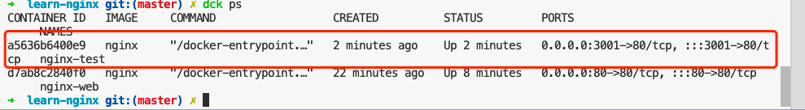
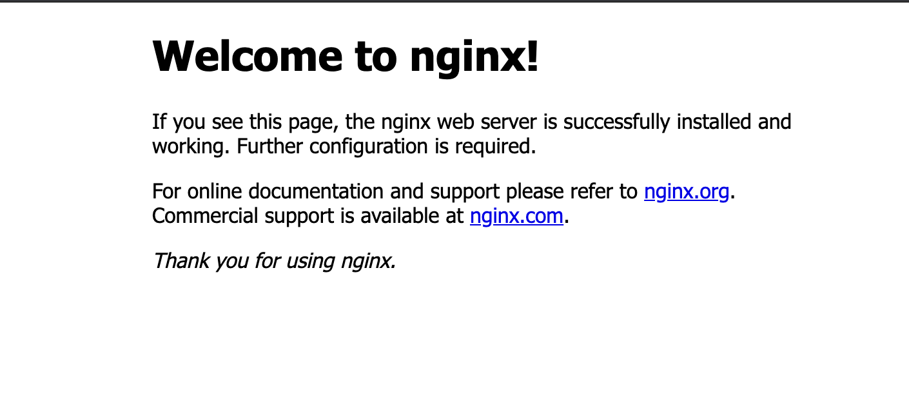
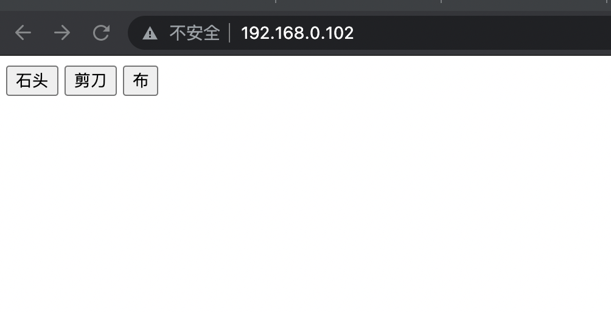

# 前端必须知道的Nginx

## 1. Nginx简介

### 1.1 是什么？

> "Nginx是一款轻量级的HTTP服务器，采用事件驱动的异步非阻塞处理方式框架，这让其具有极好的IO性能，时常用于服务端的反向代理和负载均衡。"

从官网的介绍中可以看出几个关键词`事件驱动`、`非阻塞`、`反响代理`、`负载均衡`、`HTTP服务器`

### 1.2 优点

1. 高并发性能好
2. 能存消耗少
3. 可商业化
4. 配置简单
5. 反向代理
6. 负载均衡
7. 灰度发布


## 2. 安装

[docker安装教程](https://juejin.cn/post/7000652858353778695)

[docker安装nginx并配置反向代理](https://blog.csdn.net/weixin_40461281/article/details/92586378)

### 2.1 预备动作

#### 2.1.1 下载镜像

```bash
docker pull nginx
```


#### 2.1.2 查看镜像文件

**启动nginx镜像**

```bash
# 运行docker
docker run -p 3001:80 --name ngix-test nginx
```


**观察docker看容器是否已经成功启动**




**看nginx是否启动成功**

之后我们登录`127.0.0.1:80`可以看到nginx自带的index.html页面



**观察配置文件**

```bash
# 进入镜像的bash
docker exec -it nginx-test bash

# 进入到镜像内
root@a5636b6400e9:/# cat /etc/nginx/nginx.conf
```


这个时候我们观察对应的配置文件

```nginx
user  nginx;
worker_processes  auto;

# 这里可以看到log的地址为/var/log
error_log  /var/log/nginx/error.log notice;
pid        /var/run/nginx.pid;


events {
    worker_connections  1024;
}


http {
    include       /etc/nginx/mime.types;
    default_type  application/octet-stream;

    log_format  main  '$remote_addr - $remote_user [$time_local] "$request" '
                      '$status $body_bytes_sent "$http_referer" '
                      '"$http_user_agent" "$http_x_forwarded_for"';

    access_log  /var/log/nginx/access.log  main;

    sendfile        on;
    #tcp_nopush     on;

    keepalive_timeout  65;

    #gzip  on;

    include /etc/nginx/conf.d/*.conf;
}
```

### 2.2 静态页面映射

**共享配置文件镜像创建**

```bash
# 在本文件夹下创建三个目录
# 分别用来存储对应展示的html，日志和配置
mkdir -p www logs conf

# 将对应conf文件复制一份
docker cp nginx-tes:/etc/nginx/nginx.conf ./conf
```

```bash
# 映射到本文件的基地址
export dir = /Users/XXX/Learn/Essays/learn-nginx
# 这里的$dir指的是对应的文件目录
docker run -d --name nginx-web -p 80:80 -v "$dir/www:/usr/share/nginx/html" -v "$dir/conf/nginx.conf":/etc/nginx/nginx.conf -v "$dir/logs":/var/log/nginx nginx
```


映射的文件:

**/usr/share/nginx/html: **用于存放nginx中展示页面的路径，其中index.html为默认的首页，50x.html为访问失败对应的展示的页面

**/var/log/nginx**：用于存放日志的文件夹，access.log（请求打到nginx的日志，成功日志）,  error.log（错误日志）


**为www下的文件中新增自己的html首页**

```html
<!DOCTYPE html>
<html lang="en">
<head>
  <meta charset="UTF-8">
  <meta http-equiv="X-UA-Compatible" content="IE=edge">
  <meta name="viewport" content="width=device-width, initial-scale=1.0">
  <title>Hello Nginx</title>
</head>
<body>
  <h1>Hello</h1>
  <h2>Welcome to you! First Nginx Web Application is on</h2>
  <div>映射成功</div>
</body>
</html>
```


**登录本机80端的页面，检查是否映射ok**


### 2.2 反向代理配置

反向代理是什么：将对应的请求转发到对应的服务器上，让用户对服务器无感知，反向代理隐藏真实服务端


**nginx怎么做：**将对应的请求转发到某一台**我们指定的服务器上**

**怎么配置**

```nginx
server {
        listen 80; # 监听的端口
        charset utf-8;
        server_name 192.168.0.102; 

        location / {
            proxy_pass http://192.168.0.102:3000; # 需要转发的地址
            proxy_redirect default;
        }
    }
```


【注意】这里配置在server的大括号后 和location的后大括号不要增加`；`不然可能导致配置出错


**效果**

重新启动对应的nginx镜像后，登录80端口的页面，可以看到已经转发到了一个本地的nodejs应用中



## 3. nginx文件详解

配置文件目录：==/etc/nginx==下的==nginx.conf==（主配置文件，由它配置对应的路由到对应的conf文件的配置）和==nginx.conf.default==，另外还有一个==conf.d==的文件下，对应的是各个应用的nginx配置文件，比如a应用可能就是a.conf，b应用就是b.conf，这个**conf.d文件夹在/etc/nginx下**

存放静态文件：/usr/share/nginx

存放日志文件：/var/log/nginx


## 4. 常见命令

| 命令            | 作用                 | 备注 |
| --------------- | -------------------- | ---- |
| nginx           | 启动nginx            |      |
| nginx -s stop   | 停止nginx            |      |
| nginx -s quit   | 停止nginx            |      |
| nginx -s reload | 重启nginx            |      |
| nginx -t        | 检查配置文件是否正确 |      |


## 5.conf配置详解

### 5.1 主配置

```nginx

user  nginx;
worker_processes  auto; # worker 进程的数量

error_log  /var/log/nginx/error.log notice; # 错误日志的存放位置
pid        /var/run/nginx.pid; # 进程pid存放的位置

events {
    worker_connections  1024;  # 每个worker进程数，最大的并发数
}


http {
    include       /etc/nginx/mime.types; # 支持的媒体库类型的文件
    default_type  application/octet-stream; # 默认的媒体类型

  	# 输出的格式
    log_format  main  '$remote_addr - $remote_user [$time_local] "$request" '
                      '$status $body_bytes_sent "$http_referer" '
                      '"$http_user_agent" "$http_x_forwarded_for"';

    access_log  /var/log/nginx/access.log  main;

    sendfile        on; # 开启高效传输模式
    #tcp_nopush     on;

    keepalive_timeout  65; # 超时时间 默认为s

    #gzip  on; # 是否开启gzip压缩

    include /etc/nginx/conf.d/*.conf; # 包含子配置项文件的位置
}

```

### 5.2.*.conf子配置项配置

1. 在/etc/nginx下创建一个config文件夹（这里好像一定要创建一个自己的config文件导入才有效，直接将配置文件写在conf.d文件中好像子应用的配置无效）

2. 在创建的config文件夹中创建一个pd_test.conf子配置文件

   ```nginx
   server {
           listen 80;
           charset utf-8;
           server_name 192.168.0.102;
   
           location /  {
               proxy_pass http://192.168.0.102:3000;
               proxy_redirect default;
               root /usr/share/nginx/html; # 用于告诉nginx文件从哪个目录中找
           }
       }
   ```

3. 配置nginx主配置文件中增加

   ```nginx
   http {
     #.......
     include /etc/config/*.conf
   }
   ```

4. 重启nginx

5. 在本机上登录3001可以看到对应的转发的反向代理配置的服务页面


## 6. 反向代理和负载均衡

正向代理：客户端的代理，是一个位于客户端和原始服务器之间的代理，作用：

+ 访问原来不能访问的网页，比如ShadowSocks等
+ 做缓存，加速资源的访问，代理服务器做静态资源的缓存
+ 对客户端进行授权，上网进行认证（wifi认证）
+ 上网行为管理，对外隐藏用户信息


反向代理：代理的服务端，集群部署情况下，对外隐藏服务器的信息，作用：

+ 保证内网安全
+ 负载均衡，通过反向代理服务器来优化网站的负载


负载均衡：服务器接收到的，由nginx反向代理到指定内部服务器请求的数量就是负载量，nginx可以控制分发到每台服务器上的请求的负载量。

【例子】比如10个请求有5台内部服务器，如果服务器1有3个请求那么再来一个请求可能就分给服务器2，3，4，用来降低每台服务器的负载量

### 6.1 负载均衡算法

1. 轮训
2. 插件


### 6.2 轮训算法控制


轮训每个服务器，获取请求时间，根据返回时间的顺序逐一分配到不同的后端服务器

**配置方法**

通过upstream来定义对应需要轮训的server，之后将pollingServer作为proxy_pass的参数

通过增加weight，来控制分发请求的权重,权重值越大，越容易被分配到

```nginx
upstream pollingServer {
  server localhost:8001, weight=2;
  server localhost:3001, weight=1;
}

server {
    listen 80;
    server_name localhost;
    location / {
    proxy_pass http://pollingServer; #在代理的时候接入constPolling
    proxy_redirect default;
    }
}

```


### 6.3 插件配置算法

+ ip_hash: 根据ip的hash结果分配（某几个ip固定分配到对应的机器上），可以解决动态网页存在session共享的问题，不需要单独安装

  ```nginx
  upstream pollingServer {
    ip_hash;  # 只要在upstream中配置这样一句即可
    server localhost:8001, weight=2;
    server localhost:3001, weight=1;
  }
  ```

  

+ Fair: 那个服务器响应速度快就分配到哪个服务器上，安装upstream_fair模块即可，安装方法[安装方法fair](https://www.cnblogs.com/xiaohanlin/p/9904487.html)

  ```nginx
  upstream pollingServer {
    server localhost:8001, weight=2;
    server localhost:3001, weight=1;
    fair; 
  }
  ```


## 7. nginx综合使用场景

配置可查看[参考博文](https://juejin.cn/post/7007346707767754765)

1. 多个子项目需要通过一个域名去访问不同的目录（A/B Test或灰度）-> 可以nginx中写一个概率判断？

2. 自适应PC和移动端页面走不同的代码目录，通过$http_user_agent来判断，通过root设置不同的目录

   **如果我们是vue或react通过webpack打包的页面，静态资源就应该通过root放到对应的打包目录下**

3. 应用刷新404问题

