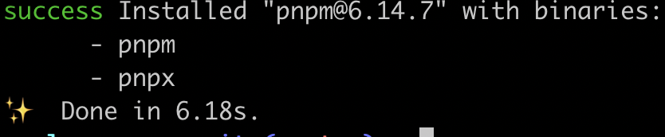
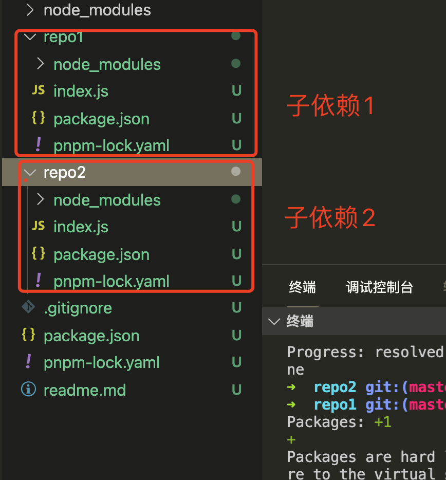
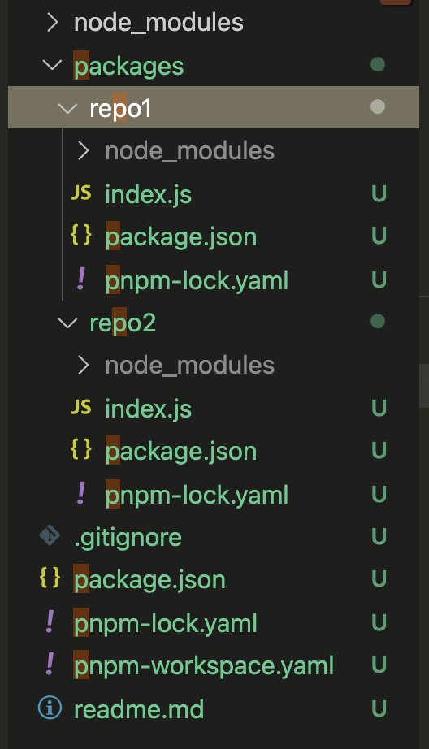
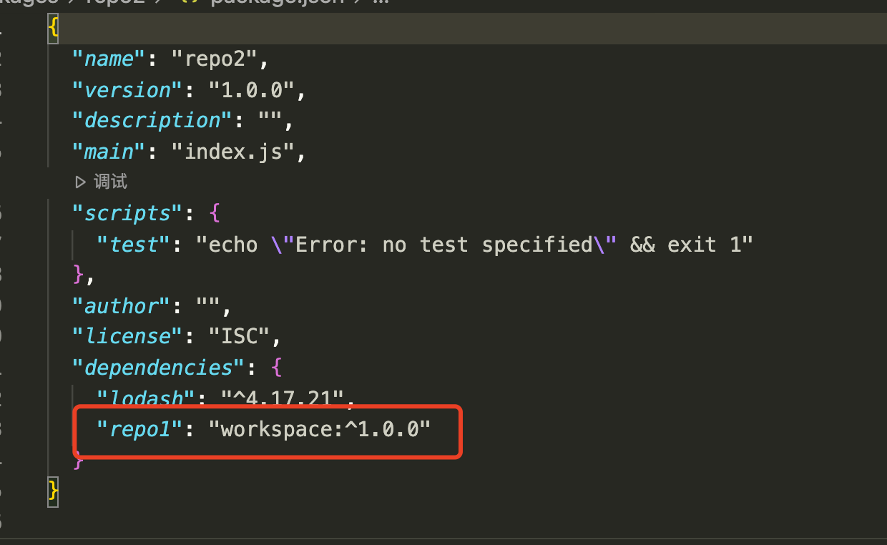

# pnpm 学习笔记

## 1. 参考资料

1. [pnpm 官网](https://pnpm.io/zh/)
2. [pnpm 大行其道，npm 已是风烛残年？](https://mp.weixin.qq.com/s/3qZT_Y3wuKJNNpHmTIF1Ew)

## 2. 简介

**Q1: pnpm 是什么**

A1: 是一个类似 yarn 和 npm 的包管理工具

**Q2: pnpm 和 yarn 和 npm 相比的区别或优势**

1. 节约磁盘空间，因为 pnpm 会有一个 hard link 的方式来引入包，不会像 npm 或 yarn 一样，100 个项目同一个版本的依赖安装 100 次
2. 非扁平化的 node_modules，包依赖的 node_modules 在包内部而不是统一到项目的根目录下进行下载
3. store 机制，因为 1 中所谈 hard link 会从 store 去找是否已经在某个 store 中安装过依赖了，如果安装过会直接去 hard link

## 2. pnpm 的安装

```bash
yarn global add pnpm

npm install -g pnpm
```

安装完成后我们发现他安装了两个命令：

1. pnpm
2. pnpx



## 3. cli 命令对比

| npm 命令        | pnpm 等效                                        |
| --------------- | ------------------------------------------------ |
| `npm install`   | [`pnpm install`](https://pnpm.io/zh/cli/install) |
| `npm i <pkg>`   | [`pnpm add <pkg>`]                               |
| `npm run <cmd>` | [`pnpm <cmd>`]                                   |

【pnpx】已废弃，现在可以使用 pnpm exrc 或者 pnpm dlx 来代替

> 他从源获取包，但不将它安装为依赖项，热加载它，并运行任何它暴露的默认二进制命令

## 4. 几个疑问

**Q1: 两种包管理方式的 node_modules 的结构**

**A1: **

npm/yarn: 每个对应依赖所依赖的包都会下载到运行 npm install / yarn 的根目录下

pnpm：将下载的依赖放到 store 下，然后在安装包的时候引用的是 store 中的 hard link 来引入已经安装过的包的版本

**Q2: 老工程的从 npm 换到 pnpm 之后运行报错怎么办**

**A2: **

因为两者的 node_modules 的结构存在异常，pnpm 是管理到每个包内部的，而 npm 是拍平的，可以暂时通过增加`--shamefully-flatten`来解决

```bash
pnpm install --shamefully-flatten
```

**Q3: hard link 和 symlink**

**A3: **

新仓库引用老的包，通过 hard link 的方式从**全局的 store 中找到对应 hardlink 的映射关系**

找到对应的 hard link 对应的地址，**真正引入包通过的 symlink 的方式**

**Q4: store 如果随着依赖包的增多越来越大怎么办**

**A4:** 使用 pnpm store prune，清除没有被引用的包

## 5. Monorepo 支持

**Q1: 为什么要使用 monorepo？**

**A1:** 将应用中独立的部分拆成多个 packages，然后**各个包中可以相互引用，极大解决了代码无法被重用的问题**

**Q2: 为什么合适使用 pnpm？**



因为在 monorepo 这种场景下，我们经常熟悉的目录结构为

==tips==：**这种依赖结构导致多个仓库可能会有相同的依赖，如果重复安装会浪费很多磁盘空间。（lerna 的公共依赖其实也无法跨应用）**

pnpm 在 monorepo 上的优势：

1. 而 pnpm 通过 hard link 保证相同的包都是通过引用的方式导入可以解决
2. 依赖平铺导致，我们在写代码时候引入的包 A 可能本身应用没有依赖，是依赖的包 B 所依赖的，这样如果有一天依赖的包 B 更新后不使用依赖 A，那么在我们应用中我们引入的包 A 就可能找不到，这样容易导致线上报错

## 6. pnpm + workspace 实践

创建对应的文件目录：



### 6.1 创建 workspace 配置文件

创建配置文件 pnpm.packages.yaml

```yaml
packages:
  - "packages/**"
  - "!test/**"
```

配置文件的包包括 packages 文件夹下的任意单独的包

指定想要拆出单独的包通过`路径直接匹配`即可，不想要单独分包通过`!`加以区分

### 6.2 安装对应的依赖包

```bash
pnpm add react react-dom -w
pnpm add moment -r --filter repo1
```

-w: 在执行命令的根结点下进行安装依赖（root）

-r: 指定安装在某一个目录下，不安装在公共目录下

--fiter：指定某个子包的目录

### 6.3 配置 monorepo

**步骤一**：配置 repo1 中的相关代码，并导出

```javascript
const moment = require("moment");

const formatDateTime = (date) => moment(date).format("YYYY-MM-DD HH:mm:ss");

module.exports = {
  formatDateTime,
};
```

**步骤二**：在 repo2 中加载 repo1 的包

```bash
pnpm add repo1 -r --filter repo2
```

**步骤三**：在 repo2 中使用 repo1 中的函数

```javascript
const { formatDateTime } = require("repo1");

const time = formatDateTime(new Date().getTime());

console.log(time);
// 2021-09-12 20:04:33
```

### 6.4 package.json 的变化

我们在 repo2 的 packages 中可以看到，增加了 repo1 的依赖


