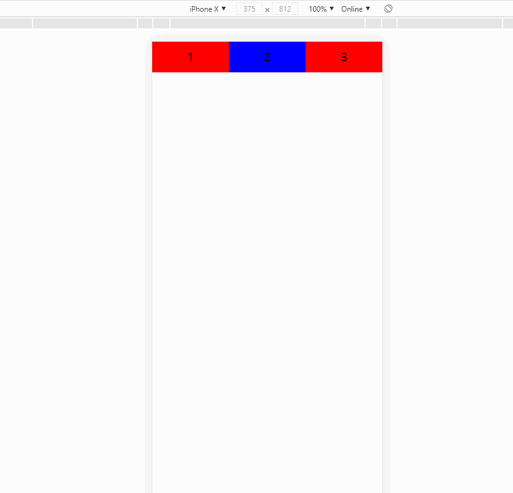

## 移动端布局 -> postcss-pxtorem实践

### 1. 依赖安装

~~~bash
# 通过vue-cli创建一个vue工程
vue create test-postcss

cd test-postcss
yarn add postcss-pxtorem
~~~

### 2. postcss-pxtorem配置

#### 2.1 rem适配原理

我们一般会通过设计给一个移动端的设计稿，我们假设是750px，那么其实我们理想状态下，是希望我们在750px宽度的屏幕下(目前应该没这种设备)，和375px的设备(iPhone X)以及其他机型如iphone 5(320px), ipad(768px)下面都能看到类似的效果，我们理解为**缩放**,那么根据什么标准去缩放呢，用什么统一的标准或单位去缩放呢？

1. rem就是通过html中body元素(根元素上的字体大小进行缩放的)，因此缩放的**标准就是根元素字体大小**
2. 那么我们在不同的设备上其实我们需要相同的单位，这个**统一的标准和单位就是rem**

#### 2.2 适配公式计算

我们假设页面拿到设计稿的宽度为**750px**, 页面整体的宽度为**10rem**(这里的10rem是自己的习惯，你也可以指定为100rem, 50rem，其会相应的影响到后面你计算的过程，但是实际计算流程不会变)，我们来从右向左填这张表：

1. 我们假设一个元素的实际在750px上的宽度为300px，在表中填写实际宽度为300px,  括号中的蓝色数字代表填写的顺序
2. 我们计算1rem对应的px数量，即750 / 10 = 75 px, 我们计算300 px对应的rem的数量为 300 / 75 = 4, 这里的**75即为我们根元素的字体大小，4 rem即为计算所得到的rem的值**
3. 这个时候我们希望在所有的对应的页面中显示的都为4rem(这个写了一半就是静态的不会变了)，所以我们将375和320尺寸设备下对应的rem值均设为4rem
4. 这个时候，我们希望的是，375对应的元素尺寸为750px设备尺寸的一般，因为页面宽度已经缩小为原来的一半了，因此，我们希望其对应的元素实际宽度为 300 / (750 / 375 ) = 150
5. 由此我们计算375页面宽度下的根元素字体大小为 150 / 4 = 37.5
6. 同理我们计算可以得到320px和其他尺寸设备下对应的根元素字体的大小和实际尺寸大小

| 页面宽度             | 元素实际宽度 | 根元素字体的大小 | 对应rem的值 |
| -------------------- | ------- | ----- | ----- |
| 750px | 300px (1) |       75px (2)         | 4rem (3) |
| 375px    | 150px (6) | 37.5px (7) | 4rem (4) |
| 320px    | 128px (8) | 32px (9) | 4rem (5) |

#### 2.3 自动rem适配步骤

从上面的过程中我们可以发现，rem适配主要有几个控制的点：

+ 通过设计稿和设计稿上的实际尺寸计算对应的rem
+ 通过页面宽度的变化计算对应根元素字体的大小
+ 通过页面根元素字体的大小和rem的值，渲染元素在不同尺寸设备下的实际宽度(浏览器实现)

上述三点中，除了最后一点是浏览器进行计算渲染的外，我们实际需要做的是1，2两点

#### 2.4 postcss-pxtorem的使用

##### 2.4.1 postcss-pxtorem的作用是什么？

postcss-pxtorem主要作用就实现我们刚才2.3中问题的第一步，我们需要将我们对应设计稿上的也就是我们开发时候根据750px设计稿上的元素尺寸转换为对应的rem，其使用方法：

1. 在和package.json同级的目录下创建一个vue.config.js,配置其如下，这里注意**propList必须要填写**，不然他不知道哪些css属性的px需要转到rem

   ~~~javascript
   module.exports = {
     css: {
       loaderOptions: {
         postcss: {
           plugins: [
             require("postcss-pxtorem")({
               rootValue: 75,
               minPixelValue: 1,
               unitPrecision: 6,
               propList: ["*"],
             }),
           ],
         },
       },
     },
   };
   ~~~

2. 我们在计算rootValue的时候，我们可以根据自己的需要，我们这里认为10rem = 750px, 那么根元素的大小为1rem = 750 / 10 = 75px

##### 2.4.2 写一段脚本动态调整根元素的字体大小

为了解决第二个问题我们需要根据不同页面宽度，对**根元素的字体大小进行缩放**,根据2.4.1中我们计算初始750px设计稿上的字体大小为75px，我们可以写下这么一段脚本：

~~~javascript
const baseFontSize = 75;
const baseWidth = 750;

function setRem() {
  const windowSize =
    document.body.clientWidth || document.documentElement.clientWidth;

  const _fontsize = (windowSize / baseWidth) * baseFontSize;

  document.documentElement.style.fontSize = _fontsize + "px";
}

window.onresize = function() {
  setRem();
};

setRem();

~~~

**原理：**根据页面的宽度和设计稿的宽度算出缩放比，然后同比缩小根元素的字体大小即可

### 3. 实现效果

我们宽度是750px，现在我们希望的是一排有三个宽度为250px的元素，即刚好等分一行，代码如下

~~~vue
<template>

  
1

  
2

  
3

</template>

<!-- Add "scoped" attribute to limit CSS to this component only -->

~~~

