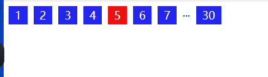
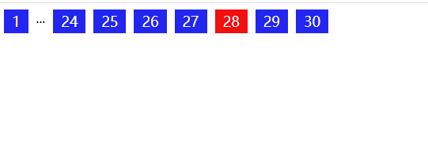
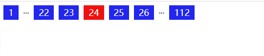

### 分页组件的思路梳理

#### 1. 分页组件的几种场景分析

> 首先这里做几个假设
>
> 1. 假设最多显示9个分页符
> 2. 省略部分用...来进行表示

##### 场景1： 总页数小于等于9页  

> 该场景没啥好说的 所有的分页符均显示就行了

##### 场景2: 总页数大于9页 且只有一边存在省略情况

> 此场景有两种情况 左边省略和右边省略：
>
> 这里要注意将...看做一个模块，则仍然是**9**个分页符，分析如下
>
> 1. 如果激活页码在起始或者结束的 9 - 2 个页码范围内 即是单边省略情况
>
> 这里的 9 代表最大模块数量，2代表 一个是另外一边的边界 + 省略号模块

##### 场景3 两边都存在省略号的场景

> 此场景刚好是激活页处于非上述两种场景的情况，即 总页数 > 最大页数 且 激活页数不在首尾边界 7 范围内的场景
>
> 这里注意：**仍然加上两个省略符仍然是9个tab的场景**， 具体分析
>
> 1. 中间存在的元素是 **9** - **4**（两个省略号 + 首尾边界）

#### 2. 代码整理

##### 1. getPageConfig

因此上述的场景其实十分简单，我们**最多**只需要渲染**9个**不同的分页符即可，其实我们最关键的就是获得一个需要渲染的分页符列表 (最多9个元素)，我们将元素分为...或者序号即可, 所以分页组件最关键的就是，找到需要渲染的列表是啥，我们写一个getPageConfig方法即可

~~~javascript
const PAGE_BLOCK = 9
const PAGE_INDENT = 4

function getPageConfig(current, totalPage) {
    let pageConfig = []

    if (totalPage <= PAGE_BLOCK) {
        // 全部展示的情况
        pageConfig = Array.from({ length: totalPage }).map((_, i) => i + 1)
    } else if (current + PAGE_INDENT >= totalPage ) {
        // ...只出现在末尾的情况
        pageConfig = [1, '...'].concat(Array.from({ length: PAGE_BLOCK - 2 }).map((_, i) => i + totalPage - PAGE_BLOCK + 3))
    } else if (current - PAGE_INDENT <= 1) {
        // ...只出现在末尾的情况
        pageConfig = Array.from({ length: PAGE_BLOCK - 2 }).map((_, i) => i + 1).concat(['...', totalPage])
    } else {
        // ...左右两边都存在的情况
        pageConfig = [...[1, '...'], ...Array.from({ length: PAGE_BLOCK - 4 }).map((_, i) => i + current - 2), ...['...', totalPage]]
    }

    return pageConfig
}
~~~

##### 2. 页面渲染

 后面我们只需要通过模板渲染即可

> Notes: 这里的页面渲染其实直接通过innerHtml全部刷新 性能有点差的 建议简单的对比需要变化的dom之后再改 这样可能性能会好一点

~~~javascript
function render(current, totalPage) {
    const container = document.querySelector('.pagination')
    container.innerHTML = '';

    const pageList = getPageConfig(current, totalPage)
    const renderHtml =  pageList.map(item => {
        if(item === '...') return '...'

        return `
            ${item}
        `
    })

    container.innerHTML = renderHtml.join('')
}
~~~

##### 3. 分页事件监听

+ 这里有一个地方要注意我们可以通过**事件代理的方法**来绑定事件，这样效率更高

+ 在这里我给Init函数绑定了两个属性来记录pagination的两个关键参数的变化，当然也可以用闭包或者全局变量，小问题啦

~~~javascript
function init(callbacks) {
    const container = document.querySelector('.pagination')
    container.addEventListener('click', function (event) {
        const target = event.target
        const { classList, innerHTML } = target
        if (classList.contains('pagination-item')) {
            if(init.CURRENT_PAGE === +target.innerHTML) return;
            init.CURRENT_PAGE = +innerHTML
            render(+innerHTML, init.TOTAL_PAGE)
            callbacks && callbacks(+innerHTML, init.TOTAL_PAGE)
        }
    })

    render(28, 30)
    init.CURRENT_PAGE = 28
    init.TOTAL_PAGE = 30;
}
~~~

