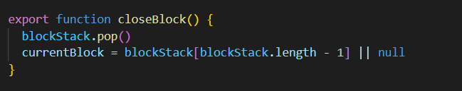

Vue源码学习笔记

## 0. 学习环境搭建

[如何搭建调试vue3源码](https://juejin.im/post/6844903959153344525)中叙述的主要步骤

1. clone vue 3源码

   ```bash
   git clone https://github.com/vuejs/vue-next.git
   ```

2. 安装依赖

   ```bash
   yarn install
   ```

3. 配置sourcemap

   ```javascript
   // rollup.config.js
   output.sourcemap = true
   
   // tsConfig.json
   // 配置在compilerOptions下
   {
       //...
       "compilerOptions": {
           // ....
           "sourceMap": true
       }
   }
   ```

4. 启动调试命令

   ```bash
   yarn dev
   ```

5. 写个测试demo通过chrome打开，并打断点

   ```html
     <script src="../../dist/vue.global.js"></script>
     <div id="test">
       <p>{{name}}</p>
     </div>
   
   
   
     <script>
       const App = {
         data(){
           return{
             name:"vue"
           }
         },
       }
       let vm = Vue.createApp(App).mount("#test");
     </script>
   
   ```

## 1. Vue结构

### 1.1 Vue 3源码结构

数据监听的设计模式，观察者模式，vue 3通过proxy代替了原来的Object.defineProperty来实现数据监听，并且加入了新的Composition API，来实现代码的抽离。

Vue 3重构之后，源码大致可以分为以下几个部分：


+ compile -> 将template -> js -> vdom
+ reactivity -> 实现响应式，实现数据监听
+ runtime -> 为vdom提供运行时需要的函数进行执行。

### 1.2 Vue 3 vs Vue 2

Vue 3相较于Vue 2做了以下几个改进：

reactive:

+ 用Proxy代替defineProperty
  + Object.defineProperty需要遍历或者递归来绑定对象的所有属性，影响首屏渲染
  + Object.defineProperty无法监听新增和属性和数组操作

compile：

+ vdom重写
  + 静态标记
  + 标记静态节点
    + 如果是静态节点就不打标，如果是动态节点就会会动态属性的类型打标例如class, props, text等
    + 这里是通过位运算进行打标的|组合， &校验
  + diff算法的更新(未看)
    + vue2: 双端比较
    + vue3: 最长递增子序列

runtime：

+ 引入Composition API

## 2 Vue 的简单响应实现

### 2.1 vue 3 composition API的使用

简单的一个数据监听的实现，看一看目前的vue 3 + composition API是怎么用的？

```javascript
const state = ref(1)

watchEffect(() => {
    console.log('effect = ', state.value)
})

watchEffect(() => {
    console.log('effect2 = ', state.value)
})
```

需要实现有以下几个点：

+ 在state.value更新的时候需要去执行对应的回调
+  使用effect函数的时候需要注册回调
+ 依赖的自动收集

如何实现？

+ 发布订阅模式


#### 2.1.1 如何自动收集副作用

```javascript
const param = ref(2)
effect(fn)
// 为了方便说明，我们将响应式参数param简称ref
// effect 称为副作用
// 称为变量
```

vue 3主要思路：

1. proxy或者defineProperty监听get方法时，去执行track收集引用ref的依赖
2. 在track中将回调注册到，store中的回调列表中
3. 每次effect新建的时候执行fn，**因为fn如果引用到ref一定会触发ref的get方法**，在这里就会注册上对应的副作用

### 2.2 简单实现ref的例子

#### 2.2.1 ref基础实现

```javascript
// 创建一个effect方法
function effect (fn) {
    effect.activeEffect = fn;
    fn()
}

effect.activeEffect = null

// event center
export class Desp {
    constructor() {
        this.subs = new Set()
    }

    depend() {
        if(effect.activeEffect) {
            this.subs.add(effect.activeEffect)
        }
    }

    notify() {
        this.subs.forEach(effect => effect())
    }
}


function ref(initVal) {
    let _value = initVal;
    let desp = new Desp()

    return {
        get value() {
            // 依赖收集
            desp.depend()
            return _value
        },
        set value(value) {
            // 修改的时候通知desp执行回调
            _value = value
            desp.notify()
        }
    }
}
```
#### 2.2.2 proxy版本
```javascript
const getCommonHandler = (desp) =>  ({
    get(target, property) {
        desp.depend()
        return target[property]
    }, 
    set() {
        Reflect.set(...arguments)
        desp.notify()
        return true
    }
})

function createProxyRef(initVal) {
    let _value = initVal
    let desp = new Desp()

    let proxy = new Proxy({ value: _value }, getCommonHandler(desp))

    return proxy
}
```

### 2.3 康康源码长啥样


### 2.4 拆分源码结构

+ track: 用于收集依赖

+ trigger: 用于调用副作用

+ targetMap: 一个用于收集reactive响应式参数的大数组，**将reactive收集的对象与其对象中参数对应的响应式effect形成1对多的映射关系**，其结构大致如下

   ```javascript
  targetMap = {
      {a, b}: {
          a: [effect1, effect2],
          b: [effect3]
      }
  }
  ```

+ effectStack: 用于缓存多个effect，在一次flush中


## 3. Compile

### 3.1 简介

#####  3.1.1 vue compile做了什么？

1. 利用各种类型的parser创建ast (html -> ast)
2. 通过vFor，vIf等各种基于vue语法编写的transform改写ast节点 (ast -> vue_ast)
3. 利用generate将生成的代码挂在context上，然后生成运行时的js代码 (vue_ast -> js (vdom))

##### 3.1.2 vue 3 compile的优化点：

+ 节点打标
+ block tree的构建

##### 3.1.3 在线验证

[vue 3 explorer](https://vue-next-template-explorer.netlify.app/#%7B%22src%22%3A%22%3Cdiv%3E%5Cr%5Cn%20%20%7B%7B%20a%20%7D%7D%5Cr%5Cn%5Cr%5Cn%20%20%3Cdiv%20v-if%3D%5C%22b%5C%22%3E%3C%2Fdiv%3E%5Cr%5Cn%20%20%3Cdiv%20v-for%3D%5C%22item%20in%20items%5C%22%3E%5Cr%5Cn%20%20%20%20%3Cspan%3E%7B%7B%20item%20%7D%7D%3C%2Fspan%3E%5Cr%5Cn%20%20%3C%2Fdiv%3E%5Cr%5Cn%3C%2Fdiv%3E%22%2C%22options%22%3A%7B%22mode%22%3A%22module%22%2C%22prefixIdentifiers%22%3Afalse%2C%22optimizeImports%22%3Afalse%2C%22hoistStatic%22%3Afalse%2C%22cacheHandlers%22%3Afalse%2C%22scopeId%22%3Anull%2C%22inline%22%3Afalse%2C%22ssrCssVars%22%3A%22%7B%20color%20%7D%22%2C%22bindingMetadata%22%3A%7B%22TestComponent%22%3A%22setup%22%2C%22foo%22%3A%22setup%22%2C%22bar%22%3A%22props%22%7D%7D%7D)

[vue 2 template explorer](https://template-explorer.vuejs.org/#%3Cdiv%20id%3D%22app%22%3E%7B%7B%20msg%20%7D%7D%3C%2Fdiv%3E)

### 3.2 vue 3模板生成过程

**简单讲**：template ->  ast -> js

我们在进入页面渲染的createApp打上断点

查询调用函数栈我们发现不简单，大致经过了这么几个过程：

#### 3.2.1  创建render

#####  1) 利用baseCreateRender创建render


创建路径createApp -> 创建Render -> ensureRender(传递了一些上下文配置) -> 调用baseCreateRender(根据option创建render，**这些利用这些option中的默认配置作为创建了下面的方法，其实就是一个闭包**)

创建过程中初始化了如下函数，可以先不看，后面有需要的时候再来查：

主要分为这么几类：

1. 处理不同patchFlag节点的方法： processxx
2. 用于挂载节点的方法：patchxx（函数内会调用初次挂载的方法mountxx方法和更新方法upodatexx）
3. 卸载方法: movexx 包含了unmountxx和removexx
4. 几个重要的需要关注的：
   1. setupRenderEffect rerender的副作用函数，会在mount的时候挂载
   2. render将vdom渲染到实dom

| 创建函数名               | 作用                                        | 关键点                        |
| :----------------------- | ------------------------------------------- | ----------------------------- |
| moveStaticNode           | /                                           |                               |
| patch                    | 渲染更新节点                                | 详见第四章                    |
| processText              | 处理文本节点                                | 详见第四章                    |
| processCommentNode       |                                             |                               |
| patchStaticNode          | 渲染静态节点                                | 详见第四章                    |
| mountStaticNode          | 挂载静态节点                                | 详见第四章                    |
| removeStaticNode         | /                                           |                               |
| processElement           | 处理原生的element                           |                               |
| mountElement             | 挂载原生的element                           |                               |
| setScopeId               | 模块之间独立                                |                               |
| mountChildren            | 挂载子节点                                  |                               |
| patchElement             | 渲染原生的element                           |                               |
| patchBlockChildren       | 挂载blockChildren                           | 这里会处理dynamic children    |
| patchProps               | props变化，diff后挂载props                  |                               |
| processFragment          | 处理Fragment                                |                               |
| processComponent         | 处理Component                               |                               |
| mountComponent           | mount自定义组件                             |                               |
| updateComponent          | 更新Component                               |                               |
| setupRenderEffect        | 注册的重新渲染的rerender回调                |                               |
| updateComponentPreRender | /                                           |                               |
| patchChildren            | 执行children挂载的                          | 会调用对应的mount和update方法 |
| patchUnkeyedChildren     | /                                           |                               |
| patchKeyedChildren       | /                                           |                               |
| move                     |                                             |                               |
| UnmountFn                | /                                           |                               |
| RemoveFn                 | /                                           |                               |
| removeFragment           | 移除Fragment                                |                               |
| unmountComponent         | 移除组件，我理解是第一个mount上去的组件实例 |                               |
| unmountChildren          | /                                           |                               |
| getNextHostNode          | /                                           |                               |
| traverseStaticChildren   | 遍历静态子节点渲染                          |                               |
| render                   | 将指定的vnode节点渲染到容器中               |                               |

最终返回值：


#### 3.2.2 createApp

##### 1) createApp入参：

1. render

   

   + render函数接受的参数

     + vnode：通过CreateVNode创建的的虚拟dom节点的结构

     + container：需要渲染到的对应容器

   + 过程分析
     + 如果是渲染过程主要就是调用patch方法，这个方法后面会详细分析
     + flushPostFlushCbs去启动下一个时间片上需要启动的副作用(Vue Scheduler中还未深入了解)

2. hydrate

   "脱水的过程"，主要用于ssr，如果是bowser渲染过程来为undefined(还未深入研究)

##### 2) createAppApi输出

1. app对象：

   在这个对象中有我们熟悉的，use，mount，unmount，mixin等方法，我们之前通过use方法来使用类似vuex的插件，通过mixin来混入通用的元素，使用mount来向父节点挂载对应的vnode，这个App的对象我们通过createAppApi来创建，下面是部分函数的截图：

   + mount: 

     

     mount主要做了这么几个事：

     1. 生成vnode-> 再初次挂载的时候只会给一个初始化的对象，然后把我们createApp中定义的东西放到对应的type中
     2. 为实例添加context (包括mixin, use, mount等)
     3. **如果有是SSR渲染，就通过hydrate进行渲染，否则通过render进行渲染**，<font color="red">主要做的就是通过render方法将vnode挂载到对应的父容器上</font>
     4. 设置节点的父容器
     5. 返回节点组件的proxy（组件实例）

   + use

     

     use主要做的事情：

     1. 通过一个Set，installedPlugins来判断是否插件已经注册，如果已经注册就提示一波
     2. 调用plugin的install或者plugin本身是个函数的话，通过传入app来完成注册
     3. 在plugin中能获得对应app的对象的所有信息

##### 3) mount方法的改造


**改造了啥？**：

1. 判断是否父容器存在(在app中的mount其实未判断父容器是否有效)

2. 目前页面会根据我们传入的模板渲染一个我们不想要的页面效果，所以需要先清一把：

   

3. 根据函数的类型来找到对应的模板，因为目前vue有这么几种模板：

   1. vue 2中的template

   2. 手动调用render函数的函数组件 

      ```javascript
      export default {
        functional: true,
        props: ['level'],
        render(h, { props, data, children }) {
          return h(`h${props.level}`, data, children)
        }
      }
      ```
   3. vue 3中新增的类组件
      

4. 初始化原来组件内使用的component(createApp时写到_component中)和现有有效父容器的innerHTML

5. 设置一些属性，返回挂载后的组件实例

#### 3.2.3 调用mount挂载对应app到container

我们之后调用App.mount(container)使用修改的mount方法将对应的节点挂载到对应的父节点中，这里需要注意的是，此时我们的component信息已经在都在调用mount的app实例当中了，因为刚才我们App.createApp其实是创建了一个App的实例。调用mount方法主要经历了这么几个步骤：

##### 1)  节点渲染过程

**关键**：

+ 从2.2下面的图可以看到，我们修改的mount其实调用的是mount

+ mount中主要是通过render进行渲染，来看下render函数

  render函数中如果vnode存在会调用patch方法

+ **VNode的主要类型**：

  ~~~typescript
  export const enum ShapeFlags {
    ELEMENT = 1,
    FUNCTIONAL_COMPONENT = 1 << 1,
    STATEFUL_COMPONENT = 1 << 2,
    TEXT_CHILDREN = 1 << 3,
    ARRAY_CHILDREN = 1 << 4,
    SLOTS_CHILDREN = 1 << 5,
    TELEPORT = 1 << 6,
    SUSPENSE = 1 << 7,
    COMPONENT_SHOULD_KEEP_ALIVE = 1 << 8,
    COMPONENT_KEPT_ALIVE = 1 << 9,
    COMPONENT = ShapeFlags.STATEFUL_COMPONENT | ShapeFlags.FUNCTIONAL_COMPONENT
  }
  ~~~

+ **NodeType主要类型：**

```typescript
enum NodeTypes {
  ROOT,
  ELEMENT,
  TEXT,
  COMMENT,
  SIMPLE_EXPRESSION,
  INTERPOLATION,
  ATTRIBUTE,
  DIRECTIVE,
  // containers
  COMPOUND_EXPRESSION,
  IF,
  IF_BRANCH,
  FOR,
  TEXT_CALL,
  // codegen
  VNODE_CALL,
  JS_CALL_EXPRESSION,
  JS_OBJECT_EXPRESSION,
  JS_PROPERTY,
  JS_ARRAY_EXPRESSION,
  JS_FUNCTION_EXPRESSION,
  JS_CONDITIONAL_EXPRESSION,
  JS_CACHE_EXPRESSION,

  // ssr codegen
  JS_BLOCK_STATEMENT,
  JS_TEMPLATE_LITERAL,
  JS_IF_STATEMENT,
  JS_ASSIGNMENT_EXPRESSION,
  JS_SEQUENCE_EXPRESSION,
  JS_RETURN_STATEMENT
}
```

##### 2)   首次patch mount的场景

1. 初次渲染的组件，如例子中，一半都是一个对象，所以ShapeFlags会被认为是STATEFUL_COMPONENT（createVNode阶段）


2. patch中找到对应的process处理方法，processComponent

3. 在第一次渲染的时候，他会去调用mountComponent：

   

   主要步骤：

   + 创建vnode实例，虽然目前我们已经有了一个虚拟的vdom，但是还没有对template进行解析，在这一层做

   + 将数据和模板进行绑定

   + 注册一个setupRenderEffect的钩子，当state变化的时候用于触发试图的更新（suspense场景）

   + 如果是正常场景下会直接执行setupRenderEffect

     

     等下会详细介绍这个函数，目前我们需要知道调用这个函数的目的：

     + 注册effect 注册一个响应式的钩子，这个钩子更新instance的update方法
     + 并且如果是非lazy场景的话，在effect中注册的方法
     + 在这个方法中的renderComponentRoot方法会调用rende方法进行渲染的


##### 3）createComponentInstance

 + 入参
   	+ VNode
      	+ parent
      	+ suspense
+ 输出
  + 一个instance对象

函数的主要作用：初始一个组件的实例对象，就是把parentNode，当前的vNode，生命周期等做个初始化

##### 4）setupComponent


+ 初始化props、和slot挂载到实例上
+ 根据是否为状态组件，如果是调用setupStatefulComponent

##### 5）setupStatefulComponent

+ 创建render缓存

+ 为上下文创建创建proxy

+ 调用setup挂载数据

  + 如果setup返回的是一个Promise

    + 如果是SSR会等Promise.then之后再挂载对应实例
    + 非SSR会给警告 不支持，建议直接使用Suspense

  + 正常情况下调用handleSetupResult ,主要是将render方法挂载到实例上，并注册state

    + 挂载render方法，如果是自动调用内联的render方法场景

    + setup场景下将返回的对象挂载到instance.setupState上

    + 挂载render (finishComponentSetup), 通过setup注册的都是通过这一步操作，将模板编译成render函数

      

    + 在instance上挂载render方法

### 3.3 Compile 过程

实现目标：将template -> 运行时调用runtime-core函数的js代码，并通过挂载到render上，函数调用链：

compileToFunction -> compile -> **(baseCompile，在这一层需要做的才是string -> ast -> js)**

#### 3.3.1 baseCompile

baseCompile的关键代码主要是下面三步


+ ast 解析 （string -> ast）
+ transform处理ast (ast -> ast)
+ generate 生成render函数 (ast -> string)

#### 3.3.2 parser

##### 1）调用方法

在parser中最终会通过调用baseParse方法来完成从字符串到ast的过程


+ 创建上下文context （记录了节点行列信息，源码的信息等）

  

+ 获取起始位置

+ 创建ast树

##### 2） parserChildren

**说一句**：在parser中重要的第一步就是通过parserChildren递归去解析和转换将每个子节点从string解析为ast

**过程：**根据不同的字符串特征(标签，标识符如{{，< , <!----等)和mode的类型进行字符串匹配等等，之后将解析完的结果存到nodes中，详见parse.ts中：


每个parser插件做的事情：

+ 解析本节点字符串
+ 递归parse子节点
+ 返回一个统一的解析结果
  + type：节点类型
  + content：节点内容
  + tag?: 如果是标签会有标签的信息
  + tagType: 标签类型(是否svg)
  + props：参数
  + loc：从第几行到第几行(里面包括源字符串，开始结束位置等)
  + 等等

 最终输出：


##### 3） createRoot

主要就把children组组装起来，然后初始化一些上下文属性：


#### 3.3.3 transform

过程：将已经得到的“毛胚房”精装修一下，ast通过各种插件的改造，变为新的ast。其函数看上去结构就很简单~

+ 创建上下文
+ 遍历节点
+ 创建rootCodegen -> 这里后面在generate的时候会用到
+ 挂载一些生成中需要用到的元信息
  + helpers: 在从Vue中导入runtime依赖的时候，是根据ast的hepler中用到的类型来进行引入的
  + directives：是否用到了transitionGroup这种
  + .......


##### 1) transform 插件

transform的入参中，这个options主要就包含了各类transform的插件，vue中内置了部分插件，从插件的名可以看到基本上都是用于解析vue的语法的，比如v-if, v-for, slot, scope等


##### 2) context创建

**目的**：这个context创建的过程中包括了在transform过程中可以会全局贯穿的属性和方法，便于在transform转换过程中的全局共享

**步骤**：其实就是返回一个对象

##### 3) traverseNode

**目的**：递归ast root，将所有子节点通过transform插件处理成我们想要ast结构

**具体步骤**：

+  将node和context通过每个transformer运行一遍，将对应的语法直接更新到node上，然后在context上做一些缓存优化
+ 调用traverseChildren -> traverseNode 对子节点做同样的处理

#### 3.3.4 generate

**目标：**将ast生成的树结构转换为字符串，也就是最后render函数的js代码

**生成步骤**：

+ 创建上下文
+ 根据是否ssr生成不同的固定模板
+ 引入对应的依赖和在runtime需要使用到的函数，_createVNode
+ 通过genNode来生成动态部分

##### 1) 生成context

Q1: context有何用？

context主要包含vue在生成代码过程中一些中间方法以及一个递归过程中顶层变量存储的功能

Q2: 中有哪些东西

主要分为共用方法 + 共用属性，其具体功能如下表：

| 类别     | 方法名            | 作用                                                         |
| -------- | ----------------- | ------------------------------------------------------------ |
| 共用方法 | push(code, node)  | 将对应的code，添加到context的code中，全局代码的生成          |
| 共用方法 | indent()          | 换行并将context中的indentLevel + 1， 用于控制缩进            |
| 共用方法 | deindent()        | indentLevel - 1用于控制缩进，可以选择是否换行                |
| 共用方法 | newline(indent)   | 按照上一行的缩进大小进行换行                                 |
| 共用属性 | helper()          | 返回helpNameMap -> 这个helpNameMap里面存储的是runtim-core中，就是生成js后，调用的Vue中运行时的一些关键函数的函数名 |
| 共用属性 | mode              | 函数和模块的话会不一样，如果是模块会带上一个scopeId在生成模板的时候 |
| 共用属性 | indentLevel       | 缩进的格数                                                   |
| 共用属性 | runtimeModuleName | 如果是module那种，一般我们通过import {} from 'vue'，所以默认值为vue |
| 共用属性 | runtimeGlobalName | 如果通过script标签引入的那种，会在全局创建Vue对象，挂载到window.Vue上，所以这里就用的是Vue |
| 共用属性 | prefixIdentifiers |                                                              |

##### 2) 引入需要引用的函数和变量

这部分主要从Vue或者vue中引入需要引入最后生成实际DOM元素的东西，根据是否为模块，分别调用genFunctionPreamble或者genModulePremeble来生成对应的代码：

我们来看下genFunctionPreamble:

1. 根据是否为浏览器环境，生成不同的引入函数的代码端

   

   || 服务端渲染 | 浏览器渲染 |
   |---| ---------- | ---------- |
   |genFunctionPreamble做的事| 直接将之前在ast解析时候的helper引入到生成代码中 | 从ast中先引入在静态hepler中存在的函数 |
   |其他| 引入@vue/server-renderer | |

   

**Q： genFunctionPreamble方法做了啥**

在genFunction中主要通过genHoists方法，其传入参数为**ast解析后的node列表**，以及**生成函数中的全局上下文context**, 在genHoists中其实通过genNode来具体生成元素对应的代码，genNode调用参数主要为**一个vnode节点**和对应的上下文**context**。

   

##### 3) genNode函数解析

genNode根据不同的nodeType来调用不同的方法来完成对于ast处理后的vnode进行解析，我们通过一个JS_OBJECT_EXPRESSION的常规vnode 的解析来看一看他是如何生成各类的vue js的代码的：


   2. genObjExpression

      Q1：这个函数的作用是什么

      A1:  主要用来生成对象的javascript代码

      Q2: 这个函数的流程

      A2： 如下

      ​	(1) 判断是否多行 -> 是否有多个参数

      ​	(2) 生成tag上的标签的key，value，并插入其中的**:**

      ​	  	

        	(3) 如果多个属性的话需要加上，并换行

##### 3) 生成render函数

1. 主要根据以下几点，来生成不同的render的函数的定义，并换行

+ 是否独立作用域
+ 是否ssr


2. 使用with块级作用域来解决参数中带有this.xxx的问题

为啥vue中使用with来解决this.xxx的问题：


之后，在ctx中引入需要在生成的代码中引入的helper，Vue runtime过程中生成真实DOM的方法

##### 4) 生成对应的DOM节点

1. 调用genVNodeCall，其中用到的几个关键的参数来控制函数的嵌套，所有我们写的类似Fragment等其实都对应了相映的Vue中的一个函数进行处理


+ directives
+ isBlock
+ diableTracking

2. 通过genNodeList将具体的tag, props children等进行JS代码的生成，逻辑大概可以概括为

   1. 如果是string -> 直接push进去就行，比如tagName, 用来直接作为createBlock的参数就行
   2. 如果是数组，比如子元素的处理，这个时候直接调用genNodeAsArray
   3. 否则的话，比如不存在的元素，在调用genNodeList会处理成null，或者是个对象，比如props是可变的场景直接调用genNode, 通过nodeType进行渲染，操作
   4. 加入一个参数就加一个逗号

3. genNodeListAsArray:  这个函数主要是用来生成多个props或者children用的，其原理就是通过genNodeList然后如果是children就直接调用后通过genNode来进行处理即可，按照上面的原理找props然后根据对应元素的nodeType, 递归生成即可，这里要注意的是，作为同一个变量的nodeList在同一层的话要用括号


##### 5) 生成代码的样子

```html
<div>{{ a }}</div>
```

```javascript
import { toDisplayString as _toDisplayString, createVNode as _createVNode, openBlock as _openBlock, createBlock as _createBlock } from "vue"

export function render(_ctx, _cache, $props, $setup, $data, $options) {
  return (_openBlock(), _createBlock("div", null, _toDisplayString(_ctx.a), 1 /* TEXT */))
}
```

目前生成的代码还是string，通过new Function重新生成一个真的函数，如果是非浏览器情况下的话，我们还需要看全局是否注入了Vue，没有的话对应的runtimeDom传进去 


这里有两个关键的函数：

+ openBlock

  

  **关键**：为一个节点树提供一个block的容器，根据官方所说可知，需在createBlock之前被调用，这里更新了当前的block -> currentBlock

+ createBlock

  

  **步骤**：

  + 创建对应的vnode -> 如果有子节点递归调用createVNode

  + 保存当前的node的dynamicChildren，新的diff的过程中，通过将每个节点的dynamicChildren进行绑定，来找到需要更新时候最小块的改动元素，从而提升了diff的性能，就是在这里被注入的

  + 将当前的vnode保存在block中,并关闭当前的block

    

    **close的时候blockStack会出栈，所以下一次的currentBlock为当前节点的父节点**

### 4.  vdom 

我们用的例子：

```html
<script src="../../dist/vue.global.js"></script>

<div id="demo">
    <div>{{ count }}</div>
    <button @click="addCount">+1</button>
</div>

<script>
    let { createApp, ref, watchEffect } = Vue
    createApp({
        setup() {
            let count = ref(0)

            watchEffect(() => {
                console.log(`now count = ${count.value}`)
            })

            const addCount = () => {
                count.value++;
            }

            return {
                count,
                addCount
            }
        }
    }).mount('#demo')
</script>
```

####  4.1 为何要更新diff算法

1. 因为双端对比可能导致一次diff时间超过单帧的刷新时间，所以需要优化，通过下面两个方面大大的缩小了更新和diff的开销
   1. block分块的策略
   2. 静态节点不进行更新
2. JSX和手写的render function h('div', null, children)是完全动态的，过度的灵活性导致可利用的优化信息不足

#### 4.2 Vue 3怎么做？

1. 如果静态节点不diff
2. 动态节点引入block tree
   + 每个区块内部基于动态节点指令(v-for v-if)切割嵌套区块
   + 每个区块内部结构固定(方便递归)
   + 每个区块内部的动态元素进行存储记录(一个Array)
3. 通过时间片进行更新，flushupdate

#### 4.3 Vue 3中如何更新节点信息

**调用链:** proxy更新 -> 对应的watchEffect  -> setupRenderEffect -> renderComponentRoot (生成新的节点) -> render函数生成vnode -> 

##### 4.3.1 更新dom展示

当页面mount的时候，会默认为该组件实例挂一个setupRender的钩子，通过这个钩子，可以完成从vnode -> 实dom的转变。

这里的instance是组件的实例，在mount的时候进行挂载：


##### 4.3.2 setupRenderEffect解析

setupRenderEffect主要做了哪些事：

+ 初次mount
  + 调用响应的生命周期钩子函数(beforeMount, onVnodeBeforeMount, mount, onVnodeMount)
  + 判断是否为hydrateNode（未看）
  + 给组件打上标记
  + 调用patch方法开始挂载组件，mount状态patch的第一个参数为空
  + 根据keepAlive将父组件处于Suspense状态(未看)
  + 设置isMounted标志位为true
  
+ 后续update

  + 组件本身动态参数变化(next为空)
    + 将next设为当前的节点vnode，执行后续步骤
  + 父组件更新调用processComponent触发的(next不为空)
    + 加载之前一次render的vnode，利用updateComponentPreRender -> flushPreFlushCbs。
  + 调用beforeUpdate钩子
  + 给组件打上标记
  + 解析新节点的vnode(renderComponentRoot) -> 这里会调用之前mount挂载在vnode实例上的render函数进行渲染
  + render函数: 通过template -> vnode的转换过程

##### 4.3.3 renderComponentRoot解析 

**目的：**为了生成新的vnode

**步骤：**

+ 从实例中获取当前的type，vnode，render函数等

+ 根据当前vnode的类型(shapeFlag)，生成和规整vnode

  + 状态组件
    + 调用mount过程中得到的render函数 （具体过程详见3.3.4节）
    + 利用normalizeVode规整render生成的vnode
      + 根据传入节点的类型进行分类
        + 布尔类型或者null -> vnode类型标记为Comment
        + 如果是数组，外面包一层Fragment
        + 如果是对象 -> 说明是个单节点，非clone节点的话，直接返回child
        + string或者number -> 创建文本节点

  + 函数组件(主要是jsx和手动调用vue中的h -> vue 2.x中的render函数中隐式提供的h)
    + 这次每次需要调用render进行重新的渲染，生成vnode

+ 进一步对vnode进行处理包括：

  + v-model绑定 -> withDirectives
  + 是否通过Transition包一层(分支后续了解)

+ 返回最终的vnode -> result

##### 4.3.4 render函数生成node

一个简单的render函数如下：


主要内容包括：

+ openBlock -> 每次createBlock之前都需要调用openBlock，创建v-for的时候，需要指定openBlock的第一个参数为true
+ createBlock-> **当使用v-if, v-for, slot的时候会将模板分成一个一个block分区，整个应用树以block串起来，之后在更新对比监控(diff)的时候可以从上而下进行，最小范围变更，提升性能**
+ createVNode（后面讨论）

##### 4.3.5 createVNode


主要是调用了createVNodeWithArgsTransform和_createVNode这两个方法


其主要作用是：

+ **将template -> vnode**，对节点的子节点，class，style以及其他的props进行规整，并保存在vnode中返回

+ 生成clone节点，目前发生的场景为，如果这种情况下，_createVNode传入的type为一个vnode，其他情况不会传入一个vnode

  ```vue
  <component :is="vnode" />
  ```

其主要生成的过程为：

+ 规整type的类型 -> 区分函数组件还是类组件

+ 规整class

+ 规整style

+ 根据type的类型来对vnode进行打标

  ```typescript
  export const enum ShapeFlags {
    ELEMENT = 1,
    FUNCTIONAL_COMPONENT = 1 << 1,
    STATEFUL_COMPONENT = 1 << 2,
    TEXT_CHILDREN = 1 << 3,
    ARRAY_CHILDREN = 1 << 4,
    SLOTS_CHILDREN = 1 << 5,
    TELEPORT = 1 << 6,
    SUSPENSE = 1 << 7,
    COMPONENT_SHOULD_KEEP_ALIVE = 1 << 8,
    COMPONENT_KEPT_ALIVE = 1 << 9,
    COMPONENT = ShapeFlags.STATEFUL_COMPONENT | ShapeFlags.FUNCTIONAL_COMPONENT
  }
  ```
  
+ 生成新的vnode节点 -> 其本质上是一个对象 

  

+ vnode对于子节点的规整 (主要通过传入的vnode的shapeFlag和children类型进行判断)

  其目的是为了规整统一其children的类型和shapeFlag(节点)的类型：

  + 数组子节点：一个元素下面有多个子节点的情况，（典型Fragment，这个时候由于多个子节点已经被解析为vnode因此不用单独处理了）

    

  + 对象子节点(子节点仍是一个vnode的场景，单节点)
    + 当前节点为element节点 或TELEPORT(传送门)
    + 当前节点为slot节点
    
  + 文本子节点
    + 当前节点类型为传送门
      + 
    + 其他类型认为是文本子节点

+ 对于Suspense节点的规整(未整理)

#### 4.4 patch

通过renderComponentRoot获得跟新后的vnode之后，我们需要将新的dom渲染到页面上从vdom -> 实dom的转换，这个时候使用patch方法, patch方法的作用：

1. vnode如果没有挂载

##### 4.4.1 patch入参


patch有如下几个入参：

+ n1: 代表父组件的_vnode属性，如果这个属性没有就认为是mount时候调用的，如果有会认为是更新场景，这个时候需要diff比对
+ n1: 代表需要挂在上去的目标vnode
+ container: 代表挂在父容器的element
+ anchor:  目前没研究出干啥用的
+ parentComponent: 父组件的vnode
+ parentSuspense: 父组件是Suspense的情况
+ isSVG：判断是否是SVG
+ optimized：优化的标志，用来控制是否需要跳过优化diff模式

##### 4.4.2 patch方法解析

简单来说patch方法的目的和实现：

目的：对比n1和n2两个vnode之前的区别，然后进行渲染到对应的父容器中。

实现：通过对比n2和n1的shapeFlag通过不同的type的处理方法挂载或更新组件

具体实现：

1. n1与n2节点类型不一样 -> 直接卸载n1, 然后n1 = null
2. n2的patchFlag如果是BAIL那么就全量diff，放弃optimized优化diff
3. 根据不同的节点类型和n2的shapeFlag调用不同的process方法进行处理

##### 4.4.3 一个processFragment的例子

**步骤：**

+ 如果patchFlag（用于标记是什么类型的动态变量的）> 0, 说明是动态节点的，开启优化模式
+ 如果n1不存在 -> 调用对应的mountChildren方法，挂载对应的子节点
+ 如果n1存在，更新操作
  + patchFlag = STABLE_FRAGMENT -> 调用patchBlockChildren： STABLE_FRAGMENT指的是不需要关心节点的顺序问题，节点的顺序会比较稳定的情况，不会出现节点之间顺序变化，但是节点本身可能是一个动态节点
  + 其他情况fragment都走patchChildren

因为我们diff的是一个简单的fragment的例子，所以这里是走patchBlockChildren方法：


**大前提：**他会对对应位置的vnode进行对比，因为STABLE_FRAGMENT 一半来说节点node的位置不会进行改变，所以其diff的步骤：

1. 逐个对比node的shapeFlag和type，获取父节点(容器)
2. 将继续调用patch方法渲染子节点

**更新案例一：**我们count的部分是一个element，所以根据上面的patch方法会通过processElement进行更新：


直接通过patchElement渲染上去：

+ 获取实际的dom节点 el

+ 获取新的patchFlag -> n2

+ 获取新老props

+ 执行钩子beforeupdate

+ 执行自定义指令的钩子函数(未详细了解)

+ 根据不同的patchFlag类型，调用不同的hostPatch方法进行操作(基本都在nodeOps中定义)

  

  这些renderOptions是在ensureRender中的option中传进去的

+   我们这里主要是count从0 -> 1所以是patchFlag = 1的场景，调用hostSetElementText

+ 调用hostPatch方法，这一步结束之后对应的改变的变量就已经被渲染到页面上了

  

+ 之后在下一次更新队列中推入调用vnodeUpdate的回调

+ 更新ref

**更新案例二**：button组件也是一个element，这里的patchFlag = 8， shapeFlag = 9 (8 + 1):

+ 根据vnode.dynamicProps获取动态props

+ 遍历双端对比相应的props，如果前后不一致，或者需要强制更新(key === value)的就执行hostPatchProps进行更新  


#### 4.5 类似fiber时间片的思想 ---- > flushJobs （待研究）

##### 4.5.1 flushJobs是什么

1. 浏览器空闲的时间对vdom进行更新对比

2. 调用方法大约如下，以组件未更新加载前一次的vdom为例：

   

   

3. 

##### 4.5.2 队列排序的作用

+ 组件的更新从父元素到子元素(因为父元素总是在子元素之前创建，所以render effect的优先级更小)
+ 如果一个组件在父组件更新时被卸载了，这个时候它应该被忽略