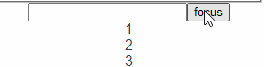

## Vue 3 学习笔记

### 1. 环境搭建

- 参考资料：[官方文档](https://composition-api.vuejs.org/zh/api.html#setup)

- 使用 vue-cli 搭建脚手架工具 -> 创建一个 vue 工程 -> 安装 vue-next

  ```bash
  yarn global add vue-cli
  vue create vue-test
  cd vue-test
  vue add vue-next
  ```

### 2. 基础 api 使用

#### 1. setup

- 功能类似于原来的 mounted
- 接受参数 props, context
- 如果需要使用到 pros，需要先在 props 这个参数中定义对应 props 的类型， **不要解构赋值**(会无法监听到传入参数的变化)
- context 中包含了对于内部组件的代理值包括 attrs, slots 等(**可以解构赋值，一直能拿到最新值**)

```vue
<template>
  <div>{{ count }} / {{ object.foo }}</div>
</template>

<script>
import { reactive, ref } from "vue";

export default {
  props: {
    msg: String,
  },
  setup(props) {
    const count = ref(0);
    const object = reactive({ foo: "bar" });
    console.log(props.msg);

    return {
      count,
      object,
    };
  },
};
</script>
```

#### 2. 响应式 api

#### 1. reactive 和 ref

> 官方解释：
>
> reactive: 接收一个普通对象然后返回该普通对象的响应式代理。等同于 2.x 的 `Vue.observable()`
>
> ref: 接受一个参数值并返回一个响应式且可改变的 ref 对象。ref 对象拥有一个指向内部值的单一属性 `.value`。

##### 小例子

```vue
<template>
  <div>
    <div>{{ count }} / {{ object.foo }}</div>
    <button @click="addNumber">+1</button>
  </div>
</template>

<script>
import { reactive, ref } from "vue";

export default {
  props: {
    msg: String,
  },
  setup(props) {
    const count = ref(0);
    const object = reactive({ foo: "bar" });
    console.log(props.msg);

    const addNumber = () => {
      count.value++;
      object.foo += count.value;
    };

    return {
      count,
      object,
      addNumber,
    };
  },
};
</script>

<style></style>
```

##### 结果分析与总结

> 结果： 点击按钮无论是 count 还是 object 中的 foo 都会同时变化

- reactive 个人理解应该用在对于引用类型/对象类型的监听上，因为调用对应的值进行响应式变化的时候直接调用 object.foo 即可
- ref 个人理解，适用于基础类型，因为其引用的时候需要从 count.value 中获取，**这里要注意在模板中会自动调用 ref.value**
- ref 如果传入的是一个对象，会自动调用 reactive 进行深层次转换

#### 2. computed

> 和 vue2 中的 watch 类似，但是是一个 hooks 函数调用的形式
>
> - 直接传入一个函数为默认定义了一个 get 方法
> - 手动写入 get 和 set 方法定义了一个 ref 对象，set 方法为该 computed 改变时调用的回调

##### 小例子

```vue
<template>
  <div>
    <div>computed -> {{ computeCount }}</div>
    <ul>
      <li>{{ count1 }}</li>
      <li>{{ count2 }}</li>
      <li>{{ reactiveCount.count }}</li>
    </ul>

    <div class="con">
      <button @click="addCount">+1</button>
      <button @click="decrCount">-1</button>
    </div>
  </div>
</template>

<script>
import { ref, reactive, computed, watchEffect } from "vue";

export default {
  setup() {
    const count1 = ref(0);
    let count2 = ref(1);
    const reactiveCount = reactive({ count: count2 });
    let computeCount = computed({
      get: () => count2.value + 1,
      set: (val) => (count2.value = val - 1),
    });

    const addCount = () => {
      computeCount.value++;
    };

    const decrCount = () => {
      computeCount.value--;
    };

    return {
      count1,
      count2,
      computeCount,
      reactiveCount,
      addCount,
      decrCount,
    };
  },
};
</script>

<style></style>
```

##### 结果分析

> 当通过点击+1，-1 更改 computeCount 值的时候，count2 的值会同时变化

#### 3. watchEffect

> 官方定义：立即执行传入的一个函数，并响应式追踪其依赖，并在其依赖变更时重新运行该函数。类似 react 中的 useEffect

##### 小例子

- watchEffect 副作用的添加(vue 3 会**自动识别为副作用添加依赖项**，不像 react 需要手动添加)
- 调用 watchEffect 返回值，可以**解除副作用**
- watchEffect 接受一个 onInvalidate 的函数，当该副作用被解除或者组件被卸载的时候会调用该函数

```vue
<template>
  <div>
    <div>computed -> {{ computeCount }}</div>
    <ul>
      <li>{{ count1 }}</li>
      <li>{{ count2 }}</li>
      <li>{{ reactiveCount.count }}</li>
    </ul>
    <div class="con">
      <button @click="addCount">+1</button>
      <button @click="decrCount">-1</button>
      <button @click="stopEffect">Stop</button>
    </div>
  </div>
</template>

<script>
import { ref, reactive, computed, watchEffect } from "vue";

export default {
  setup() {
    let count1 = ref(0);
    let count2 = ref(1);
    let timer = null;
    const reactiveCount = reactive({ count: count2 });
    let computeCount = computed({
      get: () => count2.value + 1,
      set: (val) => (
        (count2.value = val - 1), console.log("computed改变为", val)
      ),
    });

    const addCount = () => {
      computeCount.value++;
    };

    const decrCount = () => {
      computeCount.value--;
    };

    const stop = watchEffect((onInvalidate) => {
      if (!timer) {
        timer = setInterval(() => {
          count1.value++;
        }, 1000);
      }

      onInvalidate(() => {
        clearInterval(timer);
      });
    });

    watchEffect(() => {
      console.log("computedCount = ", computeCount.value);
      console.log("count1 = ", count1.value);
      console.log("count2 = ", count2.value);
    });

    const stopEffect = () => stop();

    return {
      count1,
      count2,
      computeCount,
      reactiveCount,
      addCount,
      decrCount,
      stopEffect,
    };
  },
};
</script>

<style></style>
```

##### 结果分析与总结

> 结果：
>
>     1. 当computeCount改变的时候，会打印computeCount, count1, count2的值，count1的每1s会增加
>
> 2. computed 的 console 前于 watchEfffect 3. 点击 Stop 按钮后，count1 不再增加且点击+1 和-1 不会再有 console

从上述可以得到几个结论：

- computed 的**set 响应前于 watchEffect**
- watchEffect 会**自动收集依赖**，且**异步执行**，且在同一个 tick 中多次执行一个 watchEffect 会被自动合并
- 使用**onInvalidate**可以执行一个函数去**取消失效回调，或之前副作用中的失效的异步操作**

#### 4. watch

> 官方说明: `watch` API 完全等效于 2.x `this.$watch` （以及 `watch` 中相应的选项）。`watch` 需要侦听特定的数据源，并在回调函数中执行副作用。默认情况是懒执行的，也就是说仅在侦听的源变更时才执行回调。

##### 小例子

```vue
<template>
  <div>
    <div>computed -> {{ computeCount }}</div>
    <ul>
      <li>{{ count1 }}</li>
      <li>{{ count2 }}</li>
      <li>{{ reactiveCount.count }}</li>
    </ul>
    <slot></slot>
    <div class="con">
      <button @click="addCount">+1</button>
      <button @click="decrCount">-1</button>
    </div>
  </div>
</template>

<script>
import { ref, reactive, computed, watchEffect, watch } from "vue";

export default {
  setup() {
    let count1 = ref(0);
    let count2 = ref(1);
    const reactiveCount = reactive({ count: count2 });
    let computeCount = computed({
      get: () => count2.value + 1,
      set: (val) => (
        (count2.value = val - 1), console.log("computed改变为", val)
      ),
    });

    const addCount = () => {
      computeCount.value++;
    };

    const decrCount = () => {
      computeCount.value--;
    };

    watch(
      () => count2.value,
      (newCount2, preCount2) => {
        console.log("单一数据监听: new: ", newCount2, "prev: ", preCount2);
      }
    );

    watch(
      [computeCount, count2],
      ([newComputeCount, newCount2], [prevComputed, prevCount2]) => {
        console.log(
          "多数据监听: computed = ",
          newComputeCount,
          "count2 = ",
          newCount2
        );
        console.log(
          "多数据监听: prev_computed = ",
          prevComputed,
          "prev_count2 = ",
          prevCount2
        );
      }
    );

    return {
      count1,
      count2,
      computeCount,
      reactiveCount,
      addCount,
      decrCount,
    };
  },
};
</script>
```

##### 结果分析与总结

> 点击 + 1 按钮有如下 console：
>
> - 单一数据监听: new: 2 prev: 1
>
> - 多数据监听: computed = 3 count2 = 2
>
> - 多数据监听: prev_computed = 2 prev_count2 = 1

**总结**

1. 如果 watch 监听**ref 定义的变量需要监听到 x.value**, 不然无法生效
2. 功能和 watchEffect 类似，值变化之后调用回调，但是**watchEffect 是自动获取依赖，watch 需要自己手动绑定依赖**

### 3. vue 3 生命周期

| vue 2 生命周期 | vue 3 对应生命周期 | 备注                                                                                                  |
| -------------- | ------------------ | ----------------------------------------------------------------------------------------------------- |
| beforeCreate   | setup              |                                                                                                       |
| created        | setup              | 现在初始化的工作可以通过 setup 完成，setup 完成数据的初始化                                           |
| beforeMount    | onBeforeMount      | 根据初始化的数据挂载对应的页面元素                                                                    |
| mounted        | onMounted          | 元素挂载完成                                                                                          |
| beforeUpdate   | onBeforeUpdate     | 页面元素更新之前的回调, 但其实没有现在通过这个回调获取变化之后和现在的 state                          |
| updated        | onUpdated          | 更新完毕后的回调函数，如果针对单一变量的话，我理解可以直接用 watchEffect 来实现对于单一元素的变化回调 |
| beforeDestory  | onBeforeUnmount    | 组件卸载之前的回调                                                                                    |
| destory        | onUnmounted        | 组件卸载之后的回调                                                                                    |

#### 1. 执行顺序探究

##### 小例子

```vue
// lifeCircle.vue
<template>
  <div>
    <h1>LifeCircle</h1>
    <div>count: {{ count }}</div>
    <button @click="addCount">+1</button>
  </div>
</template>

<script>
import {
  onBeforeMount,
  onMounted,
  onBeforeUpdate,
  onUpdated,
  onBeforeUnmount,
  onUnmounted,
  ref,
} from "vue";

export default {
  setup() {
    console.log("setup");
    const count = ref(0);

    const addCount = () => {
      count.value++;
    };

    onBeforeMount(() => {
      console.log("onBeforeMount");
    });

    onMounted(() => {
      console.log("onMounted");
    });

    onBeforeUpdate(() => {
      console.log("onBeforeUpdate");
    });

    onUpdated(() => {
      console.log("updated");
    });

    onBeforeUnmount(() => {
      console.log("onBeforeMount");
    });

    onUnmounted(() => {
      console.log("onUnmounted");
    });

    return {
      count,
      addCount,
    };
  },
};
</script>

<style></style>
```

```vue
// Index.vue
<template>
  <div id="app">
    <button @click="showLifeCircle">show life circle</button>
    <life-circle v-if="isShowLife" />
  </div>
</template>

<script>
import LifeCircle from "./components/LifeCircle.vue";

export default {
  name: "App",
  components: {
    LifeCircle,
  },
  data() {
    return {
      isShowLife: false,
    };
  },
  methods: {
    showLifeCircle() {
      this.isShowLife = !this.isShowLife;
    },
  },
};
</script>

<style>
#app {
  font-family: Avenir, Helvetica, Arial, sans-serif;
  -webkit-font-smoothing: antialiased;
  -moz-osx-font-smoothing: grayscale;
  text-align: center;
  color: #2c3e50;
  margin-top: 60px;
}
</style>
```

##### 结果分析和总结

1. **没有数据更新**场景的执行过程

> - 点击 show life circle 按钮出现 lifeCircle 组件，console 提示
>
>   - setup
>   - onBeforeMount
>   - onMounted
>
> - 点击 + 1 按钮
>   - onBeforeUpdate
>   - updated
> - 再次点击 show life circle 按钮 lifeCircle 消失，console 提示
>   - onBeforeMount
>   - onUnmounted

结论 1：

- 当对于没有在声明周期中更新页面 data 的过程，在**创建组件**过程中执行**setup，onBeforeMount, onMounted**
- 在数据更新时候更新顺序为**onBeforeUpdate，updated **
- 当组件卸时的更新顺序： **onBeforeMount, onUnmounted**

2. 如果**存在数据更新**的时候的执行过程

```vue
// 在setup中添加下面的代码，来模拟onMounted时候异步载入数据时候的情况
watchEffect(() => { console.log(count.value); }); onMounted(() => { //
mounted中加载数据 console.log("onMounted"); count.value++; });
```

> - 上述当点击 show life circle 加载 LifeCycle 组件的时候，页面的更新为
>   - setup
>   - 0
>   - onBeforeMount
>   - onMounted
>   - onBeforeUpdate
>   - 1
>   - updated

从结果可以看到：

- 数据在 setup 更新后，直接通过 watchEffect 钩子函数执行(此时不执行 update 钩子)
- 在 mounted 更新后，会进入 update 的过程
- watchEffect 在更新过程中的执行顺序: onBeforeUpdate -> watchEffect -> updated

### 4. 依赖注入

> provide, inject 类似于 React 中的 Context，我们可以通过 Context 上下文将一个共同需要用到的状态或者方法直接在深层的子组件中拿到，而不需要通过一直将方法嵌套的模式来完成

#### 调用方法

> 1. 在 setup 中调用，在需要提供全局变量父组件中，直接使用 provide 提供一个对应的全局变量(可以是响应式的参数)
> 2. 在深层需要使用该变量的时候，通过 inject 拿到对应的变量
> 3. 这个变量如果是响应式的，当其变化的时候可以自动更新视图

#### 小例子

- 在这里我们构造三个嵌套组件最外层 Parent、一级子组件 Son, 二级嵌套子组件 GrandSon

```vue
/*Parent.vue*/
<template>
  <div>
    <h2>Parent</h2>
    <Son />
  </div>
</template>

<script>
import { provide, reactive } from "vue";
import Son from "./Son";

export default {
  setup() {
    const userInfo = reactive({
      name: "",
      age: 0,
      right: 0,
    });

    provide("commonInfo", userInfo);

    return {
      userInfo,
    };
  },
  components: {
    Son,
  },
};
</script>

<style></style>
```

```vue
/*Son.vue*/
<template>
  <div>
    <h3>Son</h3>
    <ul>
      <li>名字：{{ common.name }}</li>
      <li>年龄：{{ common.age }}</li>
      <li>权利等级: {{ common.right }}</li>
    </ul>
    <GrandSon />
  </div>
</template>

<script>
import GrandSon from "./GrandSon";
import { inject } from "vue";

export default {
  setup() {
    const common = inject("commonInfo", {});
    console.log(common);

    return {
      common,
    };
  },
  components: {
    GrandSon,
  },
};
</script>

<style></style>
```

```vue
/*GrandSon*/
<template>
  <div class="wrap">
    <fieldset>
      <legend>GrandSon Modify</legend>
      <div class="item">
        <span>修改姓名</span>
        <input type="text" v-model="common.name" />
      </div>

      <div class="item">
        <span>修改年龄</span>
        <input type="number" v-model="common.age" />
      </div>

      <div class="item">
        <span>修改权利</span>
        <div>
          <input type="radio" id="Manager" value="10" v-model="common.right" />
          <label for="Master">管理员</label>
        </div>
        <div>
          <input type="radio" id="Origin" value="1" v-model="common.right" />
          <label for="Origin">普通人</label>
        </div>
        <div>
          <input type="radio" id="None" value="0" v-model="common.right" />
          <label for="None">无</label>
        </div>
      </div>
    </fieldset>
  </div>
</template>

<script>
import { inject } from "vue";

export default {
  setup() {
    const common = inject("commonInfo", {});
    console.log(common);

    return {
      common,
    };
  },
};
</script>

<style>
.item {
  text-align: left;
}

.wrap {
  width: 300px;
  margin: 0 auto;
}
</style>
```

#### 结果


#### 分析

- 通过 provide(key, value)在上层绑定一个全局变量，然后在需要使用的地方通过 inject(key)得到对应的绑定结果
- provide 中可以通过传入响应式参数，当深层次组件更新该元素后使上层相关视图也一起变化

### 5. 模板 Refs

在 vue 3 中 ref 和原来 vue 2 中获取元素实体的 ref 进行了统一，首先来看一个 vue3 中，通过外部按钮 focus 对应 input 的例子

#### 使用 ref 获取元素实例

```vue
<template>
  <div>
    <input type="text" :ref="inputRef" />
    <button @click="focusInput">focus</button>
  </div>
</template>

<script>
import { ref, reactive, onBeforeUpdate, unref, onMounted, toRef } from "vue";

export default {
  setup() {
    const inputRef = ref(null);
    const focusInput = () => {
      inputRef.value && inputRef.value.focus();
    };

    return {
      inputRef,
      focusInput,
    };
  },
};
</script>
```

#### 结果 1



#### 针对 v-for 的多 ref 场景例子

很多时候我们需要绑定多个 ref 的值，但是 v-for 根据官方文档解释，其实并不支持多绑定，这个时候官方文档给出了一种 v-for 的多 ref 绑定方法，需要注意几个关键点

```vue
<template>
  <div>
    <div>
      <input type="text" :ref="inputRef" />
      <button @click="focusInput">focus</button>
    </div>
    <div
      v-for="(item, i) in list"
      :ref="
        (el) => {
          divs[i] = el;
        }
      "
      :key="{ i }"
    >
      {{ item }}
    </div>
  </div>
</template>

<script>
import { ref, onMounted, watchEffect } from "vue";

export default {
  setup() {
    let list = ref([1, 2, 3]);
    const divs = ref([]);

    const getRefListInner = () => {
      const divRef = divs.value;

      divRef.forEach((ref) => {
        console.log(ref.innerHTML);
      });
    };

    onMounted(() => {
      setTimeout(() => {
        list.value = [4, 5, 6];
      }, 500);
    });

    watchEffect(() => {
      getRefListInner();
    });

    return {
      list,
      divs,
    };
  },
};
</script>
```

#### 结果 2


**随着 ref 的更新我们可以通过绑定的 divs 获取得到最新的 ref 元素**

### 6. 响应式工具集

| 工具名     | 作用                                                                                               | 例子                       | 备注                                                                |
| ---------- | -------------------------------------------------------------------------------------------------- | -------------------------- | ------------------------------------------------------------------- |
| unref      | **获取 ref.value 的值**，即 unref -> ref.value ?? ref                                              | 可以换参考下面的**例子 1** | 如果是简单类型直接返回值，如果是复杂类型是一个包了 proxy 的复杂类型 |
| toRef      | 将**复杂类型的 reative**中的某些属性**转换为 ref**且**保留响应式** (reactive 复杂类型中的单个元素) | 可以换参考下面的**例子 2** | 复杂类型的 reactive 才有效，简单类型无效                            |
| toRefs     | 将**整个复杂类型的 reactive 变为 ref**,且保留响应                                                  | 参考下面的**例子 3**       | 返回的是一个对象，但是其中的属性都是 ref                            |
| isRef      | 判断是不是一个**ref**类型                                                                          | /                          | /                                                                   |
| isProxy    | 判断是不是被 proxy 包了一层                                                                        | /                          | /                                                                   |
| isReactive | 判断整体是不是一个 reactive                                                                        | /                          | /                                                                   |
| isReadonly |                                                                                                    | /                          | /                                                                   |

#### 1. 例子 1

```javascript
const _ref = ref(1);
const _ref2 = ref({ a: 1 });

console.log("_ref = ", unref(_ref)); // 1
console.log("_ref2 = ", unref(_ref2)); // Proxy{ a: 1, __v_reactive: Proxy }
console.log("isRef = ", isRef(_ref)); // true
console.log("isRef2 = ", isRef(_ref2));

console.log("isRef = ", isRef(_ref)); // true
console.log("isRef2 = ", isRef(_ref2)); // true
console.log("isProxy ref2 = ", isProxy(_ref2)); // false
console.log("isReactive ref = ", isReactive(_ref2)); // false
console.log("isProxy ref2 = ", isProxy(_ref2.value)); // true
console.log("isReactive = ", isReactive(_ref2.value)); // true
```

**结论：**如果是通过 ref 包的不管是基础类型还是引用都是都是 ref,但是**如果是引用类型，\_ref2.value 其实是一个 reactive 也是 proxy**，就是如果是引用类型的 ref，其实是包着 ref 的壳，内部还是 proxy 和 reactive

#### 2. 例子 2

```javascript
const _reactive1 = reactive(1);
const _reactive2 = reactive({
  a: 1,
});

const _reactive2Ref = toRef(_reactive2, "a");
const _reactive1Ref = toRef(_reactive1);
_reactive2Ref.value++;

console.log("_reactive = ", _reactive1Ref.value); // Proxy {} 啥都没 找不到 1
console.log("_reactive2 = ", _reactive2.a); // 2 之前的value++影响到了这里
console.log("isReactive reactive1 = ", isReactive(_reactive1)); // true
console.log("isReactive reactive2 = ", isReactive(_reactive2)); // false
console.log("isRef reactive2 = ", isRef(_reactive1)); // false

console.log("toRef single elem = ", isRef(_reactive1Ref)); // true
console.log("toRef total = ", isRef(_reactive1Ref)); // true
```

**结论**： reactive 用于复杂对象时，才是 reactive 类型，因此，其实我理解官方在定义这 api 的时候，其实希望我们能将引用类型传给 reactive，然后如果是基础类型，是通过 ref 来保持响应的。


#### 3 例子 3

```javascript
const _reactive2 = reactive({
  a: 1,
  b: 2,
});
const _reactiveRefs = toRefs(_reactive2);
console.log("_refs = ", _reactiveRefs.b.value);

console.log("toRefs = ", isRef(_reactiveRefs)); // false
console.log("toRefs is Proxy = ", isRef(_reactiveRefs)); // false
console.log("toRefs isReactive = ", isReactive(_reactiveRefs)); // false
console.log("toRefs elem = ", isRef(_reactiveRefs.a)); // true
```

**结论**： **toRefs**实际上就是将一个引用对象内部拆成多个 ref 然后再进行组合
