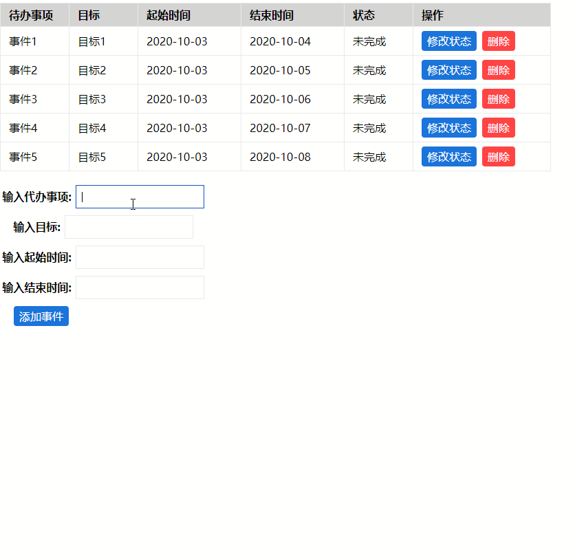
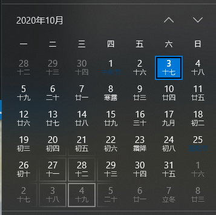

# vue3-todolist

### 0. 前言

之前已经学了一波vue3，笔记在[vue3学习笔记](https://juejin.im/post/6871493847847960589)

想直接看代码的可以去[github](https://github.com/LaoChen1994/Essays/tree/master/vue/vue3-todolist)

### 1. 实现效果 

### 2. 需求分析

#### 1. 模块功能分析

+ 列表展示(静态展示 + 状态修改)
  + table静态展示
  + table支持自定义列 (自定义slot的插入)
+ 事件录入(控制部分)
  + 自定义的input输入框
  + 日期选择器

#### 2. 组件分析

通过上面的分析，我们需要撸的组件大概有这么几个：

+ table
+ button
+ input
+ datepicker

好了需求明确了，废话不多说开干~冲冲冲

### 3. 一个简单的Table组件

#### 1. 打算怎么使用？

以前使用的React Table组件好像都是类似这么写的，就是指定对应的数据源，然后我们通过对每一列Column的配置，他会将对应列行的每一列去取得对应的字段填上去，emmmmmm我就要这种~

~~~vue
<SimpleTable :dataSource="todoList" :columnConfig="column" />

~~~

#### 2. 开始1.0版本

**目标：**

+ table列宽可定制 -> 通过colgroup指定对应的col的宽度
+ 每一列的title可定制 -> 通过thead 中的 th指定对应的header的名就好了
+ 每一列能根据传入的key从data中拿数据，在tbody的tr和td中遍历key就行了

~~~vue
<template>
<table class="table">
  <colgroup>
    <col v-for="item in columns" :key="item.key" :aria-colspan="item.span || 1" :width="item.width || '100px'" />
  </colgroup>
  <thead class="table-head">
    <th scope="col" v-for="(item, index) in columns" :key="'header -' + index">
      {{ item.title }}
    </th>
  </thead>
  <tbody>
    <tr v-for="(data, index) in tableData" :key="'tabledata' + index">
      <td v-for="(item, i) in columns" :key="'tabledata - index' + i">
        {{ data[item.key] }}
      </td>
    </tr>
  </tbody>
</table>
</template>

~~~

**现有问题**：

**目前我们已经可以支持简单的表单显示了，但是如果我们需要在后面增加自定义按钮要怎么弄的?**

Q1:  使用**slot**就可以啦~

#### 3. 开始2.0版本

**1. 我们可以这么用：**

~~~vue
<SimpleTable :dataSource="todoList" :columnConfig="column">
    <template v-slot:action="{ item }">
      <my-button :handleClick="handleChangeClick(item)" type="primary">修改状态</my-button>
      <my-button :handleClick="handleDeleteClick(item)" type="danger">删除</my-button>
    </template>

    <template v-slot:status="{ item }">
      已完成
      未完成
    </template>
</SimpleTable>
~~~

即： 如果我们那一行对应的slot是action，我们就加载我们自定义action的具名插槽，如果我们对应的是status的slot，我们就可以使用名为status的具名插槽，我们来看看怎么写这个v-dom的结构：

**其他代码略，我们仅改动tbody**

~~~vue
  <tbody>
    <tr v-for="(data, index) in tableData" :key="'tabledata' + index">
      <td v-for="(item, i) in columns" :key="'tabledata - index' + i">
        <template v-if="item.slot">
          <slot :name="item.slot" :index="index" :item="data"></slot>
        </template>
        <template v-else>{{ data[item.key] }}</template>
      </td>
    </tr>
  </tbody>
~~~

**记笔记：我们通过遍历column的时候去判断是否item中存在slot，如果存在的话，我们就加载对应的slot就行了**

### 4. 一个简单的input组件

#### 1. 新变动

input组件的问题在于，我们需要了解v-model自定义组件中的新用法：

[vue 3 v-model](https://v3.vuejs.org/guide/migration/v-model.html)官方文档中，说这里有一个breaking change：

+ prop:value -> modelValue
+ event: input -> update:modelValue

我们来看看现在要怎么用吧

#### 2. 我们想怎么用

~~~vue
<my-input
	label="输入代办事项"
	v-model="todoForm.title"
	showCol="true"
></my-input>
~~~

主要简单设计的api：

1. label -> 输入框的标题
2. showCol -> 是否显示冒号
3. 支持v-model

#### 3. 代码撸起来

**关键点：**

1. 原来我们通过this.$emit来触发事件，现在这些东西都在context也就是setup的第二个参数中，解构参数可获得
2. 外层v-model其实传入的参数是modelValue，我们emit要触发父组件v-model监听的事件是 update:modelValue
3. 我们input的change其实还是改变的value这个prop和监听@input这个事件，所以这一层我们不需要变动

~~~vue
<template>

  {{ label }}:
  <input type="text" :value="modelValue" @input="handleInpuChange" class="input_bar" @focus="focus" @blur="blur" ref="inputRef" />

</template>

~~~

### 5. 一个简单的datepicker组件

#### 1. 打算怎么用

~~~vuue
<my-date-picker
	v-model="todoForm.startTime"
	label="输入起始时间"
></my-date-picker>
~~~

提供的api能力：

+ 支持v-model获取选择的参数
+ 通过label指定对应的标题

#### 2. 思路分析

**datepicker其实分为两个部分：输入框 + 日期选择面板**

+ 输入框我们通过刚才的input可以完美打成我们的需求

+ 日期选择面板的制作

    + 思路前言：其实我们看下一般windows的日历，他其实分为6行，每行一个礼拜一共六个礼拜，我们只需要，将这个月的天数补齐在对应的位置，然后其他的用前一个月和后一个月的日子补齐就好了~~~
+ 计算第一天是周几 -> 来计算前一个月需要补齐的天数
    + 添加本月天信息
+ 剩下**6 * 7 - 前一个月的天数 - 本月天数** 用**后一个月补齐**
    

#### 3. 代码撸起

**重点**：

1. 我们通过input的blur事件来显示和隐藏我们的日期选择panel，但是其实你点击panel的时候input已经blur了，所以我们需要通过mouseover事件来监听是否在我们的panel上来使，点击的时候能获取到对应的日期
2. 在我们点击prev和next按钮的时候因为此时鼠标在panel内，因此我们再点击页面不会让panel收回，这是因为其实这个时候input已经是blur状态，后面点击页面其他位置不会再出发input的panel事件了，因此，我们需要通过ref去获取input，然后手动focus 一下input，解决这个bug
3. 在发生改变的时候，我们还是需要通过modelValue和update:modelValue来实现组件的双向绑定

~~~vue
<template>

  <my-input :label="label" :focus="handleFocus" :blur="handleBlur" :showCol="true" :modelValue="modelValue" ref="inputRef" />
  

    

      

      

      

        {{ year }} 年 {{ month + 1 }} 月
      

    

    

      

        {{ item.date }}
      

    

  

</template>

~~~

### 6.感谢

感谢你们看到这里，蟹蟹蟹蟹

