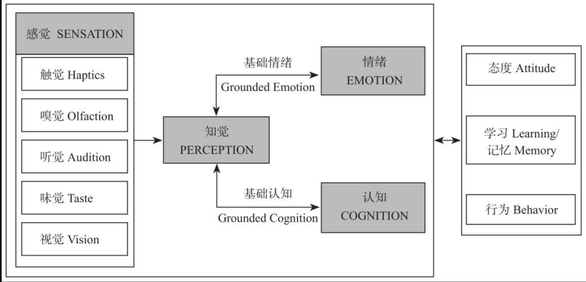
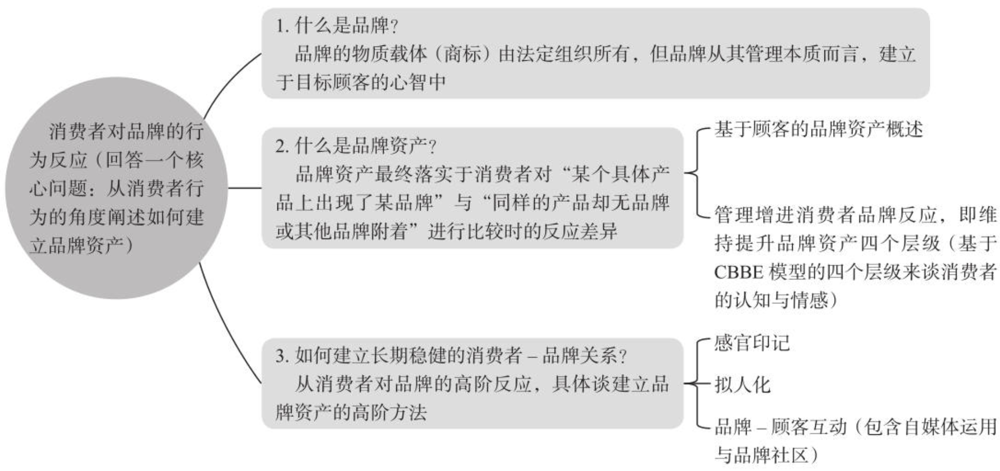

# 消费者行为学

## 前言

### 为什么你必须要了解消费者行为

1. **把消费者推向其所希望的方向**，将自己的产品推销出去，能够打中痛点
2. 你需要知道消费者的需求、引起他们注意的方法、令他们感兴趣的或难以忘怀的内容，让他们心甘情愿地购买产品
3. **只有消费者愿意为你的产品买单，才能实现你的价值**
4. 产品质量的提高，消费者却不能一定感知到这种质量的提升
5. 一定要在用户感知得到，在意的点去提升，了解消费者心理才能卖的更好
6. 有些时候，**太低的价格反而不会让用户放心购买**（因为消费者觉得好货不便宜，便宜没好货）

### 中国消费者有什么不一样

1. 受到政策影响巨大
2. 受他人影响巨大（亲友推荐），对新产品缺乏信任，更加依赖口碑
3. 中国消费者喜欢投资不动产（**中国消费者的焦虑，需要通过不动产来带来安全感**）

## 第一部分 影响消费者的内在因素 Who

### 1 身份与自我

#### 1.1 自我概念与自我意象

主题：**消费者行为如何受到消费者的自我认识以及对自我的情绪感受的影响。**

##### 我是谁
1. 自我认识中的动机（**一般而言积极大于消极**）
   1. 准确性
   2. 一致性
   3. 自我提升
2. 好于平均效应，大部分人都积极认为自己的表现比人群平均要更好

##### 自我意向：我是如何看待自己的

1. 自我意向具有主观性
2. 长期暴露在狭隘的广告中，让消费者对自己越来越不自信
3. 越来越多的商家和消费者逐渐意识到了不切实际的完美形象对消费者自我意象的负面影响，并做出了一些实际行动以期消除这些负面影响（**通过制造焦虑来卖货**）

##### 自我意想一致性模型

1. **消费者倾向于购买或使用那些与自我意象相匹配的商品或服务**
2. 策略：抓准用户画像

#### 1.2 身份

##### 自我构建与消费者行为

1. 自我构建：**独立型自我构建**和**依存型自我构建**
2. 东亚：依存型自我构建 欧美：独立型自我构建
3. 通过**暗示**（表述从我 => 我们）让消费者改变自我构建
4. 自我构建影响消费行为
   1. 自我构建人格以自己为主，倾向于自己做出选择，容易冲动消费
   2. 依存型自我构建以群体推荐为主，倾向于根据实用性做出选择
5. 针对依存型人格，突出"其他"消费者对其的青睐

##### 多重自我与消费者行为

1. 消费者拥有**多重自我**
2. 将消费者带入某个场景，某个角色，然后突出商品和消费者匹配的商品特性

##### 性别角色与消费者行为
1. **现代社会更偏好中性化**
2. 女性行为：
   1. 更重视人际关系
   2. 容易被他人影响
   3. 考虑集体的和谐性
3. 男性行为：
   1. 更加独立
   2. 更加自信
   3. 不易受别人的影响，对线索/物体更敏感

#### 1.3 从消费中认识自我

##### 自我知觉理论和自我信号理论

1. 自我知觉论：人们的行为会影响其态度
2. 自我信号论：通过自己的行为，给自己传递，自己可能存在的特质
3. 使用仿制品（山寨）往往让消费者认识到自己**不够真诚**，而且还会影响他们的

##### 延伸自我

1. 眼神自我指的是自己与商品之间简历情感联结
2. 购买产品一般具有所有权效应：一旦拥有商品后就会把它吹爆
3. 延伸的多重意义
   1. 消费者可能通过这些商品认识自己
   2. 消费者也有可能通过这些商品向他人展示自己
   3. 人们还会通过延伸自我进行怀旧

#### 1.4 自尊

##### 自尊是什么

1. 物的价值是决定人们对该事物的情绪感受的重要因素，一个人的自尊高低在很大程度上取决于其对自我的价值评估。

##### 自尊激励的本质

1. 负性的自我情绪会引发强烈的消费欲望
2. 对于自我的情绪感受，人们有一种**强烈的愿望和动机将它始终维持在正性的状态**，这一根深蒂固的动机被称为自我提升
3. 营销策略：
   1. 让消费者**对自我某些方面产生负性的情绪**感受
   2. 让消费者相信其所宣传的**产品能够改善自我，并消除这些负性情绪**

##### 自尊与他人眼中的自我

1. 决定自尊的两大因素
   1. 自我在自己眼中的价值
   2. 自我在他人眼中的价值（更重要）
2. 营销策略：
   1. 让消费者**相信自己在别人的眼中并不怎么样却是一件相对容易的事情**
   2. 是先使潜在的消费者感到被忽视或不被接受，然后提供给他们解决这一危机的方法

#### 1.5 如何评估自我价值

##### 社会比较

1. **人们通常通过与他人的比较来评估自己的社会及个人价值**
2. 社会比较方式：
   1. 向上比较：和比自己好的人比较。会有强烈的意愿想要改变自己，缩小差距
   2. 向下比较：和不如自己的人比较，获得优越感
3. 营销策略：
   1. 让潜在消费者进行向上社会比较，杜绝向下进行比较
   2. 向上比较容易让消费者因为不满而产生冲动消费行为

##### 反事实的比较

1. 理想自我和应该自我
   1. 理想自我：最高最大的目标（没有达到让人感到遗憾）
   2. 应该自我：最低目标（没有达到会让人感觉到羞耻）
2. 营销策略：
   1. 选择消费者的应该自我，而不是理想自我进行营销

##### 象征性的自我实现

1. 象征性自我实现：指的是用建立商品和应该自理想之间的关系，间接让人感觉实现了自我目标
2. 人们却常常因为**象征性地减少了自我差异就体验到浓浓的满足感并实现自尊的提升**
3. 营销策略：**让潜在消费者看到你的产品在某些方面象征性地代表了他们的理想或应该自我目标**

##### 恐惧管理理论

1. 利用死亡的恐惧来管理消费者的焦虑
2. 消费者的自我决定了自我的消费行为。
3. 营销策略
   1. 营销人员可以利用人们这种通过加入和归属某一社会群体来管理对死亡的恐惧焦虑的行为特征来改变及影响消费者行为

### 2. 需求和动机

1. 市场的核心是**争夺消费者**

#### 2.1 消费者需要和需求

##### 消费者想要什么
1. 需要值得是**欲望或要求**，需求指的是**具有支付能力的需要**
2. 需求一个重点是**考虑价格约束和受众群体**
3. 营销策略：
   1. 观察总结消费者的行为规律，从消费者反馈中挖掘他们**最本质的需求**
   2. 跳出现有框架，以意想不到的方式满足他们的需求

##### 需要的类别划分
1. **关注需要可以抓住市场机遇，并且通过价格区分来获取对应的用户**
2. 需要类别划分：
   1. 生理需要（温饱）：**营销活动的重点则集中在精准发掘人们渴望满足生理需要的时刻**
   2. 安全需要（对秩序、规则、健康的追求）：营销活动侧重对安全感的时刻（经济安全、健康安全等）
   3. 社会需要：营销主打亲情牌，针对社会性的社会
   4. 尊重需要：营销侧重对于人自尊的满足，比如打赏后被给予的一句谢谢
   5. 自我实现需要：营销侧重理想自我，诗和远方
3. 自我决定论，人类内心的**三大心理需求**：
   1. 胜任力需要：在活动过程中体验到自己的**能力和满足感**
   2. 自主需要：希望自己的想法和行为都是**出于自己的意志，而非受外界所控制**
   3. 关系需要：能够维持良好的社会关系

#### 2.2 难以说出口的消费者需求

极大倾听消费者的需求，可能会局限在消费者的认知中，而没有办法做出真正划时代的产品

**与其在意消费者的态度，不如专注其行为（言行举止、生理反应）**

消费者告知需求中的几个瓶颈：
1. 不知道
2. 说不出来
3. 不愿意说

##### 消费者不知道
1. 在没有被激活之前，消费者没有意识到需求的存在
2. 不了解真正选择的原因，通过合理化自己选择的理由来做选择

##### 消费者不愿意说

1. 人们通过给自己的购买行为找一些功能型的借口来掩饰自己真实的享乐型目的
2. 出于对调研者的礼貌或者讨好企业的原因
3. 消费者需求和自己的利益存在冲突，故意隐瞒

##### 消费者说不出来

1. 无法用语言描述，通过记忆回忆来描述存在偏差
2. 消费者本身认知存在偏差

#### 2.3 挖掘消费者需求的基本方法

##### 定性方法
1. 深度访谈：
   1. 按照特定主题对消费者进行深入访问
   2. 通过他们对现有消费活动的态度和情感来判断他们的潜在需求
   3. 阶梯式提问，提升消费者对需求的理解
2. 焦点小组：
   1. 将一定人数的消费者聚集在房间中，通过单向玻璃观察其互动评价
   2. 焦点小组的优势在于消费者之间的互动能够告诉调查者许多单独访谈中无法获得的信息
   3. 消费者之间的讨论范围往往更加宽泛和发散，能够激发调查者的创新思路
3. 人种志研究
   1. 通过在真实环境中进行第一手观察和参与来进行对人类社会的描述研究
   2. **用一种“上帝的视角”来客观地看待消费者在产品使用过程中的需求**
4. 投射法
   1. 把自己的思想、态度、愿望、情绪或特征等，不自觉地反映于外界事物或他人的一种心理作用
   2. 通过访问技巧，来侧面预测一个不相关的消费者会怎么做

##### 定量方法

1. 定量方法以数据为佐证，有利于验证判断的正确性
2. 三种定量研究方法
   1. 描述性研究：消费者需求的现状如何、反应消费者需求
   2. 相关性研究：回答现象会在“何时、何地、何种条件下发生”这类问题，用海量数据揭示**事物之间的规律和相互关系**
   3. 实验性研究：控制变量法进行实验，排除无关因素（推崇的是田野实验，即在真是环境下）

##### 研究方法的选择

#### 2.4 消费者的目标

##### 目标内容

1. 目标的升职和贬值效应：一个人**追求什么目标，与该目标有关的东西就会显得异常重要**
2. **一个迫切要紧的目标会抑制无关事物对这个人的吸引力**

##### 目标体验

1. 追求目标的不同阶段、内心冲突程度也会影响消费者的心理和行为
2. 相比于只有单一目标的消费者，那些**经历了目标冲突的消费者或者没有明确目标的消费者更有可能做出混合型选择集**
3. 在追逐目标的早期，伙伴们往往关系非常密切，越接近达到目标，越会出现分歧和疏远

#### 2.5 消费者目标与需求的应用

##### 利用目标的记忆特性

1. 通过唤起消费者的需求，来进行获利，因为**需求一直都在**
2. 可以通过蹭热点来实现利益增长
3. 营销策略：
   1. 通过测热点来占据消费者的心理资源、激发他们的购买欲望
4. 目标之间的相互抑制性，如果没有成为消费者的**主要采购目标，会被消费者遗忘**
5. 调研消费者真实的需求，从竞争者手中抢到**钱包份额**对电商企业尤其重要

##### 沟通策略的选择

1. 内在动机和外在动机：
   1. 外在动机通过奖惩机制，在内在动机不足时被引入
   2. 外在动机很有可能会剥夺人类的内在动机
   3. 营销策略：**使用金钱等外在激励促进消费者活动时候，要考虑是否会蚕食消费者的内在动机**
2. 趋近型动机和规避型动机
   1. 趋近型：为了达到某种目的
   2. 规避型：为了避免某些事情
3. 享乐动机和实用动机
4. 理性动机和感性动机
   1. 2/3/4的营销策略：**根据消费者的特质调整自己的沟通方式**

##### 积分奖励计划

1. 企业可以通过**积分奖励计划**来帮助消费者更好、更快地完成目标，并实现盈利
2. 营销策略：
   1. 为消费者的购买行为树立目标，从而塑造其忠诚购买行为和消费习惯
   2. 即使积分的实际价值没有发生变化，**更大数额的积分也更具激励作用**
   3. 通过设置虚假进展，让用户更容易达成目标
   4. 设置亚目标，激励用户完成目标，避免畏难情绪（**把容易的亚目标放在整个积分计划的前期进行，能够更好地帮助消费者实现目标**）
3.

### 3. 知觉和注意力

#### 3.1 消费者知觉概述

##### 感觉和知觉

1. 感官体验对许多产品或服务的营销意义非凡
2. 感觉可以理解成客观存在的，知觉可以理解成因为客观存在带来的主观感受

##### 知觉的形成

1. 暴露：当一种刺激进入感觉器官范围内
2. 注意：对特定的刺激选择性的进行关注
3. 解释：对感官的刺激赋予一定的意义

#### 3.2 消费者的感觉与感官营销

##### 感官营销概念模型

1. 一些卓越的企业通过优化消费者感官体验、丰富产品的感官属性来获得竞争优势
2. 感官营销是指将**消费者的五种感官体验（视觉、触觉、味觉、嗅觉和听觉）融入其中来影响消费者感知、判断和行为**的营销方式

##### 感官对行为的影响

1. 触觉：
   1. 人人直接接触：是把双刃剑
   2. 人人间接接触：影响消费者的关键在于是谁摸过（名人效应）
   3. 人物接触：触摸商品能够增加消费者的购买欲望
   4. 环境触觉：例如环境温度能提高消费者的社会亲近感并使消费者表现出更多的从众行为
2. 视觉：
   1. 空间特征：
      1. **认知偏差**（视觉捕获的形状等空间特征，会使消费者对产品容量、重量等量值的估计产生偏差） 
      2. **隐喻认知**（指消费者对长度、形状、颜色、位置等空间特征或概念赋予空间属性之外的意义）
   2. 颜色：
      1. 颜色容易影响人们的动机或情绪
      2. 例如红色让人具有更高的唤醒水平、攻击行为、竞争表现
      3. 例如蓝色让人更加有亲近感和低欲望
   3. 环境亮度（亮度低会让人更悲观）
3. 听觉
   1. 语音：关注音频、音量、节奏等
      1. 动听的音乐有积极的作用
   2. 非语音：关注声音属性和环境噪声
      1. 音乐：音乐能增强广告的劝说效果
      2. 产品本身的声音属性：声音影响消费者对产品的判断
      3. 噪声：适当的噪音能提升创造力，分贝过大创造力会下降
4. 嗅觉
   1. 消费者对环境的警觉和评价
   2. 与嗅觉有关的具身认知效应
   3. 影响消费者的记忆与学习
5. 味觉
   1. 对人们的一些社会判断产生具身效应
   2. 味觉容易收到其他感官的影响
6. 营销策略：多感官整合，品牌名称与口味协同、气味与音乐协同等

##### 塑造感官印记

1. 视觉：主要**从美感和记忆度方面来展开标识设计**与其他企业和产品形成区隔和识别
2. 听觉：起名字的时候要充分考虑其发音
3. 触觉：触觉能够决定感知产品的基调
4. 嗅觉：**适当气味的产品**可以让消费者对产品信息的记忆延续到两周之后
5. 味觉：味觉对消费者判断力影响不大
6. 营销策略：**感官营销是一个增值动作或者说是加分动作，它必须在营销的基本动作已经做到位之后才能够发挥作用**

#### 3.3 暴露与注意

##### 暴露与感觉阈值

1. 提高广告的绝对阈值，让消费者能够更容易得到营销刺激
2. 调整价格中应该遵循差别阈值
   1. 正面变化高于差别阈值：让人能感受出来
   2. 负面变化低于差别阈值，降低消费者知觉
3. 韦伯定律：**第一次刺激的量越大，人们察觉出变化时就需要有更大的变化量**
4. **使用阈下知觉**（潜在的广告植入）引发情绪或者概念效应，间接刺激消费

##### 简单暴露效应

1. 简单暴露效应：仅仅是刺激的**暴露次数的增加**就可以增加消费者偏好
2. 营销策略：利用明星效应将消费者对明星的喜爱迁移到产品上

##### 注意与知觉选择

1. 鸡尾酒效应：**刺激与消费者自身及其需求的关联程度影响注意的选择**
2. 刺激与消费者**自身及其需求的关联程度**影响注意的选择
3. **增强对比也是捕获注意的重要方法**，和别人与众不同来争夺眼球
4. 营销获取边际受益要注意避免重复而让消费者**产生适应**
5. 使用眼动仪来找到消费者关注的规律

##### 营销人员的新挑战：注意力碎片化

1. 移动互联网时代的营销策略：
   1. 内容植入
   2. 快速引起兴趣
   3. 激发互动和分享

#### 3.4 知觉解释

1. 影响知觉的因素：
   1. 个体对刺激物的组织方式
   2. 消费者既有的经验图示
   3. 社会环境的象征意义

##### 个体对刺激物的组织方式

1. 完形原则：倾向于把不完整的对象感知成完整的对象
2. 相似分组原则：消费者倾向于对物理特性相似的刺激进行归类
3. 主角原则：指个体很难同时注意到主角和背景

##### 消费者既有的经验图式

1. 指消费者会根据自己过去的经验来解读和理解当前遇到的事物
2. 营销人员除了可以启动消费者的正面经验之外，还应当避免唤醒可能导致负面评价的经验模式

##### 社会环境的象征意义

1. 消费者对刺激的解释不仅受到个体心理和经验的影响，还会受到社会环境的影响。

##### 综合运用：品牌知觉定位图

1. 知觉图的目的是尝试将消费者或潜在消费者的感知用直观、形象化的图像表达出来
2. **企业通常会挑选在知觉图上没有其他竞争对手的位置进入**

### 4. 消费者情绪

#### 什么是情绪

##### 情绪的定义

1. 通过广告激发各种消费者情绪从而达到其营销目标
2. 情绪让消费者对品牌产生依恋，甚至购买自己不需要的东西
3. 情绪的组成部分：生理唤醒、主观体验、外部行为

##### 情绪的分类

1. 根据：两极性、相似性、强度进行三维区分

##### 情绪的功能

1. 动机功能：激励人的活动，提高活动效率
2. 组织功能：情绪能够改善人信息处理的质量并且还会影响消费者的注意和被消费者记住
3. 信号功能：用来在人际间通过表情来传递和沟通信息，任何品牌形象一致
4. 感染功能：情感可以传递给身边的其他人
5. 迁移能力：消费者会爱屋及乌，因此选对代言人，带货人，品牌很重要 
6. 营销策略：
   1. 通过诱导消费者产生积极情绪，来达到消费推广的目的

#### 情绪和消费者行为

##### 基本情绪和消费者行为

1. 快乐
   1. 在快乐中容易记住产品，对产品评价更加积极
   2. 消费者在快乐的情绪下决策会非常快
2. 悲伤
   1. 悲伤让人反思
   2. 悲伤往往会更加偏好高风险、高报酬的选择，去进行补偿
   3. 悲伤让人更多进行享乐型消费
3. 后悔
   1. 后悔的类型：**预期后悔**和**购买后的后悔**
   2. 降低用户的购买后悔可以挽救品牌评价、品牌态度和忠诚度
   3. **预期后悔比购买后悔要更强烈**
   4. 创造不可逆的购买机会的购买，错失后会造成更强烈的后悔（短期后悔）
   5. 商家想要消费者续用就应该提升预期后悔，如果想要抢占客户就需要消除这种预期后悔
   6. 营销策略：**提高转换成本，降低用户流失率**（技术壁垒、产品专用性、服务可得性和便利性）
4. 恐惧：
   1. 降低对过去和将来的关注，让消费者关注限制在当下
   2. 让消费者产生风险规避以及采用系统的信息处理方式
   3. 营销策略：
      1. 较高程度的恐惧使用第三人称，较低程度的恐惧使用第一人称
      2. 使用恐惧情绪和其他情绪配合促使消费者**进行更多的健康行为**

##### 自我情绪和消费行为

1. 羞愧内疚：通过热情周到的服务降低消费者的内疚情绪，提高交易达成的可能性
2. 尴尬：
   1. 尴尬营销会让消费者逃离且损害品牌形象
   2. 尴尬的出境会让个体去修复个人形象，让自己更加正面和积极
3. 自豪感：
   1. 傲慢的自豪：让消费者选择独特的产品（奢侈品）
   2. 真正的自豪：促进消费者的积极行为，来维持自我价值（你的值得拥有）

#### 消费者行为中的情绪影响和情绪应用

##### 情绪的影响方式

1. 整体性情绪：
   1. 消费者体验产品的整个过程
   2. **整体性情绪和产品评价、产品购买之间的关系非常强**
   3. 消费者在缺乏行业经验、需要快速做出决定、消费动机低的场景下，**受整体性情绪影响会被进一步放大**
   4. 营销策略：关注整体美感和产品本身，不要过度介绍产品参数等，**交给消费者整体性去做决策**
2. 伴随性情绪
   1. 源于伴随性情绪可能来源于**个体长期性的情绪特质**
   2. 主要通过同化效应产生，比如高兴时做出消费决策更高
   3. 只有消费者处理信息动机和能力在中等水平，伴随性情同化效应才最强
   4. **消费者不清楚伴随性情绪的来源时最强**
   5. 只有当消费者**决策基于体验性动机、选择享乐型产品、采用整体性判断**以及为自己做决策时，伴随性情绪的同化效应的影响才会最大化
3. 在决策过程中需要在各种属性或者产品之间做出权衡导致的不愉悦感往往会导致消费者采用规避型的策略（保持现状）
4. 提升决策的愉悦感，提升转化：
   1. 价值匹配，决策方式和目的互相匹配
   2. 降低期望属性和可的属性的权衡，降低决策困难
5. 使用美感溢价，提高产品的吸引力和评价
6. 通过产品诉求来激发消费者的某种特殊情绪
7. 通过**塑造仪式**和激活怀旧情绪来迎合消费者的品牌偏好
8. 从环境入手刺激消费者：
   1. 感官刺激需要保持一致
   2. 家笃信的一些策略，其实并非如商家预期的那么有效
9. 情绪塑造过程中的关键点
   1. 负面情绪替换成积极情绪
   2. 降低消费者的不舒适感
   3. 混合情绪中：**较低水平的构建往往是一种基于情景的信息解读，常常反映了一些具体的行为和事件；而抽象的、较高水平的构建则是一种去情景化的，反映了对行为和时间更加普遍的理解**
   4. 消费者采用具体的信息处理方式的时候，混合情绪会带来负面的态度；而当消费者采用抽象的信息处理方式的时候，混合情绪会带来更加积极的态度。
10. 情绪的影响存在跨文化差异
11. 

### 5. 信息加工

#### 5.1 注意力

##### 什么是注意力

略

##### 注意力的特点

1. 一个人在某个时间点能同时处理的**信息容量上限是7±2个信息块**
2. 广告躲避行为更多地发生在**生活繁忙、高社会阶层、年轻的男性消费群体中**
3. 营销人员需要了解在**不同的产品品类中消费者不同的注意偏好**
4. 如果某个**没有被关注到的刺激突然很吸引我们**，我们就很有可能分心

##### 影响注意力的因素

1. 消费者个人因素
   1. 动机：需要和兴趣驱动
   2. 能力：广告本身至少**要超过消费者的差别阈限**，这样消费者才能体会到产品的变化和不同
2. 营销策略：产品有利更新要大于差别阈值，不利更新要低于差别阈值
3. 刺激物的因素
   1. 个性化
   2. 情绪的愉悦
   3. 与预期不符：令人意外的信息
   4. 容易识别和理解

##### 消费者如何注意到信息

1. 图形与背景指人们倾向于把信息置于一个背景之中来感知
2. 封闭原则：通过残缺的图案让人自动补全一些信息，加深印象
3. 归类原则：人们会把信息进行分类，从而更容易对这些信息加工处理

#### 5.2 记忆和提取

**把品牌打造成品类的代名词，就能占据消费者心中的重要地位**

##### 三种记忆类型

1. 感觉记忆（瞬时记忆）：将感官体验短暂、及时地存储起来的能力就被称为感觉记忆。
2. 短时记忆：将瞬时记忆进行一些加工，**绝大多数的信息加工和处理都发生在短时记忆中**
   1. **激活多重感觉通道对短时记忆进行加工**，会直接影响到消费者是否喜欢这个商品
   2. 短时记忆会影响我们对拥有某个商品的满意度
3. 长时记忆：短时记忆中的信息通过**不断重复和充分的加工之后**进入长时记忆，自此便可在头脑中保持很长的时间
4. 消费者会记住与**广告中宣传的产品相关的体验和经历**
5. 怀旧可以让过去成功的经历和亲密的人际关系重现，从而**给予我们生活的安全感和归属感**，消除孤独感，引发亲社会行为

##### 如何提升记忆

1. 分组：短时记忆3～4个组块更容易被记忆，所以**营销人员把较长的信息分解成到一个组块，并重复将短期记忆变成长期记忆**
2. 复述：主动去重复那些信息，便于消费者去记住
3. 阐释：通过对信息进一步精加工和阐述将其转移到长时记忆

##### 什么是提取

1. 外显记忆: 努力回忆，尝试记起某件事情
2. 内隐记忆：在提示下直接通过处理完的长期记忆被提取出来
3. 营销策略：
   1. 宣传提升消费者对品牌名称、产品属性、品牌优势的回忆（成熟市场新晋产品）
   2. 不好的回忆会影响消费的选择
   3. 使用内隐记忆来确认回忆和广告之间的有效性

##### 如何促进记忆的提取

1. 信息特点：
   1. 突显性：刺激要比较突出
   2. 代表性：能够代表一个品类或者成为领头羊
   3. 传播的媒介：找到更合适的传播渠道
2. 信息加工过程
   1. 通过感觉编码存储的信息会被记得更牢
   2. 广告通过**图片和形象化的文字和形象的引导**，来促进信息的双重加工
3. 消费者的特点
   1. 心情：愉悦 -> 积极的记忆，低落 -> 消极的记忆
   2. 专业性：专业性连接起的记忆网络能让人记住更多的品牌和产品信息

##### 提取失败
1. 随着时间而只产生一些**模糊的印象**
2. 营销策略：通过消费者的记忆消退通过虚假广告来产生越来越积极的态度

##### 减少消费者的遗忘

1. 利用艾宾浩斯遗忘曲线规律，在**在消费者接触第一个广告之后，应该在短时间内让广告反复曝光**
2. **智能电子设备仿佛是一个干扰源，让我们无法集中注意力用心感受不同经历带给我们的体验**

#### 5.3 学习

消费者的学习行为，将影响产品对消费者的认知，从而影响消费者的消费行为

##### 行为学习理论

1. 行为学习理论：行为反馈造就了我们的后续行为，**通过条件反射引导用户学习**
2. 经典条件反射：
   1. 营销人员**将线索和刺激相匹配**，并且**重复曝光可以增强刺激–反应的联结，并且防止这些联结在记忆中消退**
   2. 是一种**自发且简单**的行为，将刺激和线索重复多次配对
   3. 营销策略：适当重复广告（重复内容是否需要变换和竞争对手策略有关），并将广告和产品调性与网站内容产生关联
3. 操作条件反射：
   1. 刻意实现某个小目标，来对消费者的行为进行塑造，通过**奖惩机制来激励消费者产生依赖**
   2. 营销策略：利用顾客忠诚计划来逐步增加条件反射的反馈

##### 认知学习理论

1. 认知学习：观察学习，并在日后的场景中运用这些信息来指导自己的行为
2. 营销策略：影响和改变消费者的行为，通过模仿效应，**利用明星效应和标杆效应来让模仿对象给消费者留下刺激**

##### 消费者如何习得自己的消费行为

1. 父母影响：可以将产品的偏好进行"遗传"，造就跨代际的品牌忠诚
2. 电视和互联网：像儿童推荐产品，养成终身习惯，广告潜移默化的影响
3. 认知发展：将不同认知阶段的儿童分层，通过**品牌名称和品牌含义**来加深孩子对品牌的偏好
   1. 通过不断给消费者提供建议，来**塑造消费者的消费选择**（种草式）

## 第二部分 影响消费者的外在因素 What

### 6. 关系中的消费者

#### 6.1 社会关系对消费者的影响

##### 关系网络的力量

1. 多数人是通过少数人与世界链接的
2. 少数人的特点：
   1. 认识的人数数量庞大
   2. 认识的人分布在各个领域
3. 营销策略：企业可以通过找到少数人，制造爆点，从速度和深度上进行高效传播
4. 为何弱关系有时更有用
   1. 强关系联系紧密，往往很难带来新的机遇
   2. 强关系中往往重叠性更高，所以存在更多的竞争
   3. 若关系有帮你跨越社交圈层，带来更多更有用的信息

##### 家庭关系对消费者的影响

1. 让步：
   1. 建立关系初期：男性占主导，女性展现出温顺与服从
   2. 关系确立与成熟：女性在关系维系中占主导地位
2. 奢侈品对女性的作用
   1. 让情敌看到男方对女方的用心程度，炫耀式消费
   2. 第三方女性追求短期关系，这种威慑才有用，若追求的是长期关系就没用了
   3. 营销策略：在设计上更加突出两性关系
3. 家长的消费观影响
   1. 儿时过分强调物质财富可能会对其产生持久的影响
   2. 避免让孩子产生典型的物质主义价值观
4. 经济不好的时候消费者偏爱女孩，因此可以调整销售和市场资源的配置
5. 社会关系会影响人的消费决策，核能会因为群体激发的目标做出选择

#### 6.2 基于关系的礼物经济

##### 礼物承载的社会功能

1. 传递信息：
   1. 间接通过礼物来传递信息可能导致，**传递和理解的不对称，导致送礼的失败**
   2. 送礼方更在乎与收礼方之间的社会关系距离，因此在选礼物时多会选择表面看上去高质量、高价值的商品
   3. 收礼方作为商品的使用者，并不太在乎双方的社会关系，而是更多地看重商品使用时的便利程度
2. 关系的巩固与建立：
   1. 在双方关系没有明确确立的时候，单方的送礼行为很有可能会得不偿失
   2. 价格必须与送礼方和收礼方的经济状况相匹配
   3. 收礼方的反馈信息就明确了双方关系的性质

##### 送礼的文化差异

1. 中国的送礼模式多建立在人情世故之上
2. 西方更多地考虑人与人的情感交流和礼物本身的吸引力
3. 送礼的准则：
   1. 不要直接直接送钱
   2. 礼物是否值钱并不重要，心意往往更重要
   3. 礼物要重体验而不是实物
   4. 有可能把礼物包装一下
   5. 写一份贴心的文字，解释自己的用意
   6. 送一份可以分享的礼物
   7. 最好能带来一些惊喜

##### 亲社会行为和幸福感

1. 赠人玫瑰手有余香，给别人带来幸福的幸福感更高

##### 亲社会行为幸福感的条件

1. 与他人的连接：没有社交链接不会带来愉悦感
2. 彰显自己的能力和价值：能够给人带来了改变
3. 自主的权利：是因为自己的心意做出的自由选择
4. 营销策略：将商业利益行为和亲社会行为有机结合起来，产生双赢

#### 6.3 去中心化的社群经济

##### 去中心化

1. 去中心化：每个节点都可能成为阶段性的中心，不存在强制性的控制中心
2. 去中心化的意义
   1. 可容错
   2. 抗攻击性
   3. 抗共谋

##### 去中心化的社群经济

去中心化的社群经济可能更多的是**为消费者搭建人与人连接的平台**，让他们**通过社群自发的“内力”找到他们所需要的“价值核心”**，而不是传统的先建立商品的“价值核心”，再把这个核心卖给消费者使其接受

##### 去中心化后诞生的粉丝经济

去中心化后每个人都有发言权，为粉丝经济奠定了基础

### 7. 群体

#### 7.1 消费者的个体身份与群体身份

**具有个性特征的消费者通过消费与该个性特征相关的产品**来建构自己的群体身份

##### 个性化定制还是群体化定制

1. 个性化：根据自己的独特特性选择与别人不同的东西；
2. 群体化：从众表现出群体特征
3. 营销策略：
   1. 个性化：针对小众群体（有特殊个性需求），不好标准化
   2. 群体化：有模版，针对群体定制的企业营销方案

##### 消费决策如何同时体现个性追求和群体特征

1. 消费者用产品的不同方面来体现个体属性和群体属性
2. 品牌效应在表现群体属性
3. 品牌的颜色、款式对应个性特征

#### 7.2 群体的建构

1. 对消费者群体自我评价和决策产生影响的原因：
   1. 可获得性：能否充分接触了解群体中他人的相关信息
   2. 相关性：参照对象和自己的可比程度（在同一个背景下）
2. 只有**相关性高**的场景才会影响个体决策

#### 7.3 参照群体

##### 参照群体的概念

1. 参照群体：**个人的看法愿望与行为受到真实或者假想的他人或群体的影响**
2. 参照群体影响决策：
   1. 信息
   2. 功能
   3. 价值表达
3. 参照群体影响**主要发生在消费者购物决策不确定**的情况下
4. 消费者会基于**参照群体与品牌的联结而建立自我与品牌的联结**
5. 品牌选择帮助消费者**寻求群体** (获得群体的认同感)或**回避群体**

##### 参照群体的相关理论

1. 诉求群体的形式：
   1. 从众：向人多的方向变化
   2. 依从：受到别人期待，努力做出符合别人期待的样子
   3. 服从：被迫做出相应的样子
2. 从众者和依从者必须有一定的认同或寻找到自身行为的理由，才会跟从外部影响而产生行动
3. 营销策略：
   1. 宣传时，利用从众心里告知大多数人都在做什么，让别人也加入
   2. 在推销时：商场先排队促销，人多吸引其他消费者驻足购买

##### 典型的参照群体

1. 亲密群体
2. 购物伙伴
3. 消费者部落
4. 品牌社群

##### 参照群体发挥效应的影响因素

1. 个性特征
   1. 顺从行人格容易收到参照群体影响
   2. 自我监控倾向较高的个体也会收到他人意见
2. 群体因素
   1. 专业性
   2. 权威性
   3. 群体的结构性（规模越小、凝聚力越强的群体内个体收到影响的可能性越高）
3. 产品因素
   1. 感知风险：感知风险越高，越需要群体的建议，因为不确定性越大
   2. 显著性：足够吸引人

#### 7.4 潜在影响的群体
##### 社会阶层

1. 社会阶层不仅影响个体拥有多少物质财富，还决定了个体的生活方式和消费方式。
2. 社会阶层是由多个纬度决定的
3. 划分社会阶层的变量
   1. 经济变量
   2. 社会变量
   3. 政治变量

##### 社会阶层对消费决策的影响

1. 社会阶层影响了：消费水平、消费方式、消费观念
2. 消费者接触媒介：
   1. 低社会阶层倾向于**代入感较强的电视节目**
   2. 高社会阶层倾向于**个性化的手段，展示地位和自我形象**

##### 世代消费群体

1. 不同代际群体消费影响方式：
   1. 拥有的物质财务、闲暇时间
   2. 成长的社会环境和经济环境造就了不同的思维方式和生活理念
2. 对于80后一代的消费更偏好于娱乐导向的媒介而非信息导向的媒介

#### 7.5 基于群体的消费者画像和市场细分

##### 用户画像

1. 用户画像旨在推测一组能够很好地**描述用户消费习惯（或特定偏好）的用户属性**
2. 利用用户画像将客户进行标签化，对不同个体推送个性化信息

##### DSP广告（需求方平台广告）

1. 基于平台用户画像，针对用户进行**精准投放**来实现ROI极大的提升
2. DSP广告的运作流程
   1. 整合分析平台用户行为
   2. 生成平台用户档案，构建用户画像
   3. 竞价广告拍卖给匹配用户的广告主

##### 基于社会阶层的市场细分

1. 企业的营销应当设计满足特定“圈子”的品牌形象，而这样的“圈子”会在社会阶层的相关变量上表现出来
2. 营销具体方式：
   1. 企业识别各个社会阶层其品牌偏好、购买动机和品牌符号意义之间的联结
   2. 确定社会阶层作为目标市场
   3. 根据目标消费者的生活方式和品牌价值偏好选择品牌定位
   4. 结合目标消费者的社会阶层信息、媒体使用信息等制定价格、产品、渠道和促销策略

### 8. 品牌

#### 8.1 定义品牌

##### 什么是品牌

1. 品牌的目的：其目的是使消费者能够识别卖家或者卖家提供的产品或服务，并将这些产品或服务与竞争者提供的产品或服务区分开来
2. 消费者购买的不仅仅是产品，还包括**品牌带给消费者的心理利益和物质利益**
3. **理解品牌的定义时必须从消费者的心智层面出发**

##### 品牌存在消费者的心智中

1. 对于消费者而言，品牌不仅仅为了区分产品，还暗示着产品质量、服务保障，以及与他们自身的存在、价值观和生活方式等产生了紧密的联系。
2. **为品牌内涵找到准确的定位**
3. 营销策略：将自己的品牌定位和品牌内涵建立在对消费者心智的洞察基础上，并在**产品所提供的利益点与对目标消费者心智和需求的洞察中找到重合点**

#### 8.2 品牌资产

##### 基于消费者的品牌资产概念

1. 不同反应（通过不同反应反映消费者对品牌的认知、态度、行为表现）
2. 品牌知识（从不同渠道获取某个品牌的信息）
3. 消费者对营销活动的反应（正反映：正资产；负反应：负资产）
4. 

##### 品牌知识

1. 品牌知名度：
   1. 品牌识别：能够认出这个品牌（影响当场购买）
   2. 品牌回忆：给出品牌相关的类目、类别，能否本能想到这个品牌的产品（影响非当场决策场景）
2. 品牌形象：
   1. 品牌属性
   2. 品牌给消费者带来的利益
   3. 对品牌的态度
3. 营销策略：避免采用不适当的营销沟通而造成品牌虽然有强大或者独特的品牌联想却是负面的品牌形象

##### 建立基于顾客心智的品牌金字塔模型

1. 构建强大品牌的步骤
   1. 品牌显著性：提升品牌深度和广度（让别人看到品牌能知道品牌是什么，所属的领域）
   2. 建立良好的品牌绩效和品牌形象
      1. 品牌绩效：产品是否可靠耐用、服务效率和态度
      2. 良好的品牌形象：消费者特征、个性与价值、品牌历史、传统和发展历程
   3. 品牌反应：
      1. 品牌判断：对品牌的总体评价和观点
      2. 品牌情感：温暖感、有趣、兴奋、安全感、社会认可、自我尊重
   4. 品牌共鸣：品牌依赖带来的重复购买
      1. 行为忠诚
      2. **态度忠诚**：发自内心的持续购买，最重要
      3. 品牌社区：使用统一品牌的客户之间产生亲切感和认同感
      4. 品牌参与：消费者愿意参与品牌的后续活动
2. 营销策路：
   1. 强度：品牌中晨读和群体意识程度
   2. 活力：消费者购买和使用某品牌的频率
   3. 在了解了消费者的心智地图之后考虑是否有一些消费者心中已有的联想可以用于品牌建设
3. 营销上的酷：
   1. 能够打破行业常规，某些不合理但是却被人们视为理所当然的事情
   2. 打破行业常规，提升消费者使用体验和感受

#### 8.3 品牌管理前沿

##### 脑科学与品牌

1. 品牌可以更多地激活大脑前额叶等与信息加工高度相关的脑区
2. 可以更多地激活大脑前额叶等与信息加工高度相关的脑区

##### 脑科学在品牌建设中的运用

1. 在品牌建设以及营销中预测消费者的喜好,**将脑成像技术当作数据采集技术，从而对消费者对于品牌营销计划进行预测**
2. 如果一个品牌拥有更积极的品牌知识结构，这个品牌的市场表现会更优秀
3. 脑科学的研究发展和工具能够使研究者和经理人实时观察到人们在受到营销活动刺激时脑部的反应，脑科学工具为探索那些难以探测到的行为机制提供了可能的途径

#### 8.4 品牌引起的感官反应

1. 感官品牌：为消费者提供的感官经历包括视觉、听觉、嗅觉、触觉以及味觉各种刺激，提升消费者购买欲望
2. 建立品牌印记的方式：
   1. 根据品牌被使用和消费的情境来设计感官印记，建立消费者和品牌之间的联系
   2. 思考该品牌**与其他品牌的差异点在哪里**与**如何通过感官渠道建立品牌印记**
   3. 考虑消费者是怎么购买自己的产品的

#### 8.5 品牌拟人化

##### 品牌个性

1. 消费者有时会将人类的个性特征赋予品牌
   1. 中国人关注的：仁、智、雅、勇、乐五个纬度
2. 消费者还会用人与人之间交流的维度来对品牌（产品品牌或者企业品牌）产生认知，这两个维度为**温暖**和**竞争力**
3. 一个品牌能够被认为具有温暖人格特征又有竞争力，那么就能够得到消费者的亲睐

##### 品牌性别

1. 消费者不但会赋予品牌不同的人类个性特征，也会赋予品牌人类的性别。
2. 消费者对自身的性别感知与品牌性别一致，那么消费者对于品牌的态度以及对于品牌延伸的态度都会提升

##### 品牌个性对消费者的影响

1. 消费者或者会将品牌视为自己的伙伴，或者将品牌视为自己的仆人。
2. 如果消费者视品牌为自己的伙伴，消费者会**不由自主地表现出与该品牌个性特征一致的行为**

##### 消费者与品牌的纽带

1. 品牌的纽带取决于消费者的自我意识与品牌之间的关系
2. **品牌越能够反应消费者的自我认知，消费者与品牌的链接越强**

### 9. 心里定价

#### 9.1 交易价值

1. 价格通常是影响交易是否成功的重要因素之一
2. 定价时需要考虑的因素
   1. 消费者
   2. 合作方分利
   3. 竞争者定价
   4. 情境
   5. 公司自身因素
3. 消费者因为都是有限理性甚至非理性的，所以商家需要通过聪明的定价来提升消费者的价值感知

##### 交易效用理论

1. 交易理论：
   1. 获得效用：取决于该商品**对消费者的价值**以及消费者购买它所付出的价格
   2. 交易效用：消费者购买该商品所付出的价格与该商品的**参考价格**之间的差别
2. **理性的消费者需要关心的应该只是它可以带来的实际效用和它现在的价格**

##### 感知交易价值的因素

1. 影响感知交易价值的三要素
   1. 支付痛苦
   2. 元认知：在观察价格，计算折扣等过程也会感受到痛苦
   3. 价格公平感：消费者对价格公平与否的判断与其在交易中感受到的愉悦性密切相关
2. 在愉悦中可以让消费者的交易价值大于实际价值

#### 9.2 参考价格

1. 消费者对于评估不确定的事物的价格往往回找到参照物，依赖其参照价格
2. 人们在做决策或者预测的时候，往往会受到所提供信息的影响，即使这一信息缺乏足够的参考价值

##### 同化效应

1. 通过同化效应让消费者受到较小的锚的影响，认为商品价格比较低
2. 同化效应的方式：
   1. 字体大小影响量级感知
      1. 同样的价格，字体小的会被认为量级更小
      2. 加大折扣的字体标注
   2. 使用潜在含义为小量级的文案
      1. 用产品描述低、小的特性来隐喻，价格小
   3. 分期付款
      1. 更容易让消费者形成低价的认知
      2. 超前消费可能对企业来说是有害的
   4. 每日等值价格
      1. 将产品价值分摊到 **「每天只需」** 来吸引消费者
   5. 高额度价值
      1. 更加精准的价格会让消费者感觉价格更低

##### 对比效应

1. 通过陪衬价格，展示一个较高的数字，然后将价格降序排列展示一个诱饵选项
2. 向消费者在无意识状态下注意到一个较高的数字，然后在这个价格区间内推荐商品
3. 将价格降序排列，消费者会受到影响，尽可能选择一个相对较贵的产品
4. 把前代产品的价格提高，提高消费者心中的参考价格，有利于售卖新产品
5. 给价格增加视觉对比，**参考价格与实际价格通过颜色做出区分或者增加两者的距离感**

##### 锚何时会有副作用

1. 过于类似的锚，让消费者增加了对比需求，去寻找两个产品之间的差异
2. 过多的选择会降低决策的有效性和满意度
3. 如果把低价商品和高价商品绑定在一起会对高价商品产生负面影响

#### 9.3 降低消费者的支付痛苦

1. 为了提高消费者的感知交易价值，商家需要尽量降低付款所带来的心理疼痛

##### 删除价格标签上的货币符号

1. 使用电子支付或者在价目牌上删除货币符号，刺激消费者的购买欲望

##### 创造一种支付媒介

1. 鼓励使用礼品卡、信用卡
2. 鼓励使用移动支付,对消费者的好处
   1. 便捷性
   2. 环保性
   3. 可持续性
   4. 降低支付带来的痛苦
3. 对商家的好处
   1. 手续费低
   2. 大数据性：利用用户数据进行二次营销

##### 把注意力转移到时间相关的因素上

1. 相较于时间，人们还是更加在意金钱的流出

##### 消费之前先收费

1. 预缴费，之后完全集中到即将要享受的服务之上
2. 消费者对体验的记忆在**高峰**与**结束时**，所以先付费后体验增加了用户对于消费的最终体验

##### 余额数量影响痛苦程度

1. 免费试用在月初实行，因为消费者预算较多，体验好了会直接下单付费
2. 折扣在月底进行，因为此时消费者钱包比较拮据，急需省钱

##### 善打免费牌

1. 赠品策略
2. 第三方市场，比如爱奇艺片中穿插广告
3. 限时免费策略，基础版免费，然后会员版收费进行使用,5%的收费用户来实现盈利

#### 9.4 增加价格认知的愉悦感

1. 知觉的流畅性会影响人们的投资选择
2. 当商品的描述不能使消费者得到流畅的知觉体验时，个体倾向于推迟购买行为

##### 低价在左与下，高价在右与上

1. 原价在左，现价在右
2. 折扣价过高和过低会引起负面效应

##### 整数和非整数

1. 产品购买情境是感性的，抹零得到整数
2. 产品购买情境是理性的，加零头得到非整数

##### 容易计算的折扣

1. 人们对于容易计算的折扣会更有好感

##### 向消费者展示价格的两个约数

1. 容易计算出的和与积，更容易给消费者以价格的认同感

##### 根据名字和生日定制价格

1. 消费者对含有其名字的生日和同样字母的价格更具有好感
2. 营销策略，把客户的名字或者生日嵌入价格中，在定价时利用消费者独特的消费心理

##### 产品与价格的呈现顺序

1. 亲民的产品先展示价格，再展示产品
2. 奢侈品先展示产品，再展示价格

#### 9.5 感知价格公平

##### 双权原则理论

1. 企业有权获取合理的利润(企业不能仅仅为了增加利润而变动价格)
2. 消费者有权支付合适的价格(消费者如果参考价格明显低于市场价格这就是不公平的)
3. 消费者能接受因为成本涨价而引发的涨价

##### 交易空间理论

1. 消费者在估计产品的成本时，只看重产品本身的生产制造成本，至于其他成本（例如管理费用和营销成本），则大多会被消费者忽视
2. 高权力感者在他人价格参照下的价格不公平感更强，而低权力感者在自我价格参照下的不公平感更强

##### 归因理论

1. 理论模型：
   1. 原因的焦点：内部还是外部
   2. 可控性：在意志上是否可以被控制
   3. 稳定性：时间上稳定还是暂时现象
2. 因此消费者认为只有是商家外部不可控原因导致的涨价，才会被认为是公平的

#### 9.6 常见促销方式的对比

1. 降价促销：消费者心里最直接，在价位较高的商品上需要谨慎打折
2. 赠品促销：取决于赠品对消费者的吸引力，最好用在易耗品而不是耐用品，利于清理库存
3. 返还促销：让消费者对流通性感到迷惑，在大型商家中使用有效，利于二次进店
4. 定金抵扣：提前刺激消费者支付疼痛，需要有品牌背书，利于资金回笼

## 第三部分 影响消费者的情境因素：When and Where

### 10. 文化环境

#### 10.1 文化影响消费行为

1. 文化是影响人的欲望和行为的基本决定因素、文化因素对消费行为的影响最为广泛和深刻
2. 跨国营销不能忽略文化的因素

#### 10.2 文化的内涵特点与内容

##### 文化是什么

1. 消费者行为学中，我们所谈论的文化指的是广义的概念
2. 广义的文化：文化堪称是一个社会总体的生活方式，包括精神和意识形态

##### 文化的特点

1. 共享性：是一种集体观念
2. 传承性：能够代代相传
3. 习得性：是后天学习到的，并非与生俱来的
4. 整体性：物质文化精神文化有机结合、共同变化

##### 文化的内容

1. 外显层：文化中在外的可见的层面，行为语言等
2. 中间层：价值观和规范
3. 内隐层：人们心中根深蒂固难以动摇的基本原则

#### 10.3 文化的外显层

1. 高语境文化：说话说一半，含蓄委婉（中国）
2. 低语境文化：言无不尽（欧美）
3. 营销策略：
   1. 东方：长话短说，言语简洁，还要充分考察使用的图片、符号等语艺信息
   2. 高语境销售：通过建立关系后才开始谈生意细节
   3. 低语境销售：避免产生过多的个人关系，影响理性思考和良好的商业谈判
4. 西方人更注重嘴巴来表达，而东方人希望通过眼睛来表达

#### 文化中间层

##### 价值观

1. 个人主义和集体主义
   1. 品牌在个人主义文化国家应该强调个体自身利益，产品必须独特、有个性、突出与他人的差异
   2. 品牌在集体主义国家，需要和某个强大的实体相联结，凸显对其家庭和群体的利益
   3. 个体主义文化下，促销信息应该突出获得收益；
   4. 集体主义文化下，促销信息应该突出规避损失。
2. 权利距离
   1. 高权力距离文化：更多购买奢侈品，更少冲动消费（亚洲各国），通过购买奢侈品来彰显自己的权利
   2. 低权利距离文化：冲动消费更多，在购买上会具有较强的自我控制力
3. 男性气质/女性气质
   1. 男性气质：着重个人成功、事业、财富
   2. 女性气质：推崇生活品质、服务他人以及社会关系
4. 不确定性规避
   1. 低不确定性社会：组织松散、灵活，人们乐于冒险追求创新
   2. 高不确定性社会：严密的组织和秩序，社会规范必须是明确细致的
5. 长期导向/短期导向
   1. 长期导向：重视传统、擅长规划未来，未雨绸缪,推崇节俭，拥有更高的储蓄率
   2. 短期导向：注重当下的生活和享受，追求短期结果，消费主义盛行，及时行乐

##### 规范

1. 相较于价值观，规范是较为客观的因素
2. 在环保工艺领域，营销人员可以使用**描述性规范**（大家都怎么做）来改变消费者的行为
3. 影响个体行为的因素（消费）
   1. 人们对待该行为的真实态度
   2. 感知到他人对该行为的看法（**营销人员需要改变一件产品使用者周围的人的眼光**）
4. 松文化与紧文化：
   1. 在松文化下，价值观或个体的真实态度，会在很大程度上决定人们的行为；
   2. 在紧文化下，人们的行为会更受规范的影响。

##### 文化中的禁忌与吉利

1. 中国人的禁忌数字：4，美国人的禁忌数字：13（出卖耶稣的犹大在最后的晚餐中是第13个出场的）
2. 禁忌消费对于企业的跨国营销尤为重要

#### 10.5 文化内隐层：基本信念世界观和思维方式

1. 文化内隐层的特点：
   1. 无形性
   2. 决定性：表现在日常生活中方方面面
   3. 顽固性：文化之间碰撞最容易产生冲突的点

##### 基本信念

1. 信念是人们内心对于两个实体或者两个概念之间关系的一种认识形式

##### 世界观

1. 人性观：中国人相信人之初性本善，西方性恶论
2. 人与自然：中国人相信天人合一，西方认为主宰自然
3. 人与命运的关系：
   1. 西方抽上个人主义（人定胜天），东方相信命运以及可协商的命运（人命由天，信命而不认命）
   2. 面子和命运是主宰中国人命运的最大规则
4. 对时间的看法：
   1. 历史传统悠久的民族注重过去时间导向，而历史相对较短的国家和民族则往往注重现在或未来时间导向。
   2. 时间导向的国家冲上老字号、大品牌，未来导向的国家崇尚新商品、创新
5. 对空间的看法：美国/中国越大越好，日本更能欣赏小空间之美

##### 思维方式

1. 东方人思维方式是整体性的（强调事物是普遍联系的）
2. 西方人是分析性的（强调事物本身是静态的）
3. 在分析性思维文化中，品牌进行延伸时要慎重，应该注重管理抽象的产品属性，突出局部信息
4. 在整体性思维文化下，品牌延伸则相对容易，应该注意管理不同情境下的消费习惯，突出整体信息
