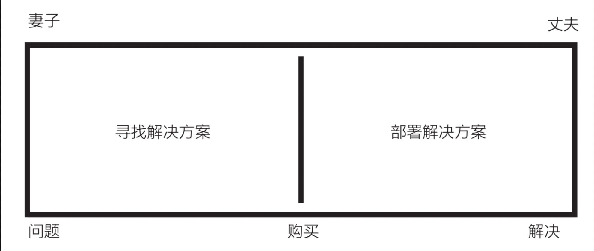
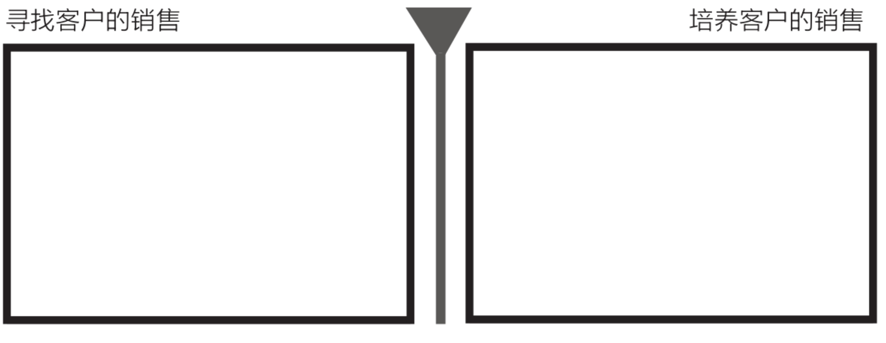
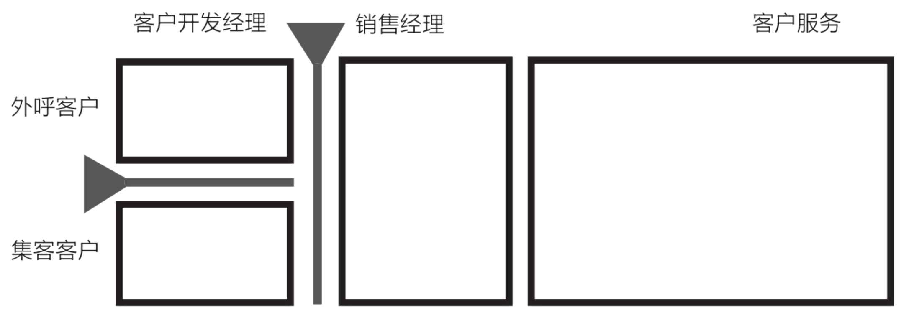
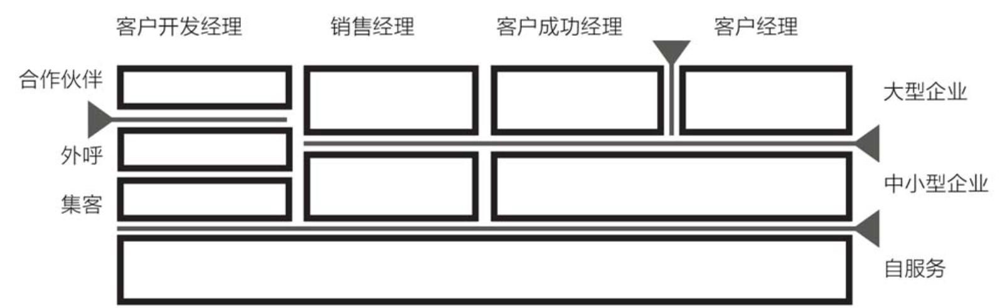
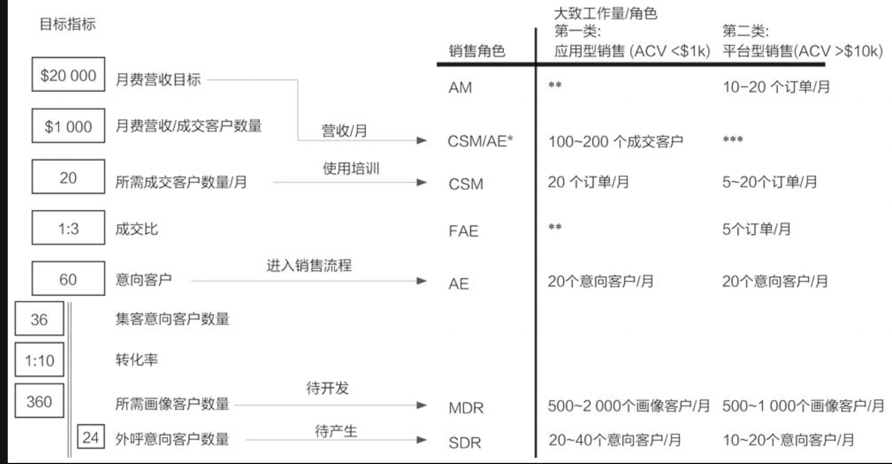

# 硅谷蓝图

## 序言

本书为了解决的问题是，解决销售效率的不确定性

给出以客户为中心设计整体战略和每个触点的细节，在赢单基础上更关注客户成功，提升系统销售效率，在单位时间和成本投入的前提下，通过战略和战术的调整迅速提升收入增长事件发生的频率

为什么美国销售效率那么高：
1. 长期高强度竞争而达成对最佳实践的行业共识
2. 高质量咨询公司的存在，对整个销售知识体系的主动积累、沉淀和提炼思考

### 书中的部分名词

#### 职业

1. AE：线上销售经理
2. AM：大客户经理
3. BDR：业务开发代表
4. CSM：客户成功经理
5. CRO：首席营收官
6. CCO：首席客户官
7. FAE：区域销售经理
8. MDR：市场开发代表
9. PM：产品经理
10. SDR：销售开发代表
11. SE：销售工程师
12. VPM：市场营销副总
13. VPS：销售副总

#### SaaS

1. SaaS：软件即服务
2. ACV：年度合同价值
3. LTV：客户终身价值，一般是ACV的3～5倍
4. ACRC：年度客户留存成本
5. ARR：年度可重复性营收
6. MRR：月度可重复性营收
7. B2B：企业对企业
8. B4B：企业服务企业
9. B2C：企业面向消费者
10. CAC：客户获取成本
11. CRC：客户留存成本
12. CR：转化率
13. CRM：客户关系平台
14. CSM：客户成功平台
15. MAS：销售自动化软件

## 引言：销售需要革新

### 规划设计的必要性

1. VPS到岗后建立销售体系的阶段：
   1. 采购工作需要的工具、建立年度培训计划（销售打法）
   2. 建立可实现规模化增长的销售流程 
   3. 提升公司收益业绩，仍没能达到规模化 
   4. 继续投入两三轮资金，产生规模化增长效应
2. 因为VPS经常性的更换，会使得公司无法快速形成有效的销售相应体系，最后错过快速增长的窗口期

### 以设计平衡效益和流程

1. SaaS企业成功的关键，在于建立一个能**平衡技巧、流程和工具之间关系的，并经过精心设计、以客户为中心的销售组织**
2. 新型销售组织：低成本（**低成本运转**）、高成就（**通过增效工具和网络提升销售效率**）、可规模化（**将所学到的知识经验传导到整个组织**）的自学性（**按年度接受培训**）组织

### 需时时谨记的几个趋势

1. **以客户为中心**：要实现个体贡献可被取代的以客户为中心的SaaS企业运营方式。
2. **SaaS全新的商业模式**：非软件行业也开始通过服务收费，即销售达成不产生实际利润，而是让利润再晚时刻实现
3. **消费者是新型买家**：期望能在网络上进行互动，迅速地得到所需的所有信息
4. **千禧一代的新型销售人员**：非常熟练地运用互联网和移动设备进行工作，有新技术出现就能马上接受

## 01-了解市场建立销售业务的3个等级

### SaaS公司拥有的三个业务层级

1. 划分客户层级的标准
   1. 带来的收益
   2. 每种客户类型的潜在客户数量
   3. 服务这些客户所需的成本
2. **组织低成本的网络销售去负责客户数量大但是价值不高的市场**
3. 三个分层：
   1. 第一层级：专业用户/微型企业
   2. 第二层级：中型企业
   3. 第三层级：多个利益相关者的大型企业

### 同等服务、不同定价

1. 免费试用：免费提供基础服务、更高级的功能和频繁使用场景需要付费，**从高频用户中获利**
2. 专业用户/微型企业：有着和企业一样的行为模式，有助于销售团队胜任网络销售，从而直接进入中小型企业市场
3. 中小型企业：**目标所在**，通过MDR筛选潜在客户、并推荐给AE，通过AE为客户提供服务（**专业领域匹配，人员及时到位**）
4. 大型企业：通过FAE管理，和SE配合跟进客户，FAE还会当面拜访客户，为企业提供相关的业务模型，销售人员之间共同协作

### SaaS企业的成功源自于中小型企业市场

1. 大客户的成功难以复制，本质上是**资源整合而不是创新和开发**
2. 免费试用能为企业提供快速反应，而不会起量

### 总结

1. FAE和SE负责大型客户（ARR在5000刀以上）
2. SDR和AR主攻中小型企业业务（ARR在2000刀左右）
3. 增长黑客主打低端市场（ARR在100刀0左右）

## 02-洞悉客户旅程，打造以客户为中心的销售模式

### 以客户为中心的销售模式

1. 客户旅程的开始一般是**发现了某个问题并且相信该问题可以得到解决**
2. 获得客户的方式
   1. 一场内容营销活动
   2. 口碑相传、老带新
   3. 电销 / 电子邮件对外展开销售
   4. 社区活动带来客户
   5. 搜索引擎优化 / 竞价排名，自然流量获得
   6. 通过社交媒体互动
3. SaaS公司的客户一旦**真正感受到服务的价值**，企业收益便有可能实现按月、按周，甚至按小时的持续可重复增长。

### 客户旅程

1. 注意到产品：客户自己发现问题，开始上网搜索或参加网络研讨会进一步了解这个问题，这时他便成了**潜在客户**
2. 帮助客户理解：新一代的销售组织则要胜任教育阶段的**双向交流模式**，努力发展意向客户
3. 决策支持：客户在一名“伙伴”的配合之下完成购买流程，这位伙伴会向客户提供所需的一切信息
4. 使用培训：客户实施／安装／激活服务，**使用培训阶段出现问题会增加客户流失的风险，还可能让公司失去为达成交易所投入的成本，即客户获取成本**
5. 使用和增购：客户频繁使用服务时会越来越体验到此项服务的价值。SaaS服务供应商还会向客户分享从其他客户那里获得的最佳服务实践经验

### 不同增购模式

| 产品模式   | 应用服务       | 平台服务               |
|--------|------------|--------------------|
| 初期销售   | 简单         | 复杂                 |
| 客户粘度   | 对业务不重要，粘度低 | 深入业务、粘度高           |
| DIY程度  | DIY程度低     | DIY成都高，需要工程师参与     |
| 增长前景   | 没有天花板      | 受制于产品的更新，新增功能价格会提升 |
| 服务商关心点 | 向上销售和交叉销售  | 客户续约和防止客户流失        |

**SaaS销售团队不能仅以达成交易为目标，还必须以达成月费营收任务并实现盈利为目标**

## 03-理顺CAC和CRC，重构销售成本

### 累进营收和累进成本

1. 获得一个新客户的成本一般是保留一个现有客户的6倍，一个高效的销售团队必须要看到客户做出投资和客户保留投资对业绩造成的影响。
2. 对于SaaS企业来说，在关注CAC的同时，更需要关注CRC

### 客户获取成本

1. CAC主要组成部分
   1. 人员（P）：工资、奖金、其他费用
   2. 内容（C）：白皮书、视频、博客、活动、研讨会等
   3. 工具（T）：CRM、MAS以及各种销售工具

### 客户留存成本

1. CRC的组成部分
   1. 人员（P）：客户成功团队、交易管理团队、客服和培训人员工资
   2. 内容（C）：客户忠诚度管理、客户培训程序、客户营销
   3. 工具（T）：客户管理和培训系统

### 年费营收

1. 通过向上销售和交叉销售来提高年费，缩短盈利时间

### 影响盈利提升的因素

1. 向上销售：扩充用户（员工账号）、推销更高级的版本、推销更多的功能
2. 交叉销售：向不同利益相关的用户推出相同的服务，向客户推销其他独特的内容产品
3. 提高定价：提高月收费的价格，让客户更愿意按年购买，**避免多年订单，在后面升级时能进一步提高营收**

### 没有盈利目标 = 行尸走肉

1. **实现盈利并利用利润进行产品创新是SaaS企业取得长期成功的关键**

### 实现盈利的时间按天计算

1. SaaS企业高管需要密切关注客户数量达到盈利点的具体天数
2. 客户盈利达到对应天数时间越短，客户越不容易流失
3. 容易忽略的隐藏成本
   1. 网络 / 增长黑客的支出
   2. 工具：社会化销售工具成本、潜在业务开发成本、自主销售成本、在线协作工具和内容管理平台成本
   3. 销售工程师
   4. 社区管理
4. 通过线上销售团队可以抑制CAC和CRC的成本

## 04-培训SDR，构建流畅的线上销售渠道

### 互联网，可掌控的客户旅程

1. 不管客户来自哪个层级，不管他们的订单数额有多大，最开始他们都会先进入目标公司的网站去了解产品
2. 公司可以控制线上信息的投放量、信息类型和投放节奏，由此就可以**掌控客户的部分体验**，借助最佳实践经验持续主动跟进客户
3. 在互联网上通过内容营销带来的优势：优质流畅的线上渠道能够让SDR快速完成交易

### 三个层级的线上旅程

1. 第一层级：互联网获客 => SDR快速达成交易
2. 第二层级：互联网获客 => 企业团队接入 => 决策者进入 => 确认供货商资质 => 达成交易
3. 第三层级：互联网获客 => 企业团队接入 => 决策者进入 => 确认供货商资质 => IT部门解决集成化问题 => 法律部门介入，发现个人身份信息的问题 

在互联网时代，我们**首先要了解客户的线上销售流程，而后再根据需要调整我们自己的销售流程，引入合适的销售工具、销售内容和销售技巧，使之与新时代的销售流程相适应**。

## 05-合理部署销售人员，推进销售组织的进化

### 销售组织进化

1. 夫妻老婆店 => 团队型销售 => 具有销售技巧 + 工具的产品型销售模式 => 通过专业行业知识获取客户信息，围绕客户需求进行销售
2. 销售组织进化是逐步深入的

### 越来越注重分工协作的销售组织

1. 夫妻店销售：全程个性化服务、无规模化能力
   
2. 产品型销售：根据不同产品特性进行分类，销售团队协作，不同人跟进不同阶段
   
3. SaaS 1.0 / 2.0 以成单为目标：进一步提升销售效率和专业化程度，组织更加细分，为了控制CAC
   
4. SaaS 3.0以服务客户为目标：解决CRC问题成立了CSM的角色
   

### SaaS行业的销售进化

1. 为了降低CAC，使销售组织专业化，通过MAS来自动挖掘（内容营销）培养潜在用户。
2. 销售组织便从以产品为中心的销售模式进化为以解决方案为中心的销售模式
3. 以解决方案为中心的销售模式：
   1. 咨询式的销售技巧，以客户碰到的问题为引导
   2. 将问题和自家产品能提供的价值相结合
   3. 给出相关问题的解决方案

### SaaS销售团队的职能和责任

1. MDR：客户筛选
   1. 接受画像客户的咨询
   2. 甄选出高意向客户
   3. 第一时间联系客户并确定意向，完成用户分层
   4. 转交给FAE（大型客户）或AE（中小型企业）
2. SDR：负责外呼客户的开发
   1. 挖掘客户：AE发现的客户名单 + 管理层选中的目标市场
   2. 确定合格的目标客户
   3. 通过电话、聊天、电子邮件了解客户需求
   4. 转交FAE或AE
3. BDR：负责企业发展伙伴和战略合作伙伴
   1. 对战略合作感兴趣的交给BDR
   2. 为合作伙伴团队进行培训
   3. 组织活动吸引合作方前来参加活动
   4. 合作伙伴挖掘和发展潜在客户，BDR负责做用户区分和分层
   5. 转交给FAE或AE
4. AE：负责中小企业销售 / 线上销售
   1. 接受意向客户并进行**第一次客户咨询**
   2. 提供产品展示
   3. 为客户提供**有价值**的专业意见
   4. 协助客户选定产品
   5. 提供服务协议和报价
   6. 安排好培训事宜
   7. 转交给CSM，并将排名前50的潜在用户转交给SDR后续跟进
5. FAE：大型企业 / 区域销售
   1. 区域内意向客户见面并进行产品演示
   2. 识别客户面临的问题和自家产品进行服务匹配
   3. 与管理层达成共识
   4. 协助客户整个购买流程、不断提供有价值的建议
   5. 安排好客户购买、培训
   6. 移交给CSM
   7. 参与客户使用培训环节
6. CSM：负责安排产品使用培训，并帮助客户开始正式使用
   1. 规划产品安装、并制定后续使用计划
   2. 重新确认对培训的预期、计划、目标
   3. 确保软件的集成 / 安装 / 启动
   4. 后续对服务和软件使用情况进行监督
   5. 后续继续跟进产品升级 / 交叉销售等事宜提升LTV
7. CSM / AM：负责客户续费和向上销售与交叉销售
   1. 保证客户对产品的持续使用、挖掘新的颊脂垫
   2. 打造一个服务满意的产品社群
   3. 产品出现扩充、升级时，由CSM匹配升级 / 续约 /交叉销售计划让（AE / FAE / AM）协助用户付费
   4. 保证客户月费营收的持续性
8. 线上：自服务型销售渠道
   1. 用户自主观看视频、试用、购买、非销售渠道用户
   2. 主要是小型用户行为

### 总结

SDR、MDR：挖掘客户需求，发现潜在用户

AE：达成交易

CSM：使用培训

**通过规模化放大成功而非失败**

## 06-解析关键指标、构建数据驱动型的销售组织

### 用数据了解现状

1. 销售组织因为大数据出现的变化
   1. 更加依赖于对流程的实时监测而非突击式的检查
   2. 更加依赖于对流程的实时监测而非突击式的检查
2. 通过**自动记录销售活动相关数据**的系统，通过各种数据比率来回答影响公司业务走向的各种销售渠道现有的问题

### 数据的不同类型

1. 可量化数据：画像客户 / 意向客户 / 成交客户的数量而形成的衡量指标
2. 转化数据：画像客户转化为意向客户的转化率，意向客户转化为成交客户的转化率

### 数据驱动型销售组织的关键指标

1. 业绩数据：使用多个衡量指标数据对所需数据进行推算 按照年月对销售周期，月费营收、客户流失率、向上销售比率等进行统计
2. **针对不同业务层级建立不同的数据衡量指标**
3. **必须学会利用图表来定义这些可量化数据，并用它来描绘数据的走向，这样才能发现问题的根源**

## 07-建立SaaS销售流程，将最佳实践规模化

### 用流程复制结果

1.  流程帮助销售实现规模化：销售组织依托**高度可控的实验和目的明确的学习**，从而实现销售规模化扩张

### 以客户为中心的SaaS销售流程结构

1. 好的流程：
   1. 大家都认可的
   2. 有效的数据都要记录在内的
   3. 可以规模化增长复制的
2. 如何建立销售流程：
   1. 列出所有销售活动
   2. 将活动按执行角色分类
   3. 发现空白和重复的地方
   4. 衡量各种角色的表现
   5. 对流程各个阶段进行修正、简化、添加和加强，最终成为精简的流程
3. 销售流程改进方案：
   1. 定义销售流程：按照公司产品，制定必须的销售流程
   2. 建立销售指南：最佳实践经验、案例
   3. 练习、练习、再练习：相互指导学习，改进话术等，并开始独立销售

**SaaS销售业务的重复性的特点决定了需要流程上的管控**

## 08-运用销售工具、提升销售速度

### 利用工具让你的努力得到超值的回报

1. SaaS销售的秘诀，靠着一套全新的销售工具，将技能不足的AE的销售效率提高到顶尖高手的水平
2. 如何选择销售工具
   1. 能否加强和客户的互动
   2. 能否将8小时有效服务时间提升至24小时
   3. 能否减少客户的响应时间
   4. 能否为销售提供准确的数据（用户画像）
   5. 能否让员工的工作更轻松
3. 销售工具的使用步骤
   1. 选定销售流程
   2. 确定完成销售中每种行为所需的工具
   3. 制作示意图，标注出需要使用的工具
   4. 查漏补缺，避免重复使用
   5. 对销售进行专业培训

### 为外呼配备的工具

1. 销售自动化环节：
   1. 潜在客户生成
   2. 潜在客户培养
   3. 社会化销售
   4. 客户培养
   5. 标注信息归类和标注添加
   6. 电子邮件
   7. 工作流
   8. 电话
   9. 产品协同展示
   10. 内容营销
   11. 产品试用

2. SDR和AE需要的工具：**CRM**
3. 如何判断是否需要销售工具：**通过分解各项行动，确定哪些地方正在使用销售工具或需要使用相应的工具来提升销售效率以及用户体验**

### 

## 09-利用内容营销推动销售流程

### 把内容当作外呼销售工具

1. **互联网使人们不再关注优质内容的来源，只要内容足够好就可以**
2. 互联网时代：**内容为王**
3. 传统销售：品牌信任，先知道品牌再通过相关资讯认识到自己的问题
4. 新一代销售：通过阅读网络 / 线上 / 自媒体专业资讯意识到自身问题 => 网站提供的咨询认识自身问题 => 联系商家解锁更多资讯
5. 通过内容和服务来留住商家，是新一代销售新的职责

### 销售流程的五个阶段

1. 没有在客户教育和使用培训阶段上进行内容投放。海量的认知阶段内容让用户感到一片茫然
2. **降低用户对产品的认知，教育用户很重要**

### 对可视化内容的需求增加

1. 与现有客户、潜在客户和销售团队做好沟通交流，记下他们需要什么内容，列出清单，以此为根据制作简短的知识性视频，并将其投放到销售的全部五个阶段即可

### 用户产生内容

1. 让平台用户自己产生内容，有利于公司规模化的增长

### SDR和AE是新型的内容创作者

1. 销售在通过内容教育用户后直接跟进线索，并提供解决方案非常重要
2. **需要对销售人员进行内容创作的培训**

### 新一代销售经营也是内容制作高手

1. 通过视频制作来提升销售人员的可行度
2. 视频中通过分享行业内资讯，让用户产生想要和AE交流行业信息的冲动
3. 双人协作的方式更有助于提高产品的可信度和真实性

**如今的销售精英不再一味追求“大单和大客户”，而开始以获取大量意向客户为目标，利用内容来实现外呼销售。**

## 10-套用公式，打造SaaS销售模型

### 数据是SaaS销售的一切

1. 首月的月费营收n在后续12个月内实现连续增长后所得的n的倍数，即一年的月费营收总额为78×n（无客户流失场景）

### SaaS销售运营指标十步推算

1. 确定月营收目标（三个层级分开）
2. 计算每个客户每月所交费平均值
3. 将上述两项相除得到月需要成交客户数
4. 计算每个订单需要的意向客户数
5. 得出每一层级所需要的总意向客户数
6. 计算集客类商机和外呼类商机所需要的意向客户数量
7. 计算各自的转化率
8. 得出外呼销售或营销培养阶段需要产生客户画像的数量
9. 得出外呼销售业务应承担的意向客户数量

### 影响营收的因素

1. 失去一位客户（不续费）
2. 客户数量不变，但购买服务变少
3. 客户账号数量减少

### 提升营收的因素

1. 向上销售
2. 交叉销售
3. 续约

### SaaS销售人员分配

### 了解你的SaaS团队

1. 通过衡量客户全年的账号使用情况，通知AE什么时候 / 哪些用户需要开展向上或交叉销售
2. 人员配置模型通过了测试，就可以批量实现销售规模化

**搞清了转化率和自己销售环节薄弱的是哪一环，规模化销售就成功了一半**

