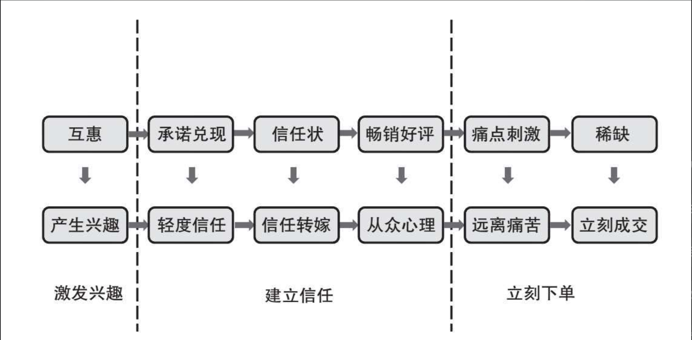

# 超级转化率

## 1. 指数级提升的转化率漏斗

略，这部分内容笔记在老电脑上后期补充

## 2. 超级转化率：让客户下单的陈勇转化六要素

### 2.1 消费者从看到商品到下单的三大步骤

1. 只有很少一部分人在思考一个消费者看到商品到下单会经历哪几步，在这些步骤中消费者在思考哪些问题
2. 下单三阶段：
   1. 激发兴趣
   2. 建立信任
   3. 立即下单
3. **针对不同的产品，在其详情页对面向不同客户应该做出不同的区分，对于不同的用户影响其购物的因素往往都是不同的**
4. 陈勇转化六要素
   
   

### 2.2 互惠：激发客户兴趣及下单的首尾呼应术

1. 互惠处于**激发兴趣阶段**
2. **容易得到导致不珍惜，不容易得到所以珍惜。** 提升送给客户优惠的难度 
3. 其实互惠也可以理解为双赢，你为客户获得优惠（好处），客户帮你增加了业绩（好处），相互直接提供好处，消费者和商家在有来有往的过程中，关系更加紧密
4. 互惠的使用方法：
   1. 首先要增加优惠券的获取难度
   2. “牺牲”自己帮助客户获取优惠券
   3. 暗示客户使用优惠券就是帮助自己

### 2.3 承诺与兑现：让客户产生轻度信任的技巧

1. 建立信任是循序渐进的过程，一共分为三个阶段：初级信任→中级信任→高级信任
2. 承诺和兑现 => 轻度信任 （**建立信任的第一阶段**）
3. 承诺和兑现的使用方法
   1. 上文做出承诺
   2. 下文做出**符合常理**的**可实现**的**保障措施+成功案例**
4. 通过承诺和可实现的保障措施，也可以用在建立人与人之间信任关系的建立上

### 2.4 信任状：信任转嫁的秘密

1. 信任状的定义和作用：**信任转嫁**，当别人对你的信任不够时，将信任转嫁到别的商品或服务上 （**建立中级信任，建立信任的第二阶段**）
2. 具体的信任转嫁：找明星/公众人物做代言，提升品牌信任度
3. 信任状的使用方法：
   1. 行业转嫁或专业机构参与
   2. 专注XX领域XX年
   3. 资质证书，专业领域内达到行业监管机构的认证标准
   4. 背景强大：有央企背书等
   5. 央媒报道
   6. 名师子弟/XX传人
   7. 名人代言/名人亲自使用
   8. 检验报告
   9. 知名的合作伙伴
   10. 同款代工厂/同款工艺/同样的供应商
4. 信任状的注意点：**大家都懂的信任状强于业内的信任状**
5. 当自己不够知名的时候，需要找大众所知的信任状来为自己背书

### 2.5 畅销好评：基因决定从众术
1. 用于在中级信任的基础上继续积累信任，达到**高级信任**，完成需要高信任产品的成交
2. 畅销好评 运用的是 **从众心理**，用来积累用户信任
3. 畅销好评使用方法：
   1. 在宣传产品或服务的过程中，要不断呈现畅销好评
   2. 全国XX家店
   3. 用户遍布××省市或国家
   4. 客户评价
   5. 销售XX万
   6. XX人访问本网站
   7. XX月XX人口碑见证
4. 畅销好评的注意点：
   1. 营销绝对不能撒谎，只能适度润色
   2. 越具体的数字越可信

### 2.6 痛点刺激：原理痛苦的助推术

1. 信任建立后，影响下单的因素
   1. 有需求，但没有购买力
   2. 有需求，但不着急
   3. 没有需求
2. 没有需求，让对对方产生需求：**痛点刺激**
3. 痛点刺激的作用：**原理痛苦的本能**，从而促进下单
4. 痛点刺激的使用方法：
   1. 找到消费却对产品厌恶的点
   2. 用某种形式将厌恶的点表现出来
5. 适合痛点刺激的产品
   1. 预防型产品
   2. 新型产品

### 2.7 稀缺：让客户买买买的撒手锏
1. 物以稀为贵，**人在商品稀缺的时候就会停止犹豫，赶紧下单**
2. 稀缺 => 立即成交
3. 稀缺的使用方法：
   1. 只有满足XX条件，营造稀缺氛围
   2. 仅限前XXX名
   3. 只剩XXX个名额
   4. 限XX时前优惠

## 3. 超级转化率的案例深度解析

下面的案例要遵循下单三部曲：**激发兴趣 -> 建立信任 -> 立刻下单** 来进行分析
并且使用转化六要素：**互惠（激发兴趣）、承诺与兑现、信任状、畅销好评（建立信任）、痛点刺激、稀缺（立即下单）**

### 3.1 猫王收音机

1. 找到产品卖点
2. 使用六要素拆解
   1. 激发客户兴趣（送定制手提盒）
   2. 建立信任（使用承诺兑现、信任状、畅销好评，分别对好听做出承诺 + 专业背书，好看和好礼使用畅销评价，分别进行信任验证）
   3. 立即下单（互惠 + 稀缺，强调现在买才送手提箱，增加稀缺性）
3. 分析需要解决的难题：
   1. 让人相信好听、好看、好礼
   2. 在优惠力度不大的情况下让人立即下单

### 3.2 无忧保姆：转化率提高1750%的增长实操方法
1. 产品卖点，用户角度出发，挖掘卖点
2. 六要素拆解：
   1. 激发兴趣（填写手机号送红包）
   2. 建立信任（强调安全、保姆能力、售后服务，使用**专注行业XX年**和**从业人员人数**与**服务家庭人数**以及**获得的荣誉**来体现专业性，最后用畅销好评来提高信任度）
   3. 立即下单（提纲挈领**总结用户痛点**，通过现在**预约送红包、每天仅限50名提升稀缺性**）
3. 需要解决的问题
   1. 相信家政公司和保姆的安全性
   2. 需要同事让男女客户满意
4. **用户对落地页信息流的兴趣就在前3屏内**，前3屏内的关键信息很重要

### 3.3 **南孚迷你充电宝：电商月销量增长13倍的秘密**

1. 找产品卖点：迷你、便于携带、品牌大
2. 六要素拆解
   1. 激发兴趣（针对出外勤、下班聚会、逛街的人群，对便携性要求较高人群，**四格漫画刺激需求**）
   2. 建立信任，（整体展示，使用数据+对比突出小，解决点亮够用的问题，信任转移使用检测院的官方证明）
   3. 立即下单：稀缺（30天免费试用 + 前68位）
3. 营销咨询的四个步骤
   1. 需求分析和引导
   2. 策划落地页
   3. 流量导入（**投放的关键词的图片和文案一定要匹配**，不然没有达到搜索的用户的要求，钱就打水飘了）
   4. 数据分析和持续优化
      1. 分析数据，优化自然排名和流量
      2. 优化落地页

## 4. 创业到规模商业的四级良性增长引擎
1. 为何需要良性增长引擎
   1. 增长出现瓶颈
   2. 流量的成本居高不下
   3. 广告效果越来越差
   4. 不知道如何以小搏大
   5. 不知道如何迅速做规模
2. 不要看到粉丝数量涨了就很高兴，如果在错误的渠道其实并不能实现转化：
   1. 时间不值钱的群体，购买力都不太高
   2. **以小搏大要在合适的渠道进行**
3. **客户在哪里就要去哪里投广告，不要花时间和精力去做无用功**
4. 四级良性增长引擎：
   1. 冷启动跑通产品原型
   2. 依靠规模投放带来规模的快速增长
   3. MGM裂变营销增长
   4. 开辟业务线，不断重复迭代前面三步

### 4.1 冷启动跑通产品原型，以小搏大
1. 研发新产品 => 天使用户体验 => 继续迭代 => 获得MVP
2. **好的天使用户会给团队带来正反馈，激励产品迭代**，创业初期激励团队的信心很重要，正反馈会使得大家对再做的事情不怀疑
3. 以小搏大的重点：
   1. 尽可能地做出被市场认可的MVP
   2. 一定要选对冷启动以小搏大的渠道
4. 创业是要做出一款能被相对大众市场接受、大家愿意花钱去购买的产品或服务，然后去服务很多人，而不是仅仅服务自己和周围有共同爱好的一小部分人
5. 好的创业思路:
   1. 发现没有被满足的需求
   2. 从周围开始调研，并逐步通过各种平台验证这种需求的旺盛程度
   3. 当前没有好的替代品，并且自己有向此方向创业的基础
6. 判断MVP是否成立的一个很简单的标准是，**受众是否愿意花钱来购买这种产品或服务**。(有用户愿意付费，就形成了最小的商业闭环，也被市场验证了这个产品的价值)
7. 成功的冷启动过程：**冷启动获得精准粉丝，通过优质的内容，不断裂变新粉丝，达到一定的量后实现流量变现**
8. **冷启动的优势就是不需要多少资源就能把事情做起来，劣势就是天花板太矮**

### 4.2 规模投放实现规模增长

1. 依靠规模投放可以带来**快速的规模增长**
2. 规模投放的重点：
   1. 选对规模投放的渠道
   2. 提高规模投放的转化率
3. 流量的类型：
   1. 信息流量（淘宝、天猫流量直通车）：为什么需要这一类产品
   2. 搜索流量（百度/搜狗/360搜索、淘宝搜索）：在哪家购买这些产品
4. 客户就是上帝，注重客户体验是企业的生命线，投放获取的客户需要通过产品质量去留住他们
5. 提高规模转化率的方法：
   1. 走一遍广告到最终交易的全流程，建立细粒度转化率节点和关键节点
   2. 找到影响每个关键节点的转化率因素，并通过各种方法去优化

### 4.3 MGM裂变营销增长

1. MGM是通过社群，进行裂变，实现病毒是扩散
2. 活动规则要策划好，要求客户完成的动作不能太难，也不能太容易。给客户的回馈既不能让客户有道德层面的压力，也不能没有吸引力
3. MGM的三层转化率：
   1. 分享率
   2. 阅读率
   3. 发生关系率（打开后愿意注册、咨询、打电话预约、购买等）

### 4.4 开辟业务线，不断重复前三步
1. 增长达到极限后，想要继续提升营收
   1. 国际化
   2. 开辟新的业务线不断重复前三步，并优化
2. 国际化的缺陷：国内外企业水土不负，要全球统一规模很难
3. 开辟业务线的思路：**深入客户业务，深度参与其中，为其获得更多价值**，提升LTV
4. 开辟新业务线的原则：
   1. 以产业链的上下游为主线开辟新的业务线
   2. 以相同客户群体不同需求为主线开辟新的业务线
5. 开辟业务线需要的注意点：
   1. 一定要等当前的业务线做好做稳之后再开辟，避免因过快开辟新的业务线导致资金链断裂

